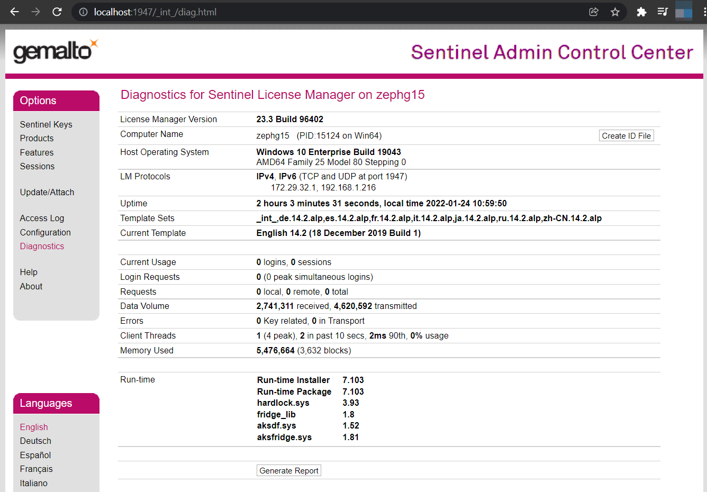
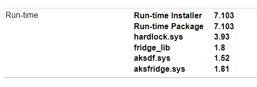
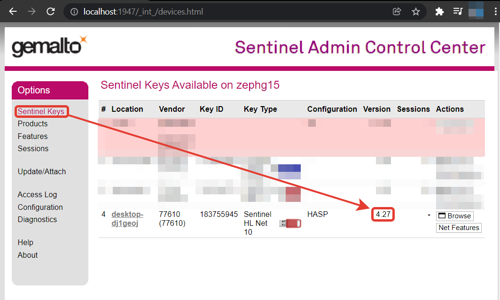
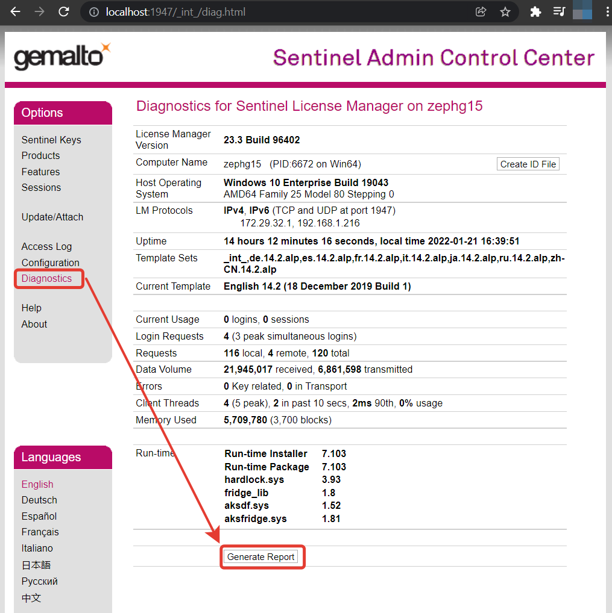
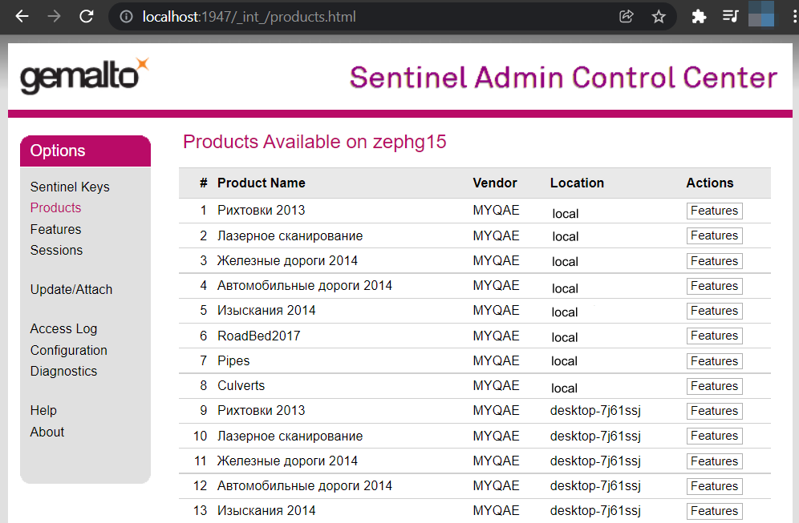
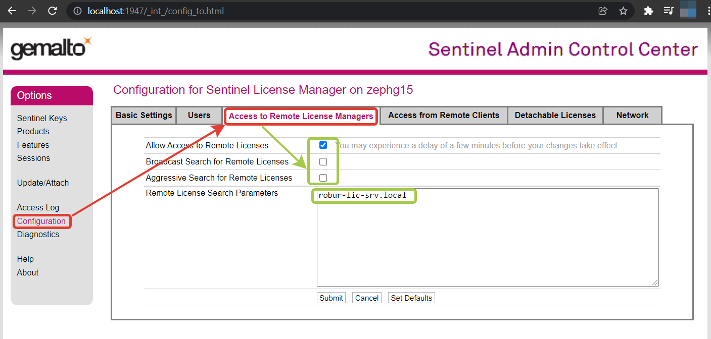
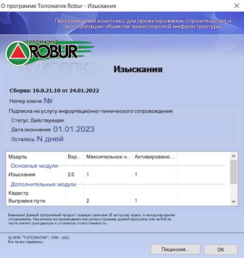

# Установка

Для установки необходимы права локального администратора.

## Шаг 1 {#step-1}

Для установки ПК «{{robur}}» запустите установочный файл (доступны по адресу: <https://topomatic.ru/products/>). Появится следующее окно:

Внимательно прочитайте лицензионное соглашение. Установите флажок «**Я согласен**» и выберите кнопку «**Установить**».

Инсталлятор устанавливает следующие программы и компоненты:

* Драйвер ключа HASP (если он не был установлен ранее).
* Microsoft .Net Framework (если он не был установлен ранее).
* ПК «{{robur}}».

Процесс установки может занимать 2—5 минут. Пожалуйста, дождитесь окончания работы инсталлятора.

## Шаг 2 {#step-2}

Убедитесь, что драйвер HASP успешно установлен. Для этого в адресной строке браузера (Edge, Chrome, Яндекс-браузер, Opera, Firefox) наберите <http://localhost:1947> (или просто перейдите по ссылке). Откроется Sentinel Admin Control Center. Выберите пункт меню **Diagnostics**:

Убедитесь, что установлен License Manager версии 23.3 и соответствующие runtime-компоненты:

Если вы планируете, что ПК «{{robur}}» будет использовать ключ, установленный на сервере лицензирования (а не локальном компьютере) то переходите к [Шагу 5](installation.md#step-5).

В том случае, когда ключ HASP будет устанавливаться в данный компьютер вам необходимо выполнить следующие действия.

## Шаг 3 {#step-3}

Вставьте ключ HASP в USB-порт компьютера. Операционная система автоматически пытается обнаружить новое устройство и настроить драйвер для работы с ним. Этот процесс занимает 1-2 минуты. Если процесс настройки драйверов прошел успешно, то светодиод ключа должен светиться красным.

## Шаг 4 {#step-4}

Для того, чтобы убедиться, что ключ HASP опознан операционной системой откройте HASP Admin Control Center <http://localhost:1947> и выберите пункт меню **HASP Keys**:

Если при установке драйверов Sentinel HASP у Вас все же возникли проблемы, и Вы не смогли их решить самостоятельно, пожалуйста, откройте Gemalto Admin Control Center <http://localhost:1947> и выберите пункт меню **Diagnostics**:

Выберите кнопку **Generate Report**. Отправьте сформированный отчет и краткое описание проблемы в нашу службу технической поддержки по адресу:

[https://support.topomatic.ru](https://support.topomatic.ru)

## Шаг 5 {#step-5}

Убедитесь, что на ключе имеются лицензии на соответствующие программные продукты. Для этого откройте Gemalto Admin Control Center <http://localhost:1947> и выберите пункт меню Products:



Если названия продуктов выглядят как **«Product 17»** то установив утилиту [haspdinst.exe](https://download.topomatic.ru/public/utilities_%20%26_instructions/haspdinst.exe) и разместив файл **[77610.xml](https://download.topomatic.ru/public/utilities_%20%26_instructions/77610.xml)** в папкy `C:\Program Files (x86)\Common Files\Aladdin Shared\HASP\vendors` и перезагрузив компьютер станут доступны человекочитаемые названия.



 Если ключ не виден, Вам необходимо в явном виде указать IP-адрес/имя компьютера, на котором этот ключ расположен. Для этого откройте HASP Admin Control Center <http://localhost:1947> и выберите пункт меню **Configuration**. Откройте вкладку **Access to remote Licence Manager**, Установите флаг **Allow Access to Remote Licence Manager**, сбросьте флаг **Broadcast Search for Remote Licence**, в поле **Specify Search Parameters** укажите IP-адрес компьютера, на котором установлен ключ. Выберите кнопку **Submit**.

 

## Шаг 6 {#step-6}

Запустите ПК «{{robur}}», щелкнув по ярлыку  на рабочем столе. После запуска программы выберите элемент меню `Справка` → `О программе`:

