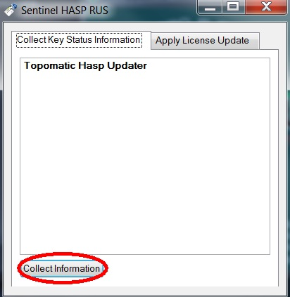
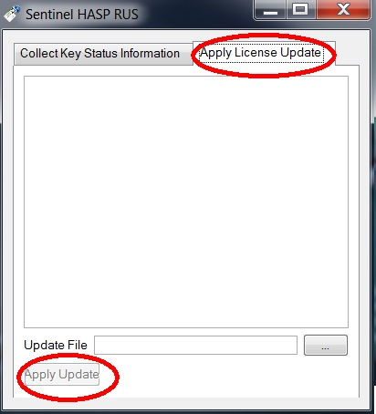
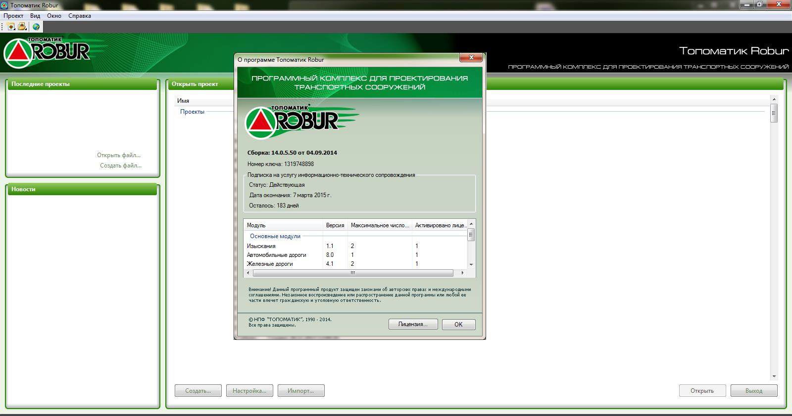
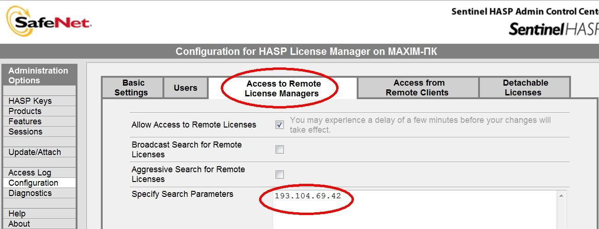

# Hasp

**ВАЖНО!** Если драйвер HASP «не видит» требуемый ключ или раздел **Products** пуст, то требуется дополнительная настройка или перепрошивка памяти ключа. В этом случае, пожалуйста, выполните следующие действия:

1. Запустите утилиту **Hasp Updater.exe** (<https://download.topomatic.ru/public/utilities_%20&_instructions/HaspUpdater.exe>). Выберите кнопку **Соllect information**.

   

2. Сохраните файл конфигурации ключа (расширение **.c2v**) и пришлите его в службу технической поддержки НПФ Топоматик на адрес [https://support.topomatic.ru](https://support.topomatic.ru).

3. В ответном письме вам будет выслан файл прошивки с расширением **.v2c**.

4. В утилите **Hasp Updater.exe** выберите вкладку **Apply licence update**, укажите имя имя присланного вам файла прошивки и выберите кнопку **Apply Update**:

   

   В процессе прошивки ключ будет мигать.



**ВАЖНО!** Не извлекайте ключ из компьютера, пока он мигает, даже если программа прошивки уже закончила работу



5. Убедитесь, что ключ прошился корректно, то есть раздел **Products** выглядит так, как показано на скриншоте в начале данного пункта.

Запустите ПК «{{robur}}», щелкнув по ярлыку  на рабочем столе. После запуска программы выберите элемент меню `Справка` → `О программе`:

В открывшемся диалоговом окне выводится информация о номере ключа и сетевом имени компьютера, на котором этот ключ установлен. А также, список программных модулей, максимальное количество число активных лицензий.



В зависимости от установленной конфигурации программы ярлык, стартовая страница и информационное окно программы может отличаться.



При запуске, программа «{{robur}}» ищет первый подходящий ключ HASP и подключается нему. Вы можете настроить программу, таким образом, чтобы она подключалась к определенному ключу, который виден в системе. Если ключ не виден, Вам необходимо в явном виде указать IP-адрес компьютера, на котором этот ключ расположен. Для этого откройте HASP Admin Control Center <http://localhost:1947> и выберите пункт меню **Configuration**:

Откройте вкладку **Access to remote Licence Manager**, Установите флаг **Allow Access to Remote Licence Manager**, сбросьте флаг **Broadcast Search for Remote Licence**, в поле **Specify Search Parameters** укажите IP-адрес компьютера, на котором установлен ключ. Выберите кнопку **Submit**.



Данная последовательность действий позволяет настроить доступ к ключу HASP, подключенному к компьютеру, расположенному как в локальной сети, так и в сети интернет.


