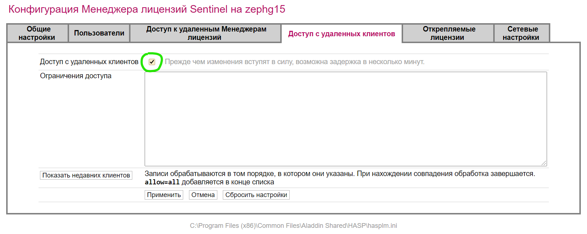

# Системные требования

Требования к системным ресурсам (объемам оперативной и дисковой памяти, разрешению экрана, наличию нескольких мониторов, и др.) существенно зависят от вида задач, решаемых с помощью ПК «**{{robur}}**», а также от объема пользовательских данных. Ниже приводится рекомендуемая конфигурация аппаратных и программных средств, необходимых для комфортной работы с программой.



## Рекомендуемая конфигурация аппаратных средств

Для работы с программами линейки {{robur}} подойдёт любой компьютер, предназначенный для работы с САПР-задачами, как минимум:

* CPU: 2-х ядерный процессор с тактовой частотой 2 ГГц.
* RAM: 4 Гб оперативной памяти (ОЗУ).
* HDD: Свободное место для хранения проектов и синхронизации хранилищ 10 Гб.
* GPU: Видеоадаптер класса рабочих станций с памятью не менее 1 Гб либо иная производительная видеокарта (особенно необходимо для работе в окне [3D вид](../startup/startup_program/working_with_window.md)) и модулем «Визуализация».Разрешение мониторов — FullHD (1920x1080), и, если позволяет конфигурация рабочего места, рекомендуется 2 и более мониторов.

Сеть:

* При работе с [сетевыми хранилищами](../startup/general_setting/storage.md) в локальной сети желательно иметь пропускную способность 1 Гбит.
* Доступ к Интернет для: получения новостей и обновлений, работы в онлайн-хранилищах (Topomatic File Server, webDAV), доступа к облачным лицензиям {{robur}} через [{{id}}](https://id.topomatic.ru/).





## Рекомендуемая конфигурация программных средств

* Операционная система Microsoft Windows 11, Microsoft Windows 10, Microsoft Windows 7 (SP2 или выше).
* Наличие средств просмотра PDF-файлов.
* Наличие Microsoft .Net Framework 3.5.
* Mенеджер лицензий «Sentinel Admin Control Center» Gemalto-Thales (поставляется вместе с [дистрибутивами {{robur}}](https://topomatic.ru/products/)).





## Серверная инфраструктура

В зависимости от требуемой схемы лицензирования и работы с хранилищами, кроме установки программ на компьютеры пользователей, может понадобиться развертка (настройка) двух серверных ролей:

1. Сервер лицензирования.
2. Сервер данных.

### Сервер лицензирования

Если у вас уже развернут сервер лицензирования Sentinel, то целесообразно добавить в него ключ ПК «{{robur}}», при этом лучшей практикой является создание DNS-псевдонима для этого сервера для последующего указания в настройках клиентов. В случае отсутствия в корпоративной сети такого сервиса — установка по инструкции [клиентского ПО](../install/installation.md), обязательно нужно разрешить [доступ с удалённых клиентов](http://localhost:1947/ru.14.2.alp/config_from.html) (<http://localhost:1947/> → «Конфигурация» → «Доступ с удаленных клиентов» → ✅ «Доступ с удаленных клиентов»).

### Сетевое хранилище

Для реализации коллективной работы в корпоративной сети, необходимо выделение места на файл-сервере, настройка прав доступа, подключение сетевых хранилищ ([подробнее](../startup/general_setting/storage.md)) на компьютерах пользователей.

### webDAV

Возможна организация коллективной работы через сервер webDAV, например, [NextCloud](https://nextcloud.com/) (лицензия AGPL 3, развертка на собственных мощностях — бесплатная). Данный способ подходит для сценария работы через Интернет, для удалённых сотрудников, а также смежных либо подрядных организаций.


