# Другие

## Оформление

В программе имеется возможность, настроить по умолчанию имена создаваемых программой слоев, как для уже имеющихся в проекте моделей, так и для вновь создаваемых. Например, у модели **Автомобильной дороги** имеются такие слои как - **Вершины, Пикетаж, Километраж** и т. д., эти имена слоев могут быть одновременно изменены для всех подобъектов данного типа. Для этого:

1. Выберите меню **Сервис - Настройка**, в открывшемся окне выберите пункт **Оформление**:

   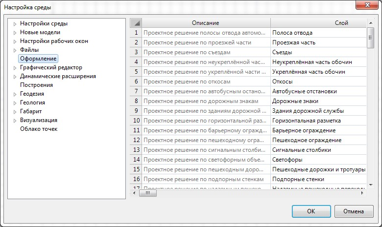

2. В правой части данного окна имеется таблица, в графе **Слой**, напротив необходимого элемента выполните переименование требуемого слоя и нажмите **Ок**. В результате слои будут переименованы.



1. В случае, если предварительно, название слоя модели было вручную переименовано через **Менеджер слоев** (меню **Формат**), то его название сохраняется, а слой будет переименован только у вновь создаваемых моделей.
2. Настройки переименованных слоев хранятся в файле с настройками проекта. Для импорта настроек слоев в другой проект воспользуйтесь механизмом импорта\ экспорта таблиц, подробное описание работы функции имеется в документации [Запуск и Настройка Топоматик - Robur, п. Импорт\экспорт данных.](../structure_project/work_with_tables.md#importksport-dannyh)



## Графический редактор

### Видеодрайвер

В данном диалоговом окне, из соответствующего выпадающего списка, имеется возможность выбора режима видео драйвера:

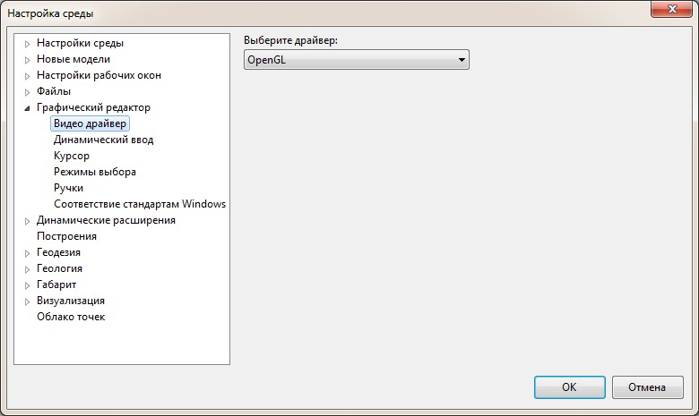

* **OpenGL** - данный режим видео драйвера является самым производительным и быстрым, поэтому при отсутствии каких - либо проблем с отрисовкой рекомендуем использовать именно данный режим.
* **Безопасный режим** - данный режим видео драйвера так же является производительным и быстрым, но выбирать его рекомендуем только при наличии каких-либо проблем отрисовки в режиме **OpenGL**.
* **Режим совместимости** - в данном режиме вся отрисовка обрабатывается за счет процессора. Данный режим является наименее производительный, поэтому выбирать его рекомендуем только при наличии серьезных проблем с отрисовкой.



 Для стабильной работы программы **{{robur}}** настоятельно рекомендуем установить последнюю версию драйвера для видеокарты.



### Динамический ввод

Данное окно предоставляет возможность выполнить различные настройки отображения **Динамического ввода**:

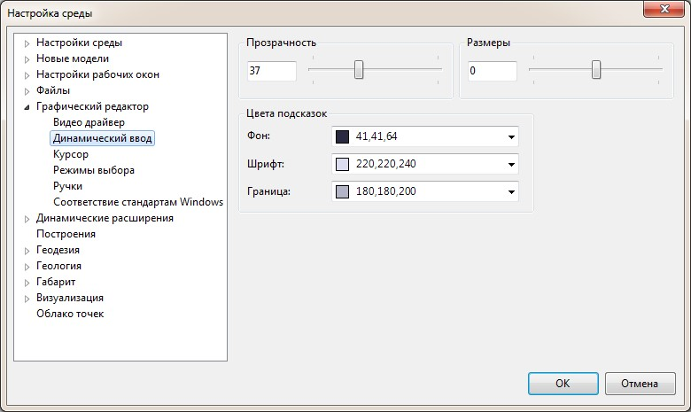

* **Прозрачность** – параметр, определяющий прозрачность **Динамического ввода**. Установите нужное значение, передвинув ползунок, либо задав в поле ввода значение в диапазоне от 0 до 100.
* **Размеры** – параметр, определяющий размеры **Динамического ввода**. Установите нужное значение, передвинув ползунок, либо задав в поле ввода значение в диапазоне от -3 до 3.

* В поле **Цвет подсказок** имеется возможность задавать цвет каждого элемента **Динамического ввода** – **Фон, Шрифт** и **Граница**.

### Курсор

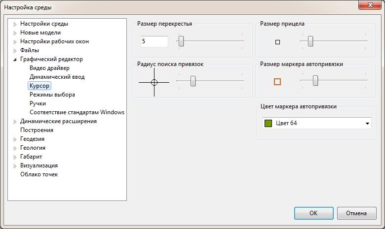

* **Размер перекрестия** - параметр, определяющий размер перекрестия. Установите нужное значение, передвинув ползунок, либо задав в поле ввода значение в диапазоне от 1 до 100.
* **Размер прицела** – параметр, определяющий размер прицела, располагающегося в центре перекрестия. Перемещение ползунка к правой границе – увеличивает размер прицела, к левой – уменьшает.
* **Размер маркера автопривязки** – параметр, определяющий размер маркера автопривязки. Перемещение ползунка к правой границе – увеличивает размер прицела, к левой – уменьшает.
* **Цвет маркера автопривязки** - в данном выдающем списке имеется возможность выбирать цвет маркера автопривязки.
* **Радиус поиска привязок** – параметр, определяющий, насколько близко надо подвести курсор к характерной точке объекта, чтобы сработала привязка к ней. Перемещение ползунка к правой границе – увеличивает радиус поиска, к левой – уменьшает.

### Режим выбора

В данном диалоговом окне предоставляется возможность настройки **Режима выбора объектов**:

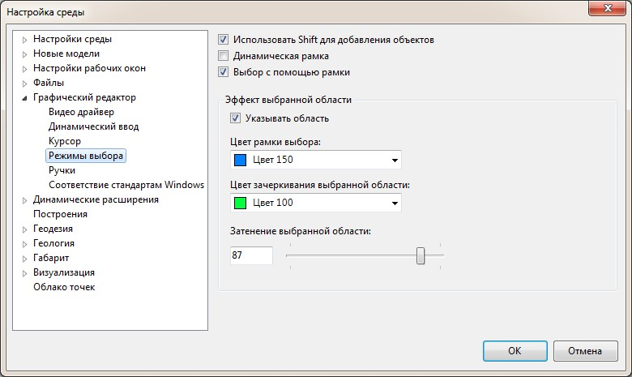

* **Использовать Shift для добавления объектов** – при включенной опции, добавление объекта в набор производится с нажатой клавишей **SHIFT**. При выключенной опции добавление объектов производится с помощью левой кнопки мыши. Удаление элемента из набора всегда производится с использованием клавиши **SHIFT**.

* **Динамическая рамка** – при включенной опции, для создания секущей рамки выбора, необходимо указать одну точку, и не отпуская левой кнопки мыши указать вторую точку. Если опция отключена, то для формирования рамки выбора достаточно просто указать две разные точки с помощью левой кнопки мыши.
* **Выбор с помощью рамки** – при выключенной опции выбор объектов производится с помощью мыши. При включении данной опции, выбор объектов производится с помощью динамической рамки.



Рамка выбора имеет два режима:

1. **Слева – Направо** – в набор попадают только те объекты, которые полностью оказались в области рамки.
2. **Справа – Налево** – в набор попадают как полностью лежащие в пределах области рамки, так и пересекающие эту область объекты.



* **Указывать область** – включение опции позволяет выделять область рамки выбора цветом. **Цвет рамки выбора** и **Цвет зачеркивания** выбранной области выбирается в соответствующих селекторах.
* **Затенение выбранной области** – опция, определяющая прозрачность фона для выбранных с помощью рамки областей.

### Ручки

Диалоговое окно, предоставляет возможность, с помощью ползунка изменять размер ручек, а также с помощью соответствующих выпадающих списков задавать цвета ручек:

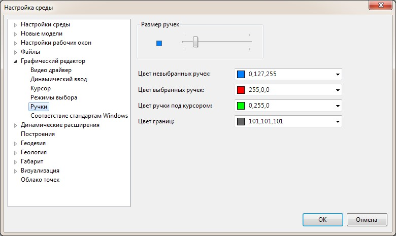

### Соответствие стандартам Windows

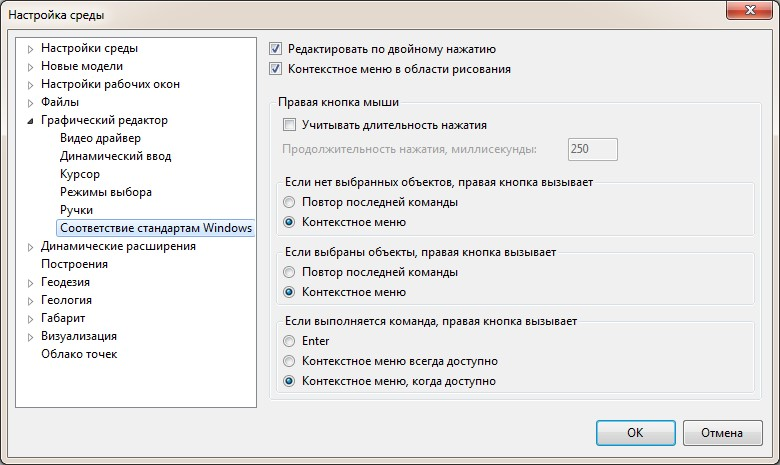

* **Редактировать по двойному нажатию** – включение данной опции позволяет переходить в режим редактирования по двойному нажатию левой кнопки мыши.
* **Контекстное меню в области рисования** – включение опции позволяет открывать контекстное меню при нажатии правой кнопки мыши в области рисования. Если флажок снят, щелчок правой кнопкой мыши воспринимается как нажатие клавиши **ENTER**.
* **Учитывать длительность нажатия** – управление событиями, происходящими при щелчке правой кнопкой мыши. Кратковременное нажатие правой кнопкой мыши эквивалентно нажатию клавиши **ENTER**. Более продолжительное нажатие кнопки вызывает контекстное меню. Имеется возможность задания продолжительности долгого нажатия в миллисекундах.

* **Если нет выбранных объектов, правая кнопка вызывает**:
  * Повтор последней команды.
  * Контекстное меню.
* **Если выбраны объекты правая кнопка вызывает**:
  * Повтор последней команды.
  * Контекстное меню.
* **Если выполняется команда, правая кнопка вызывает:**
  * Enter.
  * Контекстное меню всегда доступно.
  * Контекстное меню, когда доступно (при выполнении какой либо команды, активация контекстного меню происходит, если в текущий момент имеются доступные параметры).

## Динамические расширения

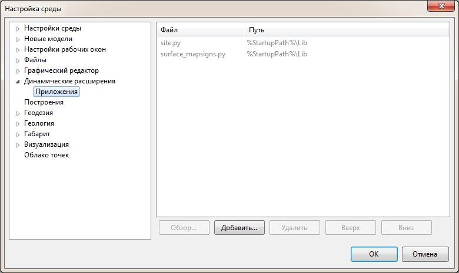

В данном диалоговом окне имеется возможность добавления приложений.

## Построения

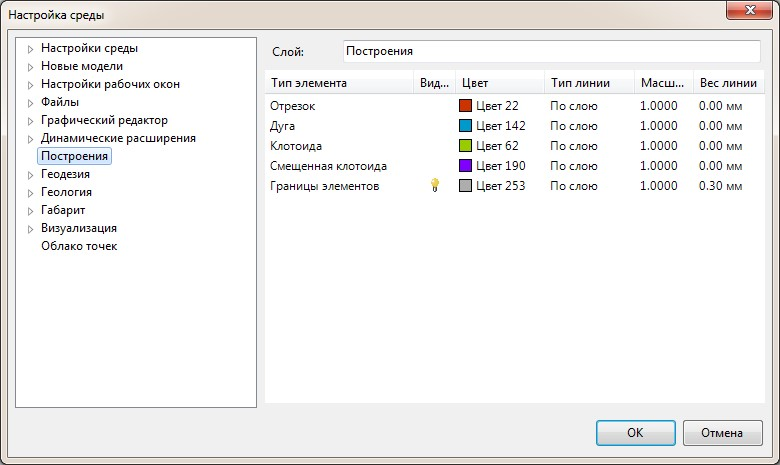

Данное окно позволяет настроить параметры отображения таких элементов как **Отрезок, Дуга, Клотоиды, Смещенная клотоида, Границы элементов**, которые используются при построении сопряжений (меню: **Ситуация - Построения**).

## Выходная документация

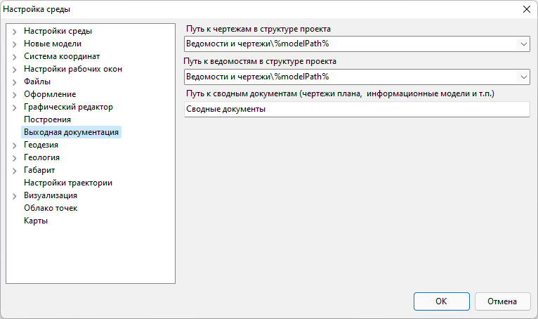

В данном разделе представляется возможным задать местоположение создаваемых выходных документов в Структуре проекта.

## Геодезия

### Настройка рабочей среды геодезии

В данном разделе можно задавать следующие настройки, влияющие на расчет и редактирование данных тахеометрической съемки:

* При создании новой тахеометрической стоянки на основе вкладки **Измерения** (кнопка **Создать стоянки тахеометрии по выделенным станциям**) в качестве ориентира принимается первая точка находящаяся в таблицы **Измерения с выбранной станции**.
* При импорте измерений из файла съемки, стоянки тахеометрии на соответствующей вкладке могут быть созданы автоматически.

Также, по настройке, при удалении какого-либо геодезического пункта (например, тахеометрической станции) могут удаляться все точки, на которые с него были сделаны измерения.

Более подробно данный функционал программы рассмотрен в разделе [Геодезия](../../../rb_survey/survey/basic_concepts.md).

### Представление чисел

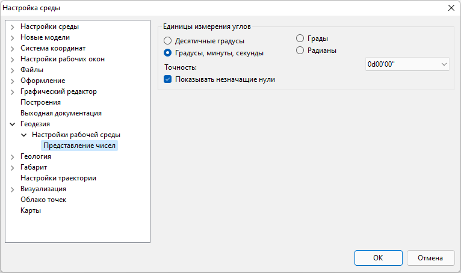

В данном поле имеется возможность задать единицы измерения углов, а также из выпадающего списка выбрать необходимую точность данных значений.

## Геология

### Настройка рабочей среды геологии

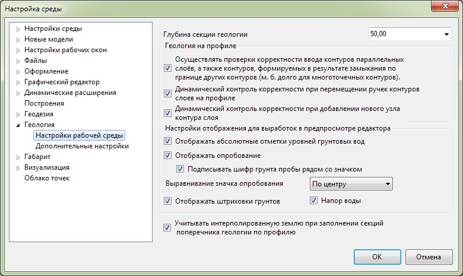

* **Глубина секции геологии** - задается максимальная глубина создаваемой базовой секции геологии на профиле и поперечниках.

* В поле **Геология на профиле** могут быть заданы необходимые проверки на корректность ввода контуров и добавления узлов.

* В поле **Настройки отображения для выработок** имеется возможность настроить отображаемую информацию на предпросмотре в окне **Выработки (Глобальные выработки)**.

* Опция **Учитывать интерполированную землю при заполнении секции поперечника геологии по профилю** подробно была описана в [Обработка геологических данных, гл. Нанесение геологических слоев на поперечные профили](../../../rb_survey/glg/application_geological_layers_cross_profiles.md).

### Дополнительные настройки

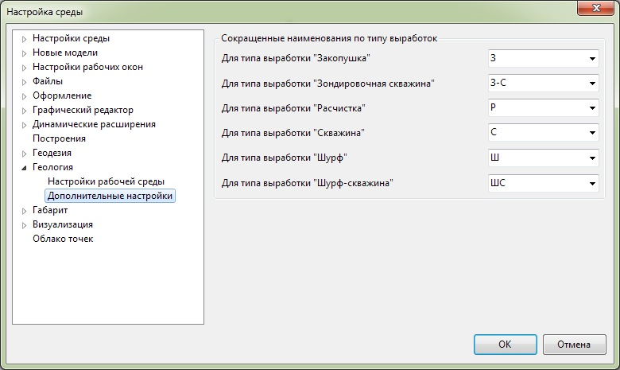

В данном разделе настроек задается сокращенные наименования различных типов выработок.

## Настройка габаритов

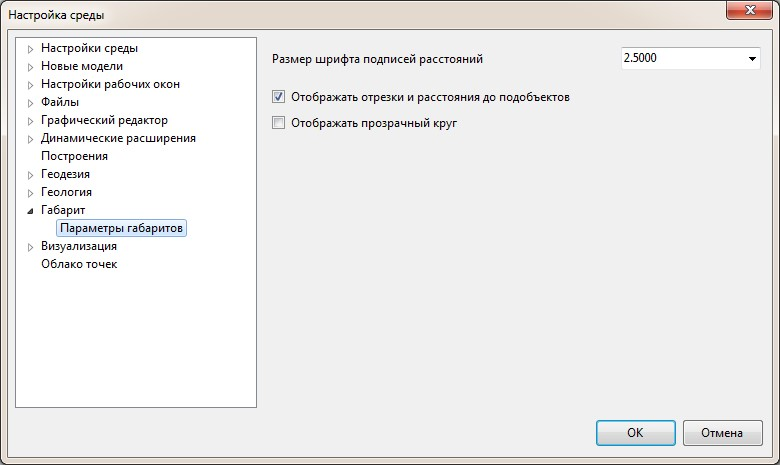

В данном окне имеется возможность настроить отображение объектов типа **Габарит**.

## Визуализация

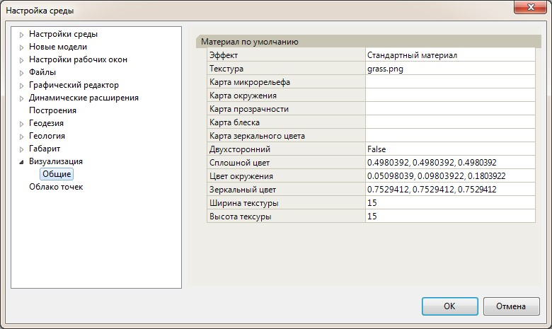

В данном диалоговом окне задаются настройки касающиеся визуализации проектного решения.

## Облако точек

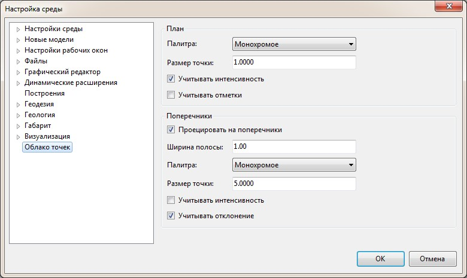

В данном окне имеется возможность настроить отображения\представления объекта типа Облако точек.



Более подробно данные настройки рассматриваются в [Лазерное сканирование](../../../commons_tasks/lidar/general_information.md).



## Настройки траектории

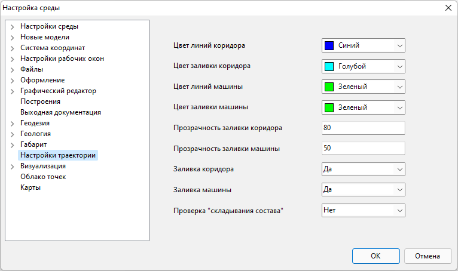

В данном разделе можно задать параметры отображения элементов траектории движения автомобиля при использовании функционала [Оценка траектории движения](../../../road/road_tasks/assessment_trajectory.md).

## Карты

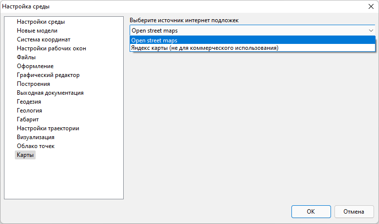

В данном разделе можно выбрать ресурс, который необходимо использовать в качестве картографической подложки (см. подробнее в [Загрузка интернет карт](../../../commons_tasks/maps/load_internet_cards.md)).
