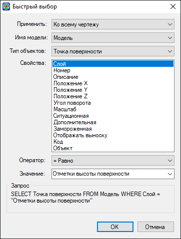

# Быстрый выбор

Функция **Быстрый выбор** предназначена для выбора, например, Точек поверхности по их свойствам (отметке, описанию и т. д.), по назначенным на них типам или классификациям объектов.

Выберите меню **Сервис – Быстрый выбор**, откроется диалоговое окно:

## Применить

* **Ко всему чертежу** – отбор объектов будет производиться по всему проекту.

* **К текущему набору** – данная функция позволяет сделать отбор из подмножества объектов, если они заранее были выбраны вручную секущей рамкой выбора.

## Имя модели

**Модель**, **Чертеж**, **Макет** – текущий режим редактирования проекта, в котором будет производиться отбор объектов.

## Тип объектов

Каждому **Имени модели** (Модель, Макет, Чертеж) соответствуют свои **Типы объектов**. Например, для **Модели** характерны такие типы объектов как **Точка поверхности**, **Структурная линия**, **Треугольник** и др., в то время как для **Чертежа** это наборы примитивов.



Если заранее было выбрано подмножество объектов вручную, а применимость установлена **К текущему набору**, то выпадающий список **Тип объекта** будет содержать только те объекты, из которых состоит данное подмножество.



## Свойства

В данном списке можно выбрать свойства, которые войдут в критерий отбора. Конкретный набор свойств зависит от использованных **Типов объектов** в процессе работы с проектом.



В критерий отбора можно выбрать только одно из доступных свойств.



## Оператор

В качестве критерия фильтра можно установить, например, равенство или неравенство выбранного **Свойства** (см. выше) некоторой величине (см. ниже), при помощи набора имеющихся **Операторов**.

## Значение

В данном поле задается некоторая величина, относительно которой с учетом **Оператора** будет вестись отбор по выбранному **Свойству**.
