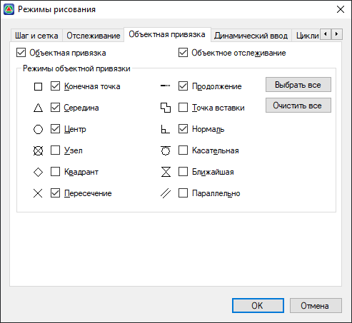
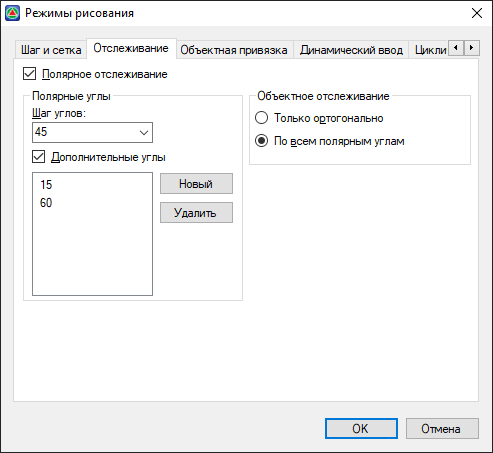
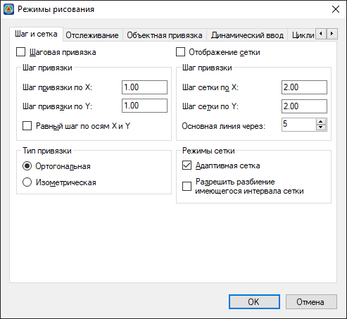
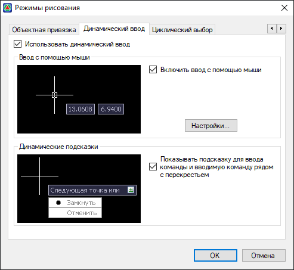
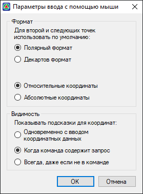
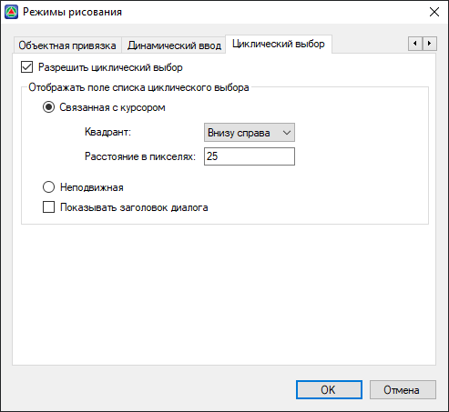
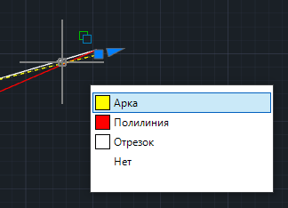

# Режимы рисования

Для настройки режимов рисования выберите меню **Сервис – Режимы рисования**. Откроется окно, состоящее из нескольких вкладок.



## Объектная привязка

* **Объектная привязка** – включает/отключает все режимы объектных привязок.
* **Объектное отслеживание** – включает/отключает режим объектного отслеживания. Отслеживание используется для формирования точек посредством построений, привязанных к паре выбранных точек на существующих элементах чертежа.





## Отслеживание

* **Полярное отслеживание** – при включении данной опции, появляется возможность «привязываться» к определенным полярным углам, шаг которых задается через селектор **Шаг углов**. Также с помощью кнопки **Новый** можно ввести дополнительные углы, к которым будет происходить привязка.
* **Только ортогонально** – отслеживание принудительно производится только по ортогональным углам (0, 90, 180, 270).
* **По всем полярным углам** – отслеживание принудительно производится по всем полярным углам, которые заданы в селекторе **Шаг углов** и в поле **Дополнительные углы**.



Режим **Объектное отслеживание** и **Полярное отслеживание** одновременно не могут быть включены.







## Шаг и сетка

* **Шаговая привязка** – включение/отключение шаговой привязки. Позволяет "привязать" все точки, указанные графическим курсором к фиксированным точкам графической области, размещенным с заданным шагом.

* **Шаг привязки по Х** может отличаться от **Шага привязки по У** и задаваться в соответствующих полях отдельно.

   С помощью опции **Равный шаг по осям Х и У**, при изменении значения шага привязки по **оси Х**, программа автоматически скорректирует и значение шага по **оси У**.

* **Тип привязки** – Ортогональная и Изометрическая.

* **Отображение сетки** – включение/отключение отображения сетки в рабочей области.

* В полях ввода **Шаг сетки по Х** и **по У** указывается шаг отображения сетки по осям Х и У соответственно.



Шаг видимой на экране вспомогательной сетки не обязательно должен совпадать с сеткой шаговой привязки.



При уменьшении масштаба чертежа на экране, точки сетки гуще усеивают рабочую область, и при определенной предельной густоте программа перестает отображать сетку. Опция **Адаптивная сетка** позволяет отображать сетку при любом масштабе путем автоматического увеличения шага отображения сетки.

Опция **Разрешить разбиение имеющегося интервала сетки** позволяет при уменьшении масштаба чертежа или его визуальном увеличении, автоматически разбивать и отображать сетку с меньшим шагом.





## Динамический ввод

**Использование динамического ввода** во время выполнения тех или иных команд позволяет отслеживать и вводить значения координат, размеров и т. п., а также отображает подсказки прямо в рабочем пространстве программы у курсора, т. е. динамически.

Если **Ввод с помощью мыши** включен, то у курсора отображаются поля с динамически меняющимися значениями в зависимости от перемещения курсора. Например, при вводе отрезка перед указанием его первой точки в динамическом поле отображаются координаты каждого текущего положения курсора, которые, кроме того, можно ввести прямо с клавиатуры.



Если у курсора находится более одного поля с динамическими данными, в которые требуется вводить значения с клавиатуры, используйте клавишу **Tab** для переключения между ними.



**Динамические подсказки** во время выполнения команд вносят ясность в действие, которое необходимо совершить пользователю для продолжения выполнения команды, или указывает на возможность изменить это действие.

Чтобы изменить параметры **Ввода с помощью мыши**, нажмите **Настройки**. Откроется окно:

Для динамической информации у курсора во время исполнения команд, выполняющих отрисовку объектов путем указания точек, можно изменить **Формат**:

* **Полярный формат** - отсчитывает значение угла, определяет длину сегмента между конечными точками.
* **Декартов формат** - отсчитывает значения приращений по X и по Y.
* **Относительные координаты** - отсчет значений приращений ведется относительно предыдущей указанной точки.
* **Абсолютные координаты** - отсчет координат указываемых точек ведется от начала системы координат (можно использовать только вместе с **Декартовым форматом**).



Координаты первой указываемой точки всегда абсолютные.



**Видимость** динамических полей координат:

* **Одновременно с вводом координатных данных** - динамические поля с координатами появляются в момент ввода значений с клавиатуры.
* **Когда команда содержит запрос** - динамические поля с координатами появляются в момент начала выполнения соответствующей команды.
* **Всегда, даже если не в команде** - динамические поля с координатами отображаются у курсора всегда.





## Циклический выбор

Включенная функция **Циклического выбора** позволяет осуществить выбор необходимого элемента в рабочей области программы, в случае если в одном месте пространства наложено друг на друга несколько элементов.

Если для списка выбрана настройка **Связать с курсором**, то он отображается в одном из **Квадрантов** курсора и расположен на определенном **Расстоянии в пикселях** от него.

Если для списка выбрана настройка **Неподвижный**, то он будет зафиксирован в одном и том же месте в рабочей области программы.

Настройка **Показывать заголовок диалога** включает/выключает отображение соответствующей подсказки над списком.


