# Среда

Чтобы задать настройки **Рабочей среды**, **Моделей**, **Файлов**, **Графического редактора** и т. д. выберите меню **Сервис - Настройка**.



## Настройки среды

### Основные настройки

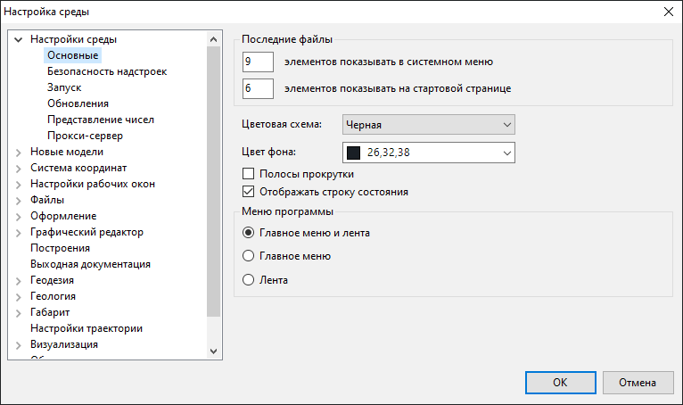

* В поле **Последние файлы** можно задавать количество элементов, отображаемых, в системном меню и на стартовой странице.
* **Цветовая схема** – в данном выпадающем списке можно выбирать цветовую схему интерфейса.



Изменения цветовой схемы интерфейса вступят в силу после перезапуска программы.



* **Цвет фона** – в данном выпадающем списке можно выбрать цвет фона рабочего окна.
* **Отображать Полосы прокрутки**, **Строку состояния** – для включения/выключения отображения данных элементов в рабочем пространстве.
* В поле **Меню программы** можно настроить отображение основных элементов интерфейса таких как **Лента** и **Главное меню**.

### Безопасность надстроек

В данном пункте окна приведен список путей к различным файлам надстроек:

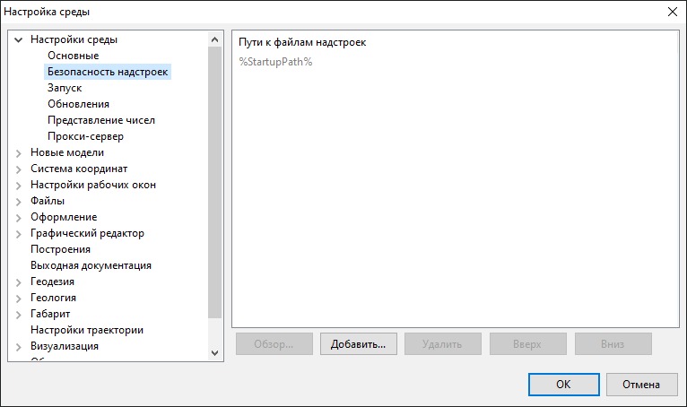

### Запуск

В данном пункте окна можно включить/выключить загрузку новостей, а также предоставление информации о пакетах обновления и бета-выпусках продуктов компании **Топоматик** на стартовой странице, а также настроить частоту обновления службы, указав необходимый временной интервал.

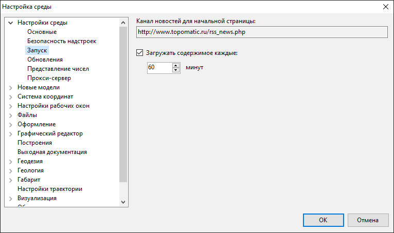

### Обновление

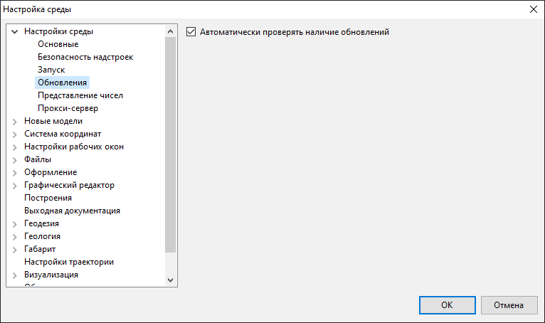

* **Автоматически проверять наличие обновлений** - включение данной опции позволяет при каждом запуске программы автоматически проверять наличие обновленных версий.

### Представление чисел

Данное пункт окна позволяет настроить отображение чисел и единицы измерения углов в проекте:

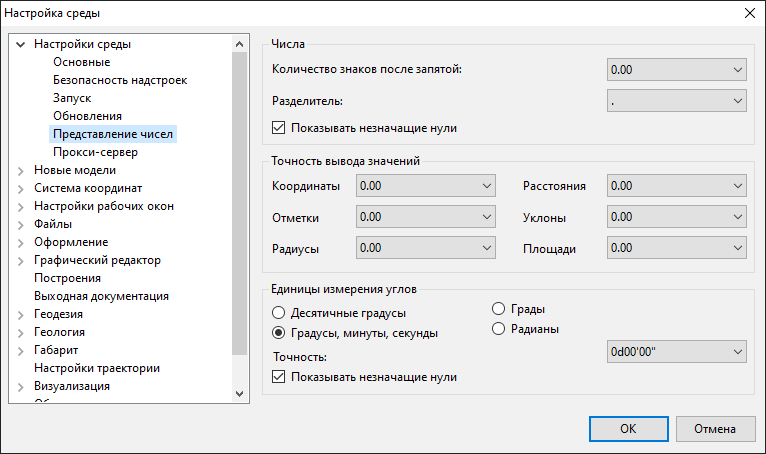

* **Количество знаков после запятой** – выпадающий список, позволяющий задать необходимое количество знаков после запятой для числовых значений. Например, если в селекторе задано значение - 0.000, то значения будут округляться до трех знаков после запятой.
* **Разделитель** - в данном выпадающем списке выбирается разделитель целой и дробной части для всех числовых значений проекта и выходных данных.
* **Показывать незначащие нули** – если в выпадающем списке значение **Количества знаков после запятой** задано больше значения в поле ввода **Округление**, то при округлении появятся незначащие нули, отображение которых можно включить или отключить, путем установки или снятия соответствующей галочки.

* В поле **Точность вывода значений** имеется возможность задать необходимое количество знаков после запятой для таких элементов как **Координаты**, **Отметки**, **Радиусы**, **Расстояния**, **Уклоны и Площади** путем выбора из выпадающего списка необходимого значения.

* В поле **Единицы измерения углов** имеется возможность задавать различные единицы измерения углов:

  * **Десятичные градусы**
  * **Градусы, минуты, секунды**
  * **Грады**
  * **Радианы**

### Прокси-сервер

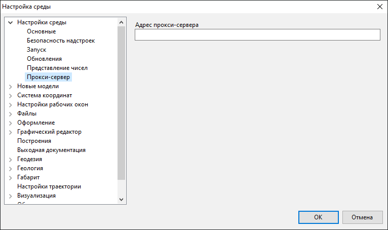

Данная настройка позволяет указать адрес ресурса, который будет использоваться в качестве посредника при обмене данными проекта.





## Новые модели

В данном разделе задаются настройки отображения/представления каких-либо элементов для каждого типа моделей проекта (**Автомобильная дорога**, **Железная дорога**, **Трасса**, **ЦММ** и др.), которые будут присвоены по умолчанию вновь создаваемым моделям.

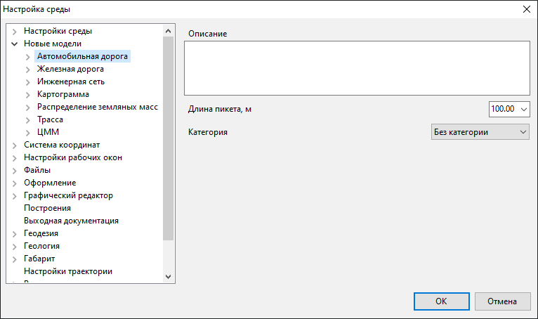





## Настройка рабочих окон

В данном диалоговом окне задаются настройки для вновь создаваемых подобъектов:

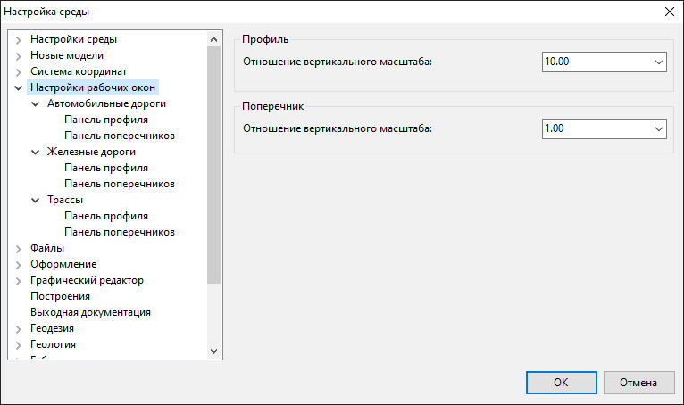

* **Отношение вертикального масштаба Профиля** – данный выпадающий список позволяет задавать отношение вертикального масштаба к горизонтальному. Параметр влияет только на отображение продольных профилей.

* **Отношение вертикального масштаба Поперечника** – данный выпадающий список позволяет задавать отношение вертикального масштаба к горизонтальному. Параметр влияет только на отображение поперечных профилей.

В пунктах, относящихся к данному разделу, находятся дополнительные настройки рабочих окон для каждого характерного типа моделей:

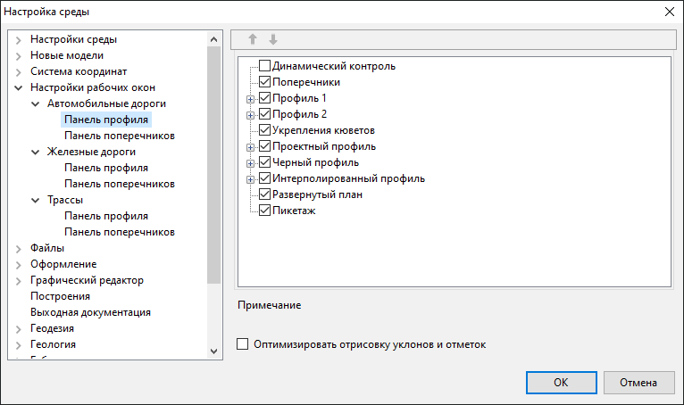

В данных пунктах имеется возможность настроить отображение необходимых элементов сетки рабочих окон **Профиль** и **Поперечник** для каждого типа моделей проекта (**Автомобильные дороги**, **Железные дороги**, **Трассы**).

Также имеется возможность **Оптимизировать отрисовку уклонов и отметок**, т.е. при зуммировании изображения в рабочих окнах **Профиль** и **Поперечник** не допускать наложения информации об уклонах и отметках на нижней панели путем упрощения ее отрисовки и исключения значений.





## Файлы

### Основные

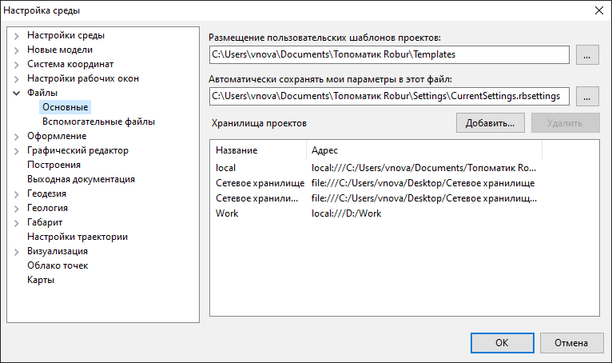

* **Размещение пользовательских шаблонов проектов** – путь, определяющий место (папку) хранения пользовательских шаблонов проектов.
* **Автоматически сохранять мои параметры в этот файл** – путь, определяющий, место хранения файла, в который производится сохранение различных параметров и данных. Например, хранится информация о последнем значении, которое было введено в поле **Динамического ввода**, и при повторном выборе какой-либо команды, по умолчанию будет предложено значение введенное ранее.
* Поле **Хранилища проектов** и функциональные кнопки **Добавить** и **Удалить** дают возможность настроить доступ к расположениям хранения проектов. Подробнее о хранилищах и настройке доступа к ним см. в следующем разделе [Хранилища проектов](storage.md).

### Вспомогательные файлы

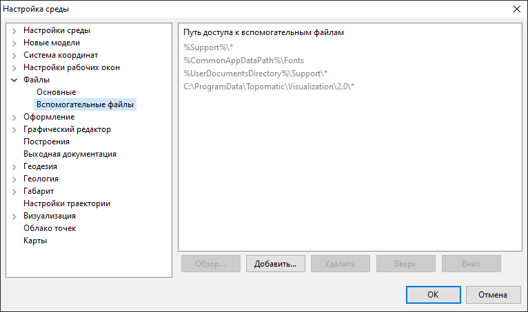

Данный пункт настроек позволяет задавать пути поиска различных вспомогательных файлов, например файлов кодификатора, шрифтов, типов линий, шаблонов штриховки и т. д.

Для того чтобы добавить новый путь доступа, выберите кнопку **Добавить**, откроется окно **Обзор папок**. Настройте путь к нужной папке и нажмите **ОК**. Выбранный путь доступа отобразится в списке вспомогательных файлов.



Дополнительные символы (\\*), введенные в конце пути доступа будут означать, что поиск производится не только в указанной папке, но и во всех вложенных (например, `C:\Program Files\`).



При необходимости удалить какой-либо путь доступа выберите кнопку **Удалить**.

Кнопками **Вверх** и **Вниз** производится перемещение путей поиска вспомогательных файлов в списке, тем самым определяя приоритет поиска. Путь доступа, располагающийся выше в списке вспомогательных файлов, имеет больший приоритет поиска, чем нижеследующий за ним.


