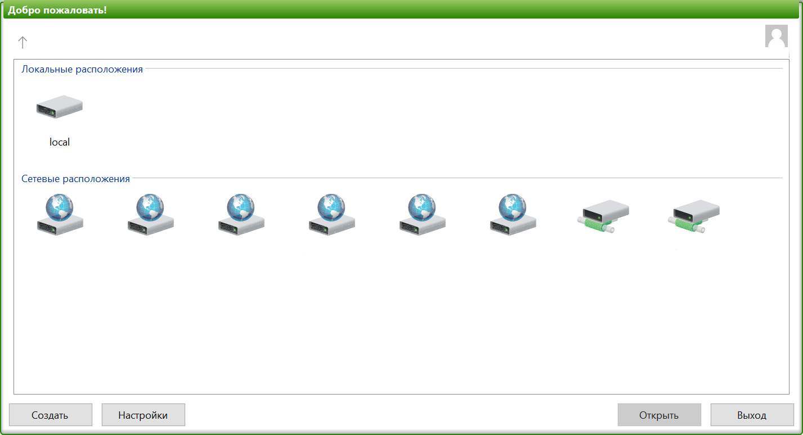
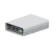
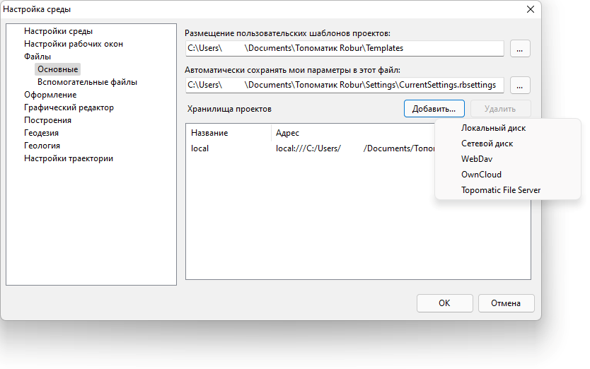
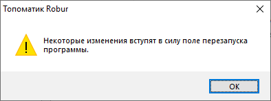

# Хранилища проектов

На стартовой странице программы представлены все подключенные **Хранилища проектов**.

**Хранилища проектов** - это расположения, в которых лежат или будут лежать проекты **{{robur}}**, на текущем компьютере или в сети.

**Хранилища проектов** разделены на **Локальные расположения** и **Сетевые расположения**.

**Локальные расположения** - это хранилища, расположенные на текущем компьютере. Данный тип хранилищ представлен иконкой . Таким локальным хранилищем может выступать, например, папка с Рабочего стола Windows.

**Сетевые расположения** - это хранилища, расположенные как на сетевых дисках, так и в облаке (на удаленном сервере). Сетевые хранилища  и облачные хранилища  отличаются между собой способом подключения их к программе.

Чтобы подключить новое хранилище к программе:

1. Нажмите **Настройки** в нижней части стартовой страницы.
2. В открывшемся окне **Настройки среды** перейдите в раздел **Файлы - Основные**.
3. В области **Хранилища проектов** нажмите кнопку **Добавить**.
4. Выберите способ подключения хранилища.
  
Способы подключения хранилищ:

* *Локальный диск* - способ подключения локального хранилища, в качестве которого выступает папка на текущем компьютере.

* *Сетевой диск* - способ подключения сетевого хранилища, в качестве которого выступает, например, папка на сетевом диске организации, причем это тот сетевой диск, который уже подключен к текущему компьютеру по локальной сети организации.

* *WebDav* - способ подключения облачного хранилища по одноименному протоколу. В качестве такого облачного хранилища может выступать, например, папка на удаленном сервере организации. Подключение данным способом происходит через Интернет. Также при помощи данного способа можно подключить папку из облачного сервиса.

* *OwnCloud* - сетевое расположение хранилищ на базе облачного сервиса ownCloud.

Выбранный способ подключения хранилища также влияет на первоначальные настройки доступа к нему (к хранилищу).

В случае если выбран *Локальный диск* или *Сетевой диск*, программа откроет окно **Обзор папок**, в котором будет предложено выбрать расположение той или иной папки хранения проектов.

В случае выбора любого другого способа программа попросит ввести интернет-адрес ресурса, к которому необходимо подключиться, логин и пароль (в случае если ресурс этого требует) и только потом откроет окно **Обзор папок**, в котором также необходимо выбрать расположение папки хранения проектов.

Вне зависимости от выбранного способа подключения хранилища после выбора его расположения в окне **Обзор папок** нажмите **ОК** и измените имя хранилища (если необходимо) - данное имя будет отображаться на стартовой странице программы.

Нажмите **ОК** и перезапустите программу.



Перезапуск программы после добавления хранилищ нужен для того, чтобы добавленные хранилища отобразились на стартовой странице.

О необходимости перезапуска программы будет свидетельствовать следующее предупреждение:



Чтобы открыть хранилище, на стартовой странице дважды щелкните левой кнопкой мыши по нему.

Хранилище может содержать в себе как проекты, так и папки с проектами. Условные обозначения проектов:

 - проект, созданный в текущей версии программы.
  - проект, созданный в предыдущей версии программы.
 ,  и  - специализированные обозначения проектов, включенных в состав коллективной работы.

В зависимости от того из какого хранилища (локального, сетевого или облачного) открыт проект, он будет работать с некоторыми отличиями. Например, если проект открыт из локального хранилища, то сохранять изменения в проекте нужно вручную, в то время как изменения в проекте, открытом из сетевого или облачного хранилища, сохраняются автоматически при смене активной модели на другую.

Более подробно отличия типов хранилищ друг от друга и разница в работе проекта, открытого из того или иного хранилища, представлены в сводной таблице ниже.

Сводная таблица основных отличий **Локальных расположений** от **Сетевых расположений** приведена ниже.

 #|
||                                         | **Локальные расположения** {.cell-align-center} | **Сетевые расположения** {.cell-align-center} | > ||
|| **Типы хранилищ**                       | Локальные хранилища
 {.cell-align-center} | Сетевые хранилища
 {.cell-align-center} | Облачные хранилища
 {.cell-align-center} ||
|| **Способы подключения хранилищ**        | Локальный диск {.cell-align-center} | Сетевой диск {.cell-align-center} | WebDav, OwnCloud {.cell-align-center} ||
|| **Расположение мест хранения проектов** | Папка с проектами находится на локальном диске текущего компьютера | Папка с проектами находится на сетевом диске, который подключен к текущему компьютеру средствами Windows, или на локальном диске текущего компьютера | Папка с проектами находится на удаленном сервере или в облачном сервисе, подключение к которым осуществляется через Интернет ||
|| **Отличия в работе проектов**           | Сохранение изменений в проекте выполняется вручную | Сохранение изменений в проекте выполняется автоматически при смене активной модели на другую | Сохранение изменений в проекте выполняется автоматически при смене активной модели на другую ||
|| ^                                       | Нельзя работать коллективно | Можно работать коллективно | Можно работать коллективно ||
|| ^                                       | - {.cell-align-center} | Возможна работа над проектом вне сети (offline). Создается резервная копия проекта на текущем компьютере | Возможна работа над проектом вне сети (offline). Создается резервная копия проекта на текущем компьютере ||
|#
