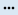
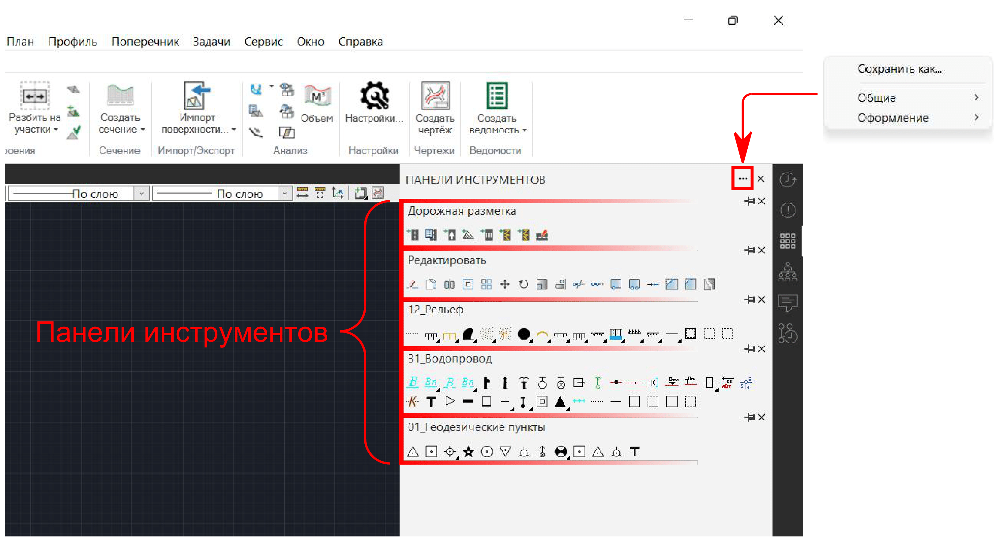
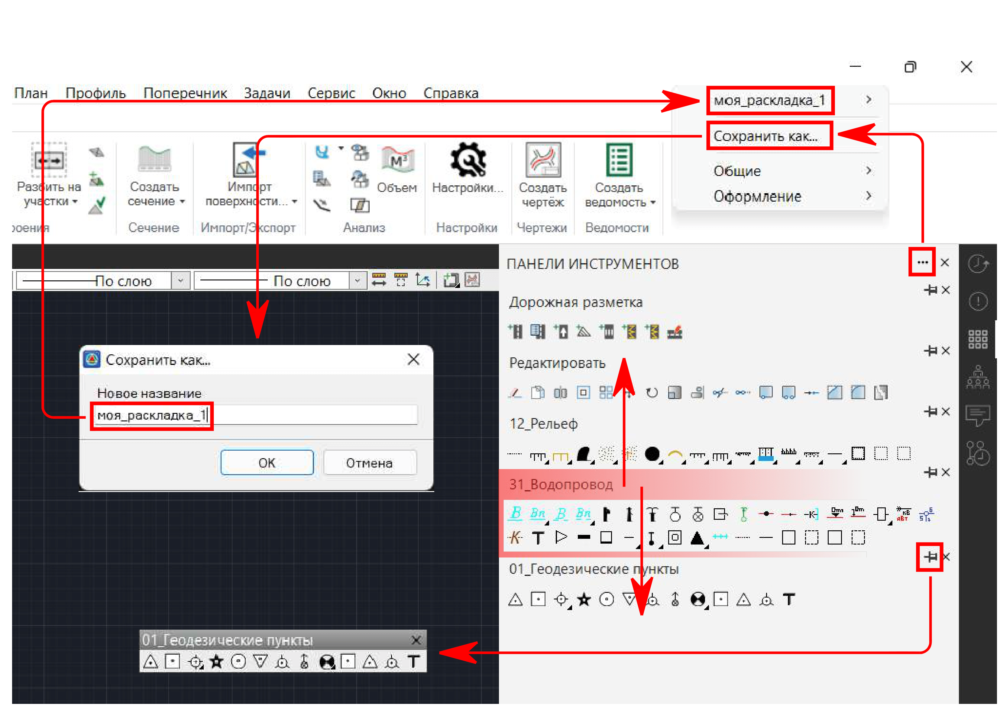
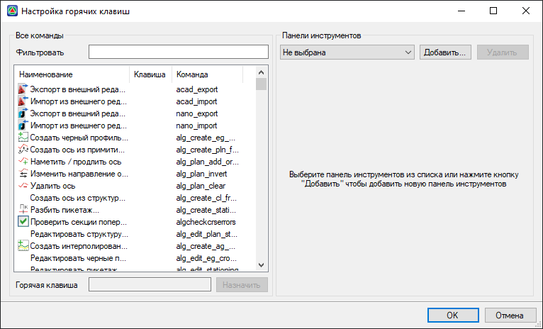
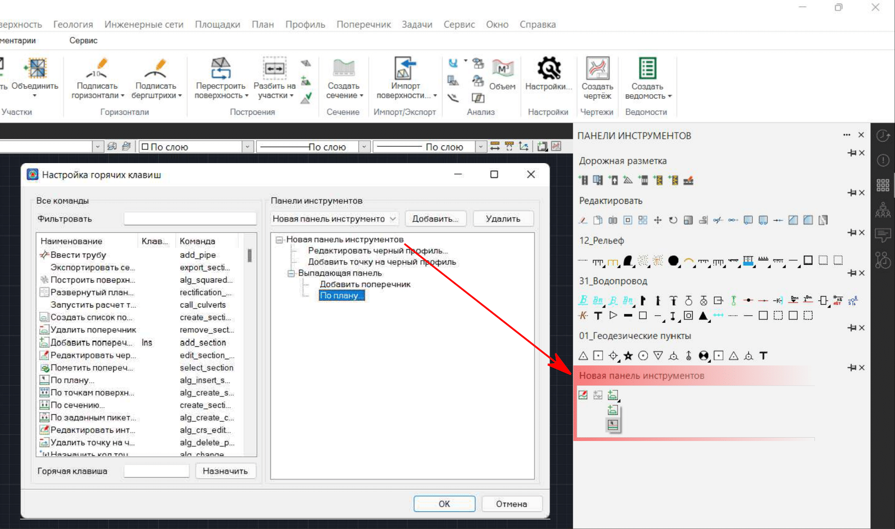
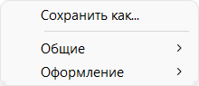

# Адаптация

**Панели инструментов** - это наборы функциональных кнопок для вызова инструментов, разделенные по назначению этих инструментов на панели и группы для решения тех или иных задач, например, задач оформления топографического плана.

Чтобы отобразить все панели инструментов и "достать" необходимые, выполните следующее:

1. На одной из **Панелей активности** выберите **Панели инструментов ** (см. подробнее в [Интерфейс программы](../startup_program/interface_program.md)).
2. Справа от наименования открывшегося окна **Панели инструментов** нажмите , перейдите в раздел **Общие** или **Оформление** и выберите интересующую панель инструментов:

   

Добавленные панели инструментов можно перемещать вверх/вниз относительно друг друга в окне, а также откреплять  их от окна, что позволяет разместить их в любом удобном на экране месте.

Чтобы сохранить текущее расположение панелей инструментов, нажмите  и выберите **Сохранить как**. В открывшемся окне введите наименование раскладки и нажмите ОК.

Созданную раскладку панелей инструментов можно восстановить в любое время, снова нажав , далее выбрав наименование вашей раскладки и **Загрузить**.

Помимо имеющегося ряда стандартных панелей инструментов в программе имеется возможность создавать пользовательские, а также назначать горячие клавиши для вызова инструментов.

Чтобы создать и настроить пользовательские наборы инструментов, а также назначить тем или иным инструментам горячие клавиши и посмотреть их консольные команды, перейдите в меню **Сервис - Настройка панелей инструментов**. Откроется окно:

## Создание пользовательской панели инструментов

В области **Панели инструментов** представляется возможным настроить наборы инструментов, объединив их в одну панель с пользовательским наименованием. Чтобы настроить пользовательскую панель инструментов, выполните следующее:

1. Выберите **Добавить**, введите наименование создаваемой панели и нажмите ОК.
2. Перетащите необходимые инструменты из области **Все команды** в настраиваемую панель.

Кроме того, панели инструментов поддерживают вложенность, т. е. в одну кнопку вызова инструмента можно добавить несколько других инструментов. Для настройки вложенности инструментов выполните следующее:

1. На инструменте, добавленном в панель, нажмите **ПКМ - Превратить в выпадающую панель**.
2. В созданную ветку **Выпадающая панель** перетащите необходимые инструменты из области **Все команды** или те, которые уже были добавлены в настраиваемую панель.
3. Таким образом инструменты, добавленные в ветку **Выпадающая панель**, будут объединены в общую кнопку, удерживая **ЛКМ** на которой раскроются сгруппированные в нее инструменты. Такая кнопка с инструментами отмечена черным треугольником у ее нижнего края, а изображена на ней иконка последней использованной команды из данной группы.



 Все пользовательские панели инструментов попадают в раздел **Общие**.

 



## Назначение горячих клавиш

В области **Все команды** всем представленным в ней инструментам можно назначить горячие клавиши и посмотреть их консольные команды. Для назначения горячей клавиши тому или иному инструменту:

1. Выделите инструмент в списке (при необходимости воспользуйтесь полем **Фильтровать** для поиска инструмента по его наименованию).
2. В поле **Горячая клавиша** нажмите клавишу или комбинацию клавиш, по которой программа будет осуществлять вызов этого инструмента, и нажмите **Назначить**.

   

   Клавиши набора текста (буквы и цифры) вне комбинаций использовать в качестве горячих нельзя. Используйте клавиши из ряда **F1...F12**, а также **Delete** и **Insert**.

   Комбинации, используемые в качестве горячих клавиш, представляют собой сочетания вида:

   * **Shift+Insert**, **Shift+Delete**, **Shift+F1...F12**
   * **Ctrl+Insert**, **Ctrl+Delete**, **Ctrl+F1...F12**, **Ctrl+0...9**, **Ctrl+A...Z**
   * **Alt+Backspace**, **Alt+(←)**, **Alt+(↑)**, **Alt+(→)**, **Alt+(↓)**, **Alt+F1...F12**, **Alt+0...9**
   * **Ctrl+Shift+F1...F12**, **Ctrl+Shift+0...9**, **Ctrl+Shift+A...Z**

   

По завершении всех настроек, нажмите ОК. Изменения по горячим клавишам и панелям инструментов вступят в силу после перезапуска программы.
