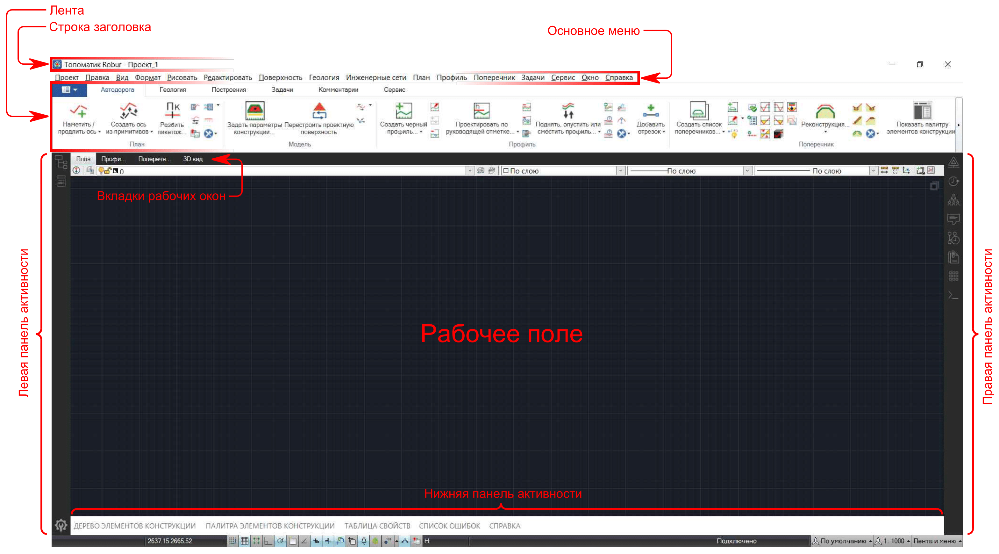
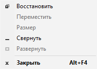
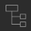
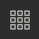

# Интерфейс программы

Ниже представлено главное окно программы, которое появляется по умолчанию после создания нового проекта.



Возможны незначительные отличия интерфейса программы, связанные с ее используемой конфигурацией и индивидуальными настройками.



Далее подробнее об основных элементах интерфейса.



## Строка заголовка

Данный элемент содержит пиктограмму и информацию о наименовании используемого программного продукта, а также название открытого проекта.

Если по Строке заголовка щелкнуть правой кнопкой мыши, появится следующее контекстное меню:

* **Свернуть** - опция, позволяющая свернуть главное окно программы. Чтобы снова его развернуть, на Панели задач Windows нажмите на иконку программы **{{robur}}**.
* **Восстановить** - опция, позволяющая уменьшить размер главного окна, если до этого оно было развернуто на полный экран. Чтобы снова развернуть главное окно на полный экран воспользуйтесь опцией **Развернуть**.
* **Закрыть** - опция, выполняющая полный выход из программы.



Также основные кнопки управления главным окном программы  расположены справа в конце Строки заголовка.







## Основное меню

Располагается под Строкой заголовка главного окна и включает в себя набор основных рабочих команд, сгруппированных определенным образом.

Наименования определенных команд меню могут заканчиваться обозначениями в виде стрелки, которая информирует о том, что данная команда содержит вложенное подменю, или многоточия, которое в свою очередь информирует об открытии диалогового окна после выбора соответствующей команды.





### Лента

Представляет собой гораздо более наглядный вариант представления основных рабочих команд.

Все рабочие команды в Ленте распределены определенным образом по вкладкам, а во вкладках разделены на группы по своему прямому назначению. Кроме того набор основных рабочих команд в Ленте динамически подстраивается под выполняемые задачи.

Наименования определенных команд на Ленте могут заканчиваться обозначениями в виде стрелки, которая информирует о том, что данная команда содержит дополнительные схожие с ней команды. Нажав на наименование такой команды, раскроется список дополнительных команд. Последняя использованная команда в данном случае попадет на Ленту и заменит предыдущую, в то время как предыдущая команда уйдет в список дополнительных.





## Рабочие окна

Основные рабочие окна - это **План**, **Профиль**, **Поперечник**, **3D вид**. Именно в них отображаются и редактируются все элементы проекта. Каждое рабочее окно имеет свою вкладку и свое рабочее поле. Также каждое рабочее окно имеет свою строку заголовка, в котором указывается его наименование, в случае если оно откреплено от главного окна программы. Подробнее о компоновке рабочих окон описано в [Настройка основных рабочих окон](../startup_program/setting_working_windows.md).





## Панели активности

Расположены по краям главного окна программы.

Панели активности выполняют функцию быстрого доступа к таким элементам интерфейса как Структура проекта , Командная строка , Панели инструментов  и др.

Чтобы увидеть полный список элементов интерфейса, доступных для добавления на Панель активности, щелкните по любой Панели активности правой кнопкой мыши. Если слева от наименования элемента интерфейса в раскрывшемся списке стоит галочка, значит данный элемент интерфейса уже закреплен на этой панели. Чтобы открепить элемент интерфейса от Панели активности, щелкните по нему в данном списке, тем самым сняв галочку. Аналогичным способом установите галочку на нужных элементах, чтобы закрепить их на панели активности.

Чтобы отключить/включить ту или иную Панель активности, выберите пункт основного меню **Окно** и снимите/поставьте галочку у наименования той или иной Панели активности.


