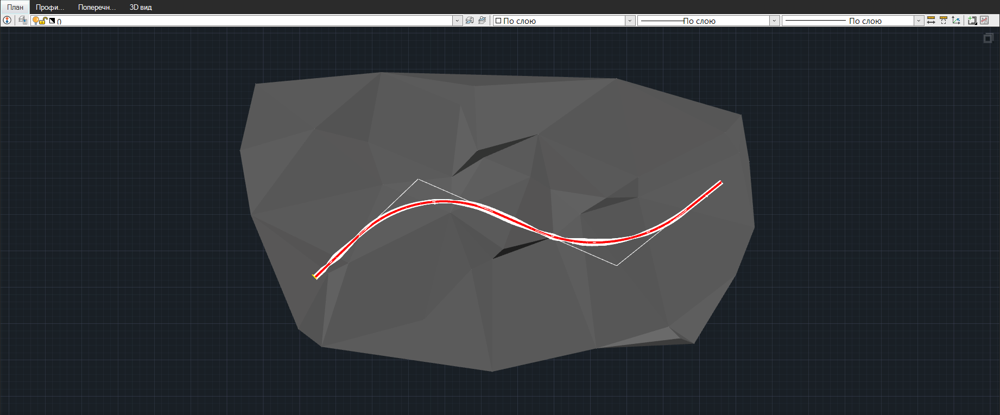
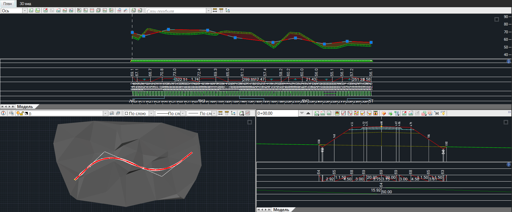
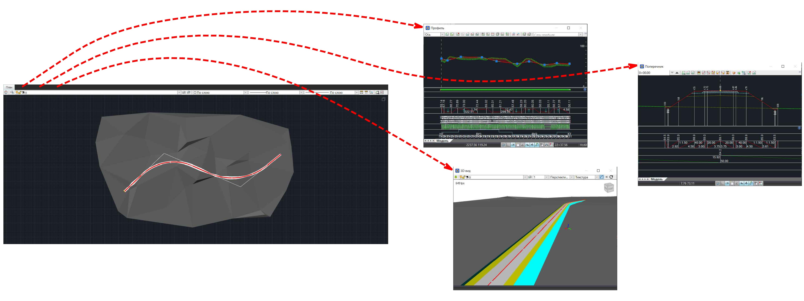

# Рабочие окна

В зависимости от выполняемой задачи программа имеет следующие основные рабочие окна: **План**, **Профиль**, **Поперечник**, **3D вид** и др.

Данные в рабочих окнах взаимосвязаны. Редактирование в одном окне приводит к модификации данных в других окнах. Например, изменение плана трассы может приводить к соответствующей модификации ее продольного и поперечных профилей, а также автоматическому изменению объемной модели в соответствующих окнах.

При работе над проектом можно работать как с одним рабочим окном и, при необходимости, переключаться на другие, так и раскрывать несколько окон одновременно, т.е. работать в многооконном режиме.

Представление рабочих окон **План**, **Профиль**, **Поперечник** и **3D вид** на экране монитора может быть настроено пользователем следующим образом:

1. **Однооконный режим** с представлением рабочих окон в виде вкладок

   

   В данном случае отображаются данные только одного рабочего поля, рабочее окно которого является текущим. Для смены рабочего окна переключайте вкладки.

2. **Многооконный режим** с представлением рабочих окон внутри главного окна программы

   

   В данном случае отображаются данные рабочих полей, рабочие окна которых организованы и остаются внутри главного окна программы. Активно то рабочее окно, в рабочем поле которого в последний раз происходили взаимодействия. Рабочее окно **3D вид** остается доступным через вкладку, как в предыдущем случае.
   Чтобы переключаться между **Однооконным** и **Многооконным** режимами, воспользуйтесь кнопкой  или  в правом верхнем углу рабочего поля любого рабочего окна (кроме окна **3D вид**). Также при помощи элемента основного меню **Окно - Организовать ** можно переключаться между данными представлениями рабочих окон.

3. **Многооконный режим** с представлением рабочих окон, открепленных от главного окна программы

   Данный режим используется для компоновки рабочих окон в области монитора в свободном режиме, а также для вывода необходимого рабочего окна, к примеру, на второй монитор.

   

   В данном случае рабочие окна **Профиль**, **Поперечник** и **3D вид** откреплены от главного окна программы, в котором осталось рабочее окно **План**. Открепить от главного окна программы можно любое рабочее окно и любое их количество и тем самым настроить представление под себя.

   Чтобы перейти в данный режим представления рабочих окон (открепить то или иное рабочее окно от главного окна программы), нажмите правой кнопкой мыши по необходимой вкладке рабочего окна и выберите **Открепить окно **.



Для быстрого открепления рабочего окна дважды щелкните левой кнопкой мыши по вкладке. Чтобы прикрепить окно, нажмите кнопку **Развернуть** в правом верхнем углу открепленного окна, либо дважды щелкните левой кнопкой мыши по Строке заголовка открепленного окна.



После открепления одного или нескольких рабочих окон для их быстрой компоновки в области монитора выберите меню **Окно - Организовать горизонтально  / вертикально **. В результате программа расположит окна программы выбранным способом.
