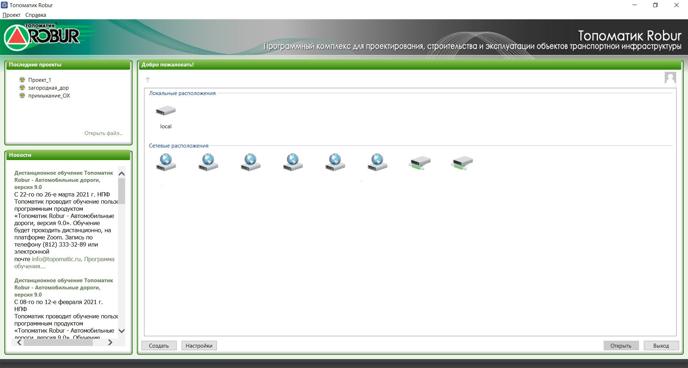
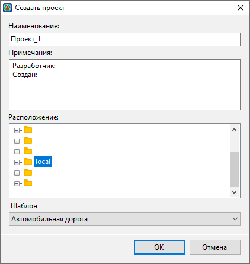
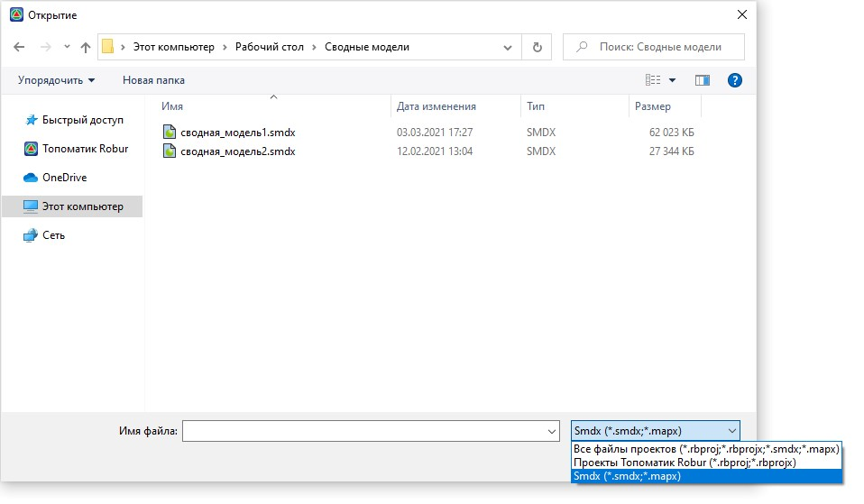
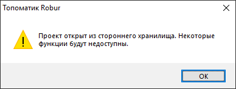
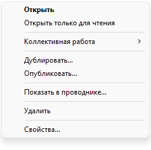

# Запуск программы

Запустите **{{robur}}**, выполнив одно из следующих действий:

* Щелкните дважды левой кнопкой мыши по иконке **{{robur}}** на рабочем столе.
* На панели задач нажмите кнопку `Пуск`, далее `Все приложения` - `{{robur}}`.

При запуске программы открывается окно стартовой страницы:



В зависимости от используемой конфигурации программы вид стартовой страницы может незначительно отличаться.



С помощью информационных полей данного окна можно создавать проекты {{robur}}, открывать уже имеющиеся, настраивать порядок их хранения, а также производить некоторые другие настройки. В поле **Новости** доступна информация, размещенная на главной странице официального сайта **НПФ Топоматик ([https://topomatic.ru](https://www.topomatic.ru/))**.



## Создание проекта

Для того чтобы создать новый проект:

1. Выберите элемент меню **Проект - Создать - Проект** или нажмите кнопку **Создать** в нижней части стартовой страницы. Появится диалоговое окно:

   

   В зависимости от конфигурации программы в поле **Шаблон** задается свой шаблон проекта, в соответствии с которым принимаются начальные настройки вновь создаваемых проектов.

2. В поле **Имя** введите наименование создаваемого проекта. При необходимости в поле ниже добавьте или отредактируйте стандартное примечание к проекту.
3. В поле **Расположение** выберите хранилище и нажмите **ОК**.

В результате, программа сразу откроет созданный проект.

Для того чтобы вернуться на стартовую страницу выберите элемент меню **Проект - Закрыть**.





## Открытие проекта

В поле **Добро пожаловать!** представлены все подключенные к программе хранилища, в которых содержатся ранее созданные проекты и папки (подробнее о хранилищах и работе с ними см. в [Хранилища проектов](../general_setting/storage.md)). Условные обозначения проектов:

  - проект, созданный в текущей версии программы.

  - проект, созданный в предыдущей версии программы.

 ,  и  - специализированные обозначения проектов, включенных в состав коллективной работы.

Чтобы открыть проект, перейдите в хранилище, в котором был создан проект, дважды щелкнув по нему левой кнопкой мыши, и из списка проектов, которые содержит данное хранилище, откройте необходимый, также дважды щелкнув по нему левой кнопкой мыши, или выберите его и нажмите кнопку **Открыть** в нижней части данного поля.



 В поле **Последние проекты** представлены наименования нескольких проектов, над которыми недавно происходило редактирование. Необходимый проект можно открыть и из данного поля.



Также проект **{{robur}}** или отдельный файл (к примеру, файл сводной модели) можно открыть из любого другого его расположения на компьютере.

Чтобы открыть проект **{{robur}}** или отдельный файл из другого расположения:

1. Выберите элемент меню **Проект - Открыть** или в поле **Последние проекты** выберите **Открыть файл**.
2. В открывшемся окне Проводника Windows укажите путь, по которому лежит проект или отдельный файл.
3. Если искомый файл будет отсутствовать по указанному пути, то укажите его точный тип.

   

   Тип файла выбирается из соответствующего выпадающего списка данного окна Проводника Windows:

   

   

4. Выберите открываемый файл и нажмите кнопку **Открыть**.

В зависимости от типа открываемого файла запустится соответствующая рабочая область в программе.



Не рекомендуем использовать данный метод открытия проекта **{{robur}}** для последующего его редактирования. Используйте данный метод исключительно для просмотра проекта.  
Проект, открытый данным способом, ограничивает некоторый функционал программы. Об этом свидетельствует следующее предупреждение, которое отобразится при открытии проекта **{{robur}}** данным способом:







## Дополнительные возможности для взаимодействия с проектом

Чтобы воспользоваться дополнительными возможностями, на стартовой странице щелкните правой кнопкой мыши по проекту. Откроется следующее контекстное меню проекта:

* **Открыть только для чтения** - позволяет открыть проект без возможности его редактирования.
* **Коллективная работа** - настройки, относящиеся к коллективной работе с проектом.
* **Дублировать** - позволяет скопировать (дублировать) проект в это или любое другое расположение, в рамках подключенных к программе хранилищ (подробнее о хранилищах и работе с ними см. в [Хранилища проектов](../general_setting/storage.md)).
* **Опубликовать** - позволяет создать нередактируемую копию проекта и дополнительно защитить ее паролем.
* **Показать в проводнике** - открывает расположение проекта через Проводник Windows (доступно не во всех типах хранилищ).
* **Удалить** - удаляет проект.
* **Свойства** - открывает окно свойств, которое содержит информацию о наименовании проекта и примечании к нему, которое в случае необходимости можно отредактировать. Также окно свойств содержит некоторые настройки проекта, относящиеся к функционалу коллективной работы.


