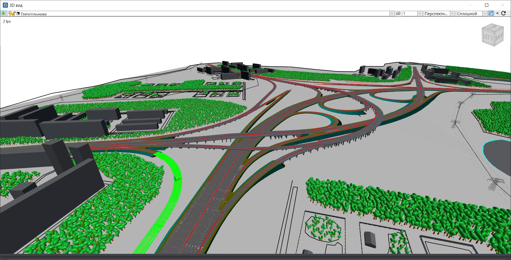
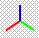
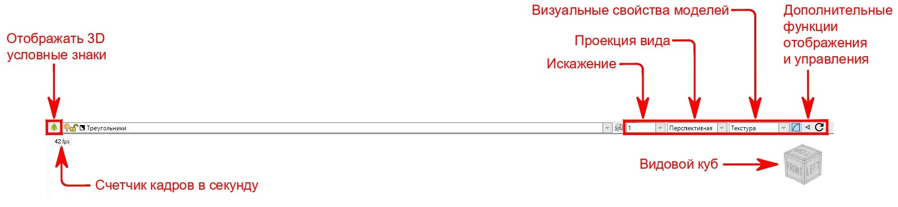
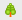
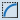
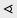
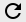

# Работа с окном 3D вида

Окно **3D вида** позволяет наблюдать в трехмерном пространстве элементы имеющихся поверхностей и запроектированных моделей с возможностью перемещения в данном окне в режиме «свободной камеры».

Для ориентирования в окне **3D вида** воспользуйтесь следующими советами:

* Для позиционирования всех объектов в рамки экрана дважды щелкните колесико мыши.
* Для приближения/отдаления используйте прокрутку колесика мыши.
* Для перемещения вверх/вниз/вправо/влево используйте колесико мыши, зажав его и потащив саму мышь в нужную сторону.
* Для наклона/поворота зажмите ЛКМ (левую кнопку мыши) и тяните мышь в нужную сторону.



Фиксация точки пространства, относительно которой выполняется приближение/отдаление, перемещение или наклон/поворот, происходит в месте последней остановки указателя мыши перед выполнением того или иного действия. На месте зафиксированной точки отображаются ортогональные оси координат  .



Для настройки отображения используются кнопки и выпадающие списки в верхней части рабочего окна **3D вида**.

**Отображать 3D условные знаки ** - включает/выключает отображение 3D условных знаков, если таковые имеются (например, объемные модели зданий на месте их контуров).

**Искажение** - отношение вертикального масштаба к горизонтальному.

**Проекция вида** - отображение объектов в объемном пространстве по законам прямой линейной перспективы или ортогонально. **Перспективная** проекция учитывает масштабирование и искажения объектов в зависимости от их удаления от "зрителя". **Ортогональная** проекция основана на отображении объектов согласно законам перпендикулярности плоскостей проецирования (фронтальный вид, вид сверху, вид сбоку и т. д.).

**Визуальные свойства объектов** определяют как отображаются все объекты в окне 3D вида. **Каркас** - визуальное свойство представляющее собой совокупность вершин и рёбер, которые определяют форму отображаемых объектов. **Сплошной** - визуальное свойство, при котором все поверхности объектов имеют заливку цветом. **Текстура** - визуальное свойство, при котором на поверхностях объектов отображаются текстуры при условии, если они заданы.

**Видовой куб** - это инструмент навигации по трехмерному пространству. С помощью Видового куба можно понять как сориентирован вид на данный момент, а также можно позиционировать вид на определенных точках обзора, выбрав необходимую грань, ребро или угол Видового куба.

**Счетчик кадров в секунду** отражает быстродействие работы окна 3D вида. Комфортным для работы является значение 60 и выше.

Из дополнительных функций отображения и управления:

 - включает/отключает сглаживание. Отключение сглаживания может повысить быстродействие окна 3D вид, но ухудшить качество отображения.

 - используется для перехода в определенное место из 3D вида в План. Чтобы перейти в План в необходимое место, щелкните левой кнопкой мыши в нужном месте в 3D виде (появятся ортогональные оси координат) и воспользуйтесь данной функцией.

 - позволяет обновить 3D вид, в случае если обновление по какой-либо причине автоматически не произошло.



Кроме того окно **3D вида** предоставляет не только визуальную часть проекта, но и информативную. Щелкнув по объекту в **3D виде**, можно увидеть описание данного объекта в соответствующем окне **Свойства**.
Выделенный объект в **3D виде** будет также выделен в окне **План** и наоборот.
Также в окне **3D вида** имеется некоторый функционал работы со слоями той или иной модели.


