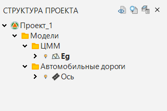
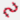
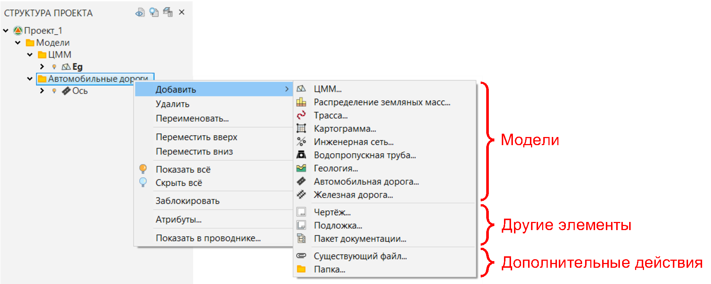
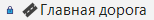

# Структура проекта

Проект **{{robur}}** включает в себя набор элементов: папок, моделей и связанных с моделями или загруженных отдельно документов (файлов чертежей, ведомостей и др.).

Для отображения полного перечня элементов, находящихся в данном проекте, откройте окно **Структура проекта**. Для этого в строке меню выберите **Вид - Структура проекта**. Откроется следующее окно:



Возможны незначительные отличия в окне **Структура проекта**, связанные с используемой конфигурацией программы, шаблоном, который был использован при создании проекта и индивидуальными настройками.



Ключевыми элементами проекта **{{robur}}** являются модели. Моделями же являются **ЦММ**  (цифровые модели местности), **Трассы** , **Автомобильные дороги** , **Железные дороги** , **Инженерные сети**  и др.

Различные операции (построения, отрисовка, формирование отчетов и т. п.) почти всегда происходят на основе текущей модели (см. подробнее [Работа с моделями](work_with_models.md)). Вновь создаваемый проект в зависимости от стандартного шаблона имеет по умолчанию хотя бы одну модель. Как правило, ей является **ЦММ**  с наименованием **Eg**.

По умолчанию во вновь созданном проекте в зависимости от шаблона уже имеющиеся модели находятся в соответствующих папках в **Структуре проекта**.

Создать ту или иную модель можно в любой папке в **Структуре проекта**. Кроме того, помимо создания моделей, можно создавать и сами папки. Также уже созданные модели и даже целые папки с ними можно перемещать по структуре в любое место, зажав левую кнопку мыши на необходимом элементе проекта и потащив его в нужное место.



Наименование проекта в структуре - это начальная (корневая) папка проекта. Удалить данную папку невозможно.



Чтобы создать новую модель, папку или другой элемент в **Структуре проекта** нажмите правой кнопкой мыши по необходимой папке, в открывшемся контекстном меню выберите **Добавить** и из перечня доступных элементов проекта выберите необходимый:

Над элементами проекта в окне **Структура проекта** можно производить различные действия. Для этого щелкните правой кнопкой мыши по необходимому элементу, откроется его контекстное меню.

Например, контекстное меню той или иной папки в **Структуре проекта** позволяет:

* **Добавить** - создает в выбранной папке проекта новые модели и другие элементы, а также позволяет импортировать в проект тот или иной элемент из внешнего расположения посредством функции **Существующий файл**.
* **Удалить** - удаляет папку и все вложенные в нее модели и другие элементы из структуры.
* **Переименовать** - позволяет изменить название папки.
* **Переместить вверх/вниз** - перемещает папку и все вложенные в нее модели и другие элементы вверх/вниз по древу структуры.
* **Показать**/**Скрыть всё** - включает/отключает в рабочих окнах видимость всех вложенных в ту или иную папку моделей.

  

  Индикатор лампочки у наименований моделей и других элементов проекта (чертежей, ведомостей и т. д.) в окне **Структура проекта** свидетельствует о том, что видимость того или иного элемента проекта включена  (или открыто его дополнительное рабочее окно, например, окно чертежа, ведомости и т. д.) или отключена .

  

* **Атрибуты** - позволяет заполнить необходимые ячейки в штампе всем чертежам, вложенным в данную папку (более подробное описание данной функции будет представлено далее в соответствующем разделе).
* **Показать в проводнике** - открывает расположение той или иной папки в Проводнике Windows.

Большинство из приведенных выше операций также доступны и в контекстном меню самих моделей и применительно непосредственно к ним. Но, кроме данных операций, в зависимости от типа модели, доступны и другие:

* **Сделать текущей** - позволяет выбрать модель, над которой будет происходить дальнейшее редактирование (см. подробнее [Работа с моделями](work_with_models.md)).
* **Дублировать** - создает копию модели.
* **Импортировать/экспортировать** - выводит модель во внешнюю среду для последующего обмена ей (более подробное описание импорта/экспорта моделей и других элементов проекта будет представлено далее в соответствующем разделе)
* и т.д.

  

  В зависимости от используемой конфигурации программы (Robur - Изыскания, Robur - Автомобильные дороги и т. д.) для редактирования доступен тот или иной набор моделей. Например, в конфигурации программы **Robur - Изыскания** не представляется возможным создавать и редактировать модели типа **Автомобильная дорога** , однако просматривать уже имеющиеся и взаимодействовать с ними, например, с целью получения сечений по их проектной поверхности можно. Около таких моделей в Структуре проекта будет стоять синий замок .

  

Более подробно описание тех или иных типов моделей (и других элементов проекта) и функционала по их созданию и редактированию будет представлено далее в соответствующих разделах.
