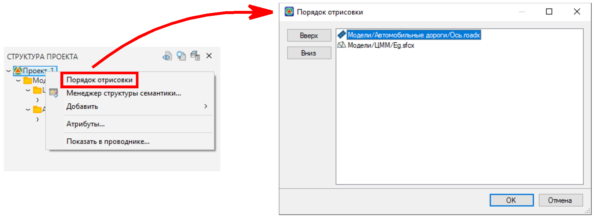
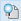
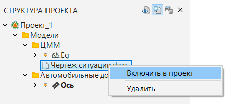
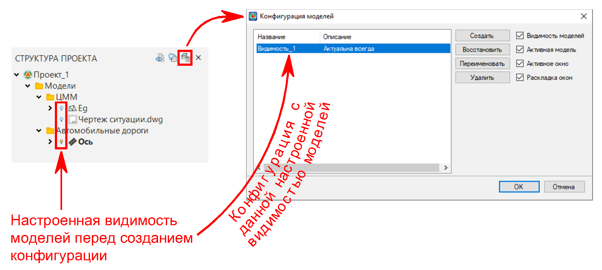
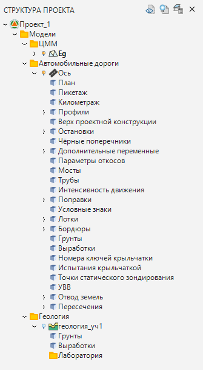
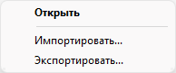

# Управление структурой проекта



## Общие функции управления

**Порядок отрисовки** - это видимость моделей в рабочем окне **План**. Чтобы настроить эту видимость, нажмите ПКМ по наименованию проекта (его корневой папке) в окне **Структура проекта** и выберите **Порядок отрисовки**.

В открывшемся окне видимость необходимых моделей можно настроить путем перемещения моделей в нужном порядке: чем выше находится модель в списке, тем она приоритетней для отрисовки в рабочем окне **План**. Для перемещения моделей по списку выделите необходимую модель и используйте кнопки **Вверх** и **Вниз**.

Также, справа от наименования окна **Структура проекта** имеются следующие функциональные кнопки:

**Скрыть скрытые**  - позволяет в окне **Структура проекта** скрыть из списка или отобразить те модели (и те другие элементы: чертежи, ведомости и т. д.), видимость которых была отключена функцией **Скрыть** (см. [Структура проекта](structure_project.md)) в рабочих окнах.



Если у всех элементов проекта в той или иной папке видимость отключена , то команда **Скрыть скрытые** скрывает эту папку целиком.



**Показать всё**  - включает отображение данных проекта (моделей, чертежей и иных документов), которые не были добавлены в **Структуру проекта**, например, для дальнейшего их включения в **Структуру проекта** и взаимодействия с ними прямо из {{robur}}.



Недобавленные в структуру файлы отобразятся только в том случае, если они физически находятся в папке проекта.



Чтобы недобавленные данные проекта включить в **Структуру проекта**:

1. Нажмите **Показать всё** , и в структуре отобразятся недобавленные в нее файлы проекта.
2. Нажмите ПКМ на необходимый файл и из его контекстного меню выберете **Включить в проект**.
3. В результате файл добавится в **Структуру проекта**.



Включить в **Структуру проекта** возможно как отдельные файлы, так и целые папки с файлами.



**Конфигурация моделей**  - позволяет сохранить и восстановить настройки видимости моделей и их слоев (подробнее о быстрой работе со слоями моделей см. [Работа с моделями](work_with_models.md)), набор открытых дополнительных вкладок (рабочих окон) и не только.

Чтобы сохранить конфигурацию, к примеру, с настроенной видимостью тех или иных моделей, выполните следующее:

1. В **Структуре проекта** настройте видимость моделей нужным образом.
2. Нажмите **Конфигурация моделей** .
3. В открывшемся окне нажмите **Создать**, чтобы сформировать новую конфигурацию.
4. Введите название конфигурации, добавьте описание (при необходимости) и нажмите **ОК**.
5. Таким образом новая конфигурация добавится в список и будет доступна для восстановления.

Чтобы восстановить ранее созданную конфигурацию, в окне **Конфигурация моделей** из списка выберите конфигурацию и нажмите **Восстановить**. Кроме того при восстановлении той или иной конфигурации можно воспользоваться дополнительными опциями:

1. **Видимость моделей** - восстанавливает в **Структуре проекта** (и в рабочих окнах соответственно) видимость моделей и их слоев.
2. **Активная модель** - делает текущей ту модель, которая была текущей на момент сохранения конфигурации (см. подробнее [Работа с моделями](work_with_models.md)).
3. **Активное окно** - делает активным то окно, которое было активным на момент сохранения конфигурации.
4. **Раскладка окон** - восстанавливает позиционирование вида, которое было на момент сохранения конфигурации, во всех рабочих окнах программы.

Чтобы изменить название и описание конфигурации или ее удалить, выберете необходимую конфигурацию и нажмите **Переименовать** или **Удалить**.





## Управление данными структуры

Под **Данными структуры** понимается набор таблиц, организованных в виде дерева в Структуре проекта.

**Данные структуры** – это численное представление графических данных проекта в виде таблиц в Структуре проекта. Изменения, сделанные в графическом поле {{robur}}, тут же отражаются в таблицах моделей в структуре, и, наоборот, изменения, сделанные в таблицах моделей в структуре, тут же отражаются в графическом поле программы.

* Если редактирование происходит графически (т.е. в графических окнах **План**, **Профиль**, **Поперечник** и т. п.), то программа отслеживает корректность данных. Например, контролируется целостность геометрии трассы.

* Если же редактируются данные моделей в таблицах Структуры проекта (табличный способ), то такая проверка не производится.

### Редактирование данных структуры

Для того чтобы редактировать данные в структуре выполните следующие действия:

1. Раскройте структуру до нужного элемента.
2. Щелкните дважды левой кнопкой мыши по названию требуемой таблицы. Раскроется окно редактора таблиц.
3. Отредактируйте данные и нажмите кнопку **OK**.

Сделанные изменения тут же отразятся в графическом поле программы.

### Импорт/экспорт данных структуры

Структура проекта является удобным механизмом для передачи данных в другие программы.

Для импорта данных выполните следующие действия:

1. Щелкните правой кнопкой мыши по таблице, в которую нужно импортировать данные. Появится контекстное меню:

   

2. Из контекстного меню выберете пункт **Импортировать**, откроется диалоговое окно выбора файлов.
3. Выберете нужный файл и нажмите **OK**.



Импорт данных возможен только в том случае, если импортируемая таблица имеет тот же формат, что и таблица данных структуры.



Для того чтобы экспортировать таблицу структуры выполните следующие действия:

1. Щелкните по ней правой кнопкой мыши, появится контекстное меню.
2. Из контекстного меню выберите пункт **Экспортировать**.
3. Введите имя файла и выберите кнопку **Сохранить**.


