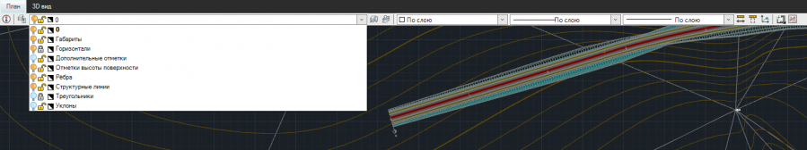

# Работа с моделями

В данном разделе описываются основные принципы работы с текущей моделью.



## Текущая модель

При работе в одном из основных рабочих окон программы, как правило, редактируется текущая модель. К примеру, в процессе редактирования текущей модели (в зависимости от ее типа) можно перетаскивать примитивы (отрезок, окружность и др.) или вводить новые, вписывать радиусы в вершины углов поворота трассы или вводить отметки высоты поверхности и т. д.

В зависимости от типа модели, которая в данный момент является текущей, в программе доступен тот или иной набор основных рабочих окон (см. подробнее раздел [Рабочие окна](../startup_program/setting_working_windows.md)).

Одновременно только одна модель может быть текущей, в Структуре проекта ее наименование выделено **жирным** шрифтом. При работе с текущей моделью можно получать данные из другой модели (или нескольких моделей), не являющейся в данный момент текущей. К примеру, перед построением красной линии продольного профиля модели типа Автомобильная дорога для нее сначала создается черный профиль (линия земли) по данным модели типа ЦММ.

Также, в зависимости от выбранной команды соответствующая модель того или иного типа становится текущей. К примеру, при текущей модели типа Автомобильная дорога, выбрав любую функцию для работы с поверхностью (из меню **Поверхность**), программа автоматически сделает текущей модель типа ЦММ.





## Слои текущей модели

Чтобы облегчить выбор составляющих модель деталей, сделать модель более наглядной или заблокировать визуальное редактирование определенных данных модели, все детали модели разделены на слои. Исходя из этого имеется возможность управления видимостью и активностью слоев текущей модели.

Для быстрого доступа к слоям текущей модели используйте селектор слоев, расположенный в верхней части основных рабочих окон программы.

На данном рисунке представлен селектор слоев текущей модели типа ЦММ в рабочем окне План.
В селекторе слоев текущей модели отображаются именованные слои и пользовательские.



У каждого типа модели свой набор именованных слоев (созданных программой автоматически). Также, в основных рабочих окнах программы наборы именованных слоев различаются между собой.



Именованные слои нужны модели для сортировки ее деталей, создаваемых инструментарием программы автоматически. Не рекомендуется использовать именованные слои для собственных построений.

Чтобы выполнять собственные построения (ручные), создавайте и настраивайте пользовательские слои. Также, при импорте тех или иных построений импортируются и пользовательские слои, в которых эти построения лежат.



Более подробно информация по работе со слоями представлена в [Работа со слоями модели](../working_with_layers_model/).




