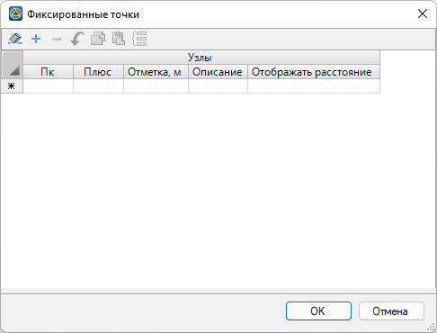
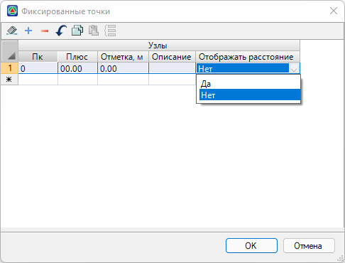
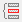
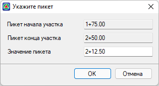
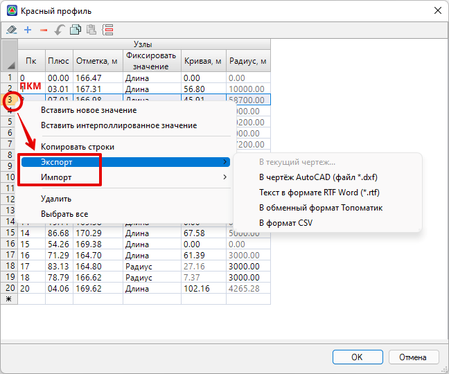
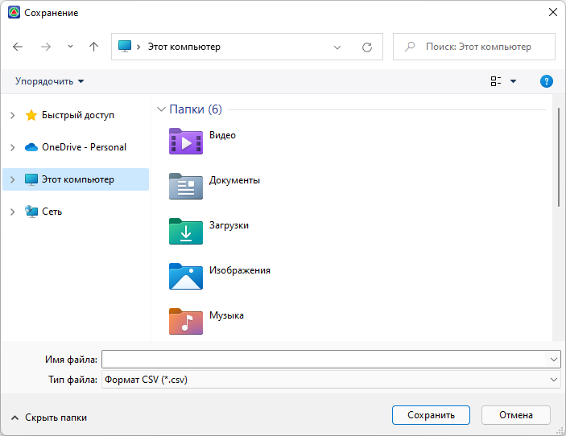

# Работа с таблицами



## Понятие таблицы

Большинство данных в {{robur}} представлено в виде таблиц. **Таблица** – это сетка с полями ввода. Каждая таблица имеет шапку.

Имеется возможность изменять значения в полях ввода, вставлять и удалять строки, экспортировать и импортировать данные.

Поля ввода содержат:

* Целые числа.
* Числа с плавающей точкой.
* Строки.
* Списки ввода.

Для перемещения по полям ввода таблицы используйте клавиши управления курсором или мышь.





## Ввод данных

Для ввода данных просто печатайте требуемые значения в поля таблицы. Для того чтобы сохранить значения, нажмите клавишу **Enter**, либо перейдите в другое поле ввода при помощи стрелок управления курсором. Целые поля могут содержать только числа от 0 до 9 и знак «минус». Поля с плавающей точкой могут содержать числа от 0 до 9, десятичную точку и также знак «минус».



В качестве разделителя целой и дробной части могут использоваться два символа:

1. Обычная точка.
2. Символ, установленный в качестве десятичного разделителя в настройках **Windows**.



Строки состоят из печатных символов, содержащихся на клавиатуре.

Список ввода состоит из фиксированного набора данных. Для выбора элемента из списка ввода выполните одно из следующих действий:

* Щелкните мышкой по полю ввода, появится кнопка, нажмите ее. В результате, появится выпадающий список, выберете при помощи мыши нужный элемент из выпадающего списка.
* Переместите указатель текущей ячейки в поле фиксированного списка, нажмите комбинацию клавиш **Alt+↓**, появится **Список ввода**, при помощи стрелок на клавиатуре выберете нужный элемент списка и нажмите **Enter**.

  





## Вставка строк

Для того чтобы вставить пустую строку, выполните следующее действие: установите указатель на строку, перед которой необходимо вставить новую, затем нажмите комбинацию клавиш **Ctrl+Enter** или выберите кнопку  на панели инструментов. Появится пустая строка.



При вставке пустой строки все данные обнуляются. Целые числа и числа с плавающей точкой будут заполнены нулями, строки – пробелами, списки – первыми элементами списка.







## Вставка строк с интерполяцией

Для того чтобы вставить строку с интерполированными значениями, необходимо выполнить следующие действия:

1. Выделите строку таблицы, перед которой необходимо получить интерполированное значение, и нажмите на кнопку . При этом откроется диалоговое окно:

   

2. При необходимости подкорректируйте значение пикет-плюс, лежащее в указанном диапазоне и нажмите кнопку **ОК**.





## Удаление строк

Для того чтобы удалить строку выполните следующие действия:

Переместите указатель активной ячейки на строку, которую вы хотите удалить и нажмите комбинацию клавиш **Ctrl+Y** или выберите кнопку  на панели инструментов.

Выбранная строка будет удалена, а все нижние строки сместятся на одну строку вверх.





## Копирование/ Вставка строк

Чтобы скопировать строку выполните следующие действия, переместите указатель активной ячейки на строку, которую необходимо скопировать в буфер обмена и выберите кнопку  на панели инструментов.

Теперь подведите указатель к строке, выше которой необходимо вставить скопированною строчку, и выберите кнопку  на панели инструментов.

Данная строка будет вставлена, а все верхние строки сместятся на одну вверх.





## Импорт\ Экспорт данных

Данные в таблицах могут быть экспортированы\импортированы в один из доступных форматов. Имеющийся функционал импорта\экспорта может быть использован, например, для обмена данными между таблицами моделей одного или разных проектов.

Для импорта\экспорта данных таблицы:

1. В окне необходимой таблицы в левой части окна нажмите правой кнопкой мыши, выберите соответствующий пункт меню и необходимый формат экспорта\импорта данных:

   

2. Укажите название и место сохранения файла:

   

Нажмите **Сохранить**. В результате будет сформирован файл в выбранном формате.


