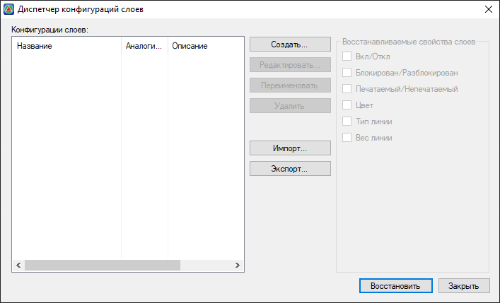
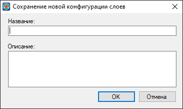
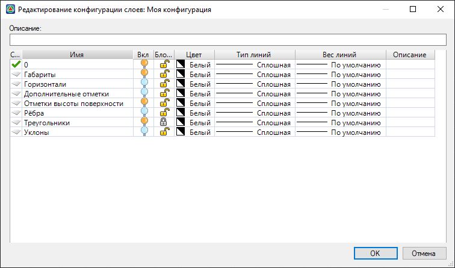

# Диспетчер конфигураций слоев

**Диспетчер конфигурации слоев** текущей модели предназначен для сохранения состояний слоев для нее в качестве именованной конфигурации. Для этого выберите элемент меню **Формат – Диспетчер конфигурации слоев,** откроется диалоговое окно:

**Создать** – опция, предназначенная для создания новой конфигурации слоев. После нажатия данной кнопки появится диалоговое окно, в котором необходимо ввести название вновь создаваемой конфигурации:

**Редактировать** – изменение параметров слоев выбранной конфигурации. Открывается окно, в котором можно настроить необходимую конфигурацию слоев:

**Переименовать** – опция предназначена для изменения имени выбранной конфигурации.

**Удалить** – для удаления выбранной конфигурации слоев.

**Импорт/Экспорт** – для **Импорта/Экспорта** сохраненных конфигураций в формате **.XML**.

Поле **Восстанавливаемые свойства слоев** позволяет произвести необходимые настройки параметров слоев выбранной конфигурации, которые будут использоваться при восстановлении.

Для восстановления в текущей модели какой-либо созданной ранее для нее конфигурации слоев, выберите **Восстановить**.
