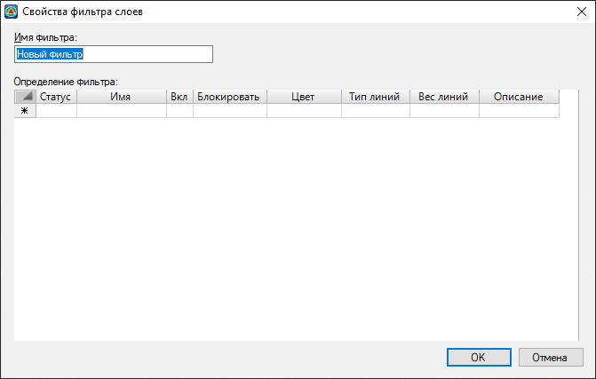
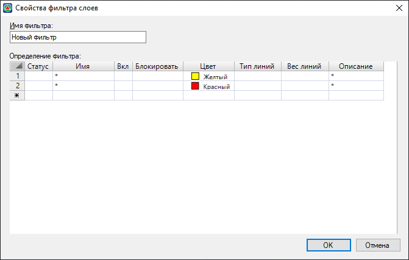

# Фильтр слоёв

Для быстрого просмотра или выбора нужных слоев в текущей модели имеется возможность создания определенных фильтров по свойствам слоев. Для этого:

1. В окне **Менеджер слоев текущей модели** (см. [Менеджер слоев](manager_layers.md)) выберите кнопку **Новый фильтр по свойствам**  , откроется диалоговое окно:

   

2. В поле **Имя фильтра** введите название создаваемого фильтра.
При создании фильтра слоев имеется возможность задавать несколько критериев отбора. Например, можно определить фильтр для всех слоев, которые имеют цвет и красный и желтый. Для этого необходимо продублировать фильтр на следующей строчке и выбрать цвет отличный от первого:

   

3. В поле **Определения фильтра** задайте параметры, по которым должны выбираться слои.
4. Нажмите **ОК**.
