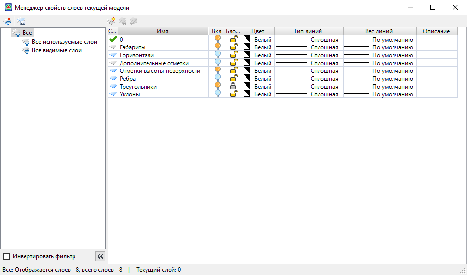
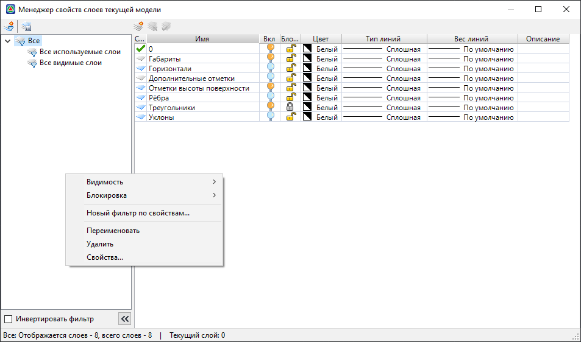

# Менеджер слоев

Для просмотра, редактирования, изменения параметров слоев (видимость, активность и т. д.) текущей модели воспользуйтесь **Менеджером слоев текущей модели**. Для этого выберите меню **Формат – Менеджер слоев**, откроется диалоговое окно:

В колонках основного поля данного диалогового окна отображаются следующие параметры слоев:

* **Статус** - соответствующим значком отображается используемый , пустой или текущий слой.
* **Имя** - отображается наименование слоя.
* **Вкл** - включение или отключение видимости объектов находящихся на выбранных слоях в рабочих окнах программы.
* **Блокировать** - блокирование или разблокирование объектов находящихся на данных слоях от редактирования.
* **Цвет** - изменение цвета объектов находящихся на выбранном слое. При щелчке левой кнопкой мыши в соответствующем поле открывается диалоговое окно **Выбор цвета**. Из представленной цветовой палитры можно выбрать цвет для объектов данного слоя.

  

  1. Подробнее о задании цвета см. ниже пункт **Цвета**.
  2. Для некоторых объектов модели параметры отображения (цвет, тип линий, толщина и т.п.) задаются индивидуально. Например, в меню **Сервис - Настройка**.

  

* **Тип линий** - изменение типа линий объектов выбранного слоя. Щелкните левой кнопкой мыши в данном поле и выберите из выпадающего списка необходимый тип линии.

  

Подробнее см. ниже пункт **[Типы линий](tool.md#naznachenie-tipov-linij)**

  

* **Вес линий** - щелкните левой кнопкой мыши в данном поле и выберите из выпадающего списка необходимый вес линии.

  

  Подробнее см. ниже пункт **[Веса линий](tool.md#vesa-linij)**

  

* **Описание** – в данном поле могут задаваться необязательные комментарии относительно выбранного слоя.
* **Новый фильтр по свойствам** - чтобы создать фильтр по свойствам для слоев текущей модели, нажмите кнопку . Данный функционал описан в разделе [Фильтр слоев](filter_layers.md).
* **Инвертировать фильтр** - установка данной опции включает в окне **Менеджер свойств слоев текущей модели** отображения всех слоев, не удовлетворяющих критериям выбранного фильтра. А слои соответствующие заданному фильтру становятся невидимыми.
* **Диспетчер конфигураций слоев** – чтобы открыть окно для создания конфигураций слоев текущей модели и управления ими, нажмите кнопку . Данный функционал описан в [Диспетчер конфигураций слоев](dispatcher_layers.md).
* **Новый слой** – для создания нового слоя нажмите кнопку , после чего он появится в общем списке слоев. По умолчанию новому слою будет присвоено имя **Слой**.
* **Удалить слой** – данная опция становится доступной при выборе слоя или группы слоев из общего списка. Для удаления слоя нажмите кнопку .

  

  Текущий слой, а также слой, который содержит какие-либо объекты, не может быть удален.

  

* **Установить** – для установки выбранного слоя текущим выберите кнопку .

Если щелкнуть правой кнопкой мыши по какому-либо из фильтров в левом поле данного диалогового окна, то появится следующее контекстное меню:

* **Видимость** – групповое включение/отключение видимости всех слоев проекта.
* **Блокировка** – групповое включение/отключение блокировки всех слоев проекта.
* **Новый фильтр по свойствам** – отображение диалогового окна создания фильтра слоев. Данное диалоговое окно будет описано ниже.
* **Переименовать** – изменение имени выбранного фильтра.
* **Удалить** – удаление выбранного фильтра.
* **Свойства** – отображение окна свойств фильтра.
