# Дополнительные инструменты

В меню **Формат** реализован набор функций по взаимодействию со слоями моделей и дополнительные функции для настройки отображения примитивов чертежа.



## Инструменты для работы со слоями

### Сделать слой объекта текущим

Функция предназначена для назначения текущего слоя, по слою выбранного объекта. Для этого:

1. Выберите элемент меню **Формат – Сделать слой объекта текущим**, курсор примет форму прицела.
2. Укажите объект левой клавишей мыши. Программа назначит текущий слой по указанному объекту.

### Предыдущее состояние слоев

Функция позволяет отменить последние изменение, внесенные в свойства слоев, для этого выберите меню **Формат – Предыдущее состояние слоев**.

### Обход слоев

Функция предназначена для быстрого просмотра объектов выбранного слоя.

Для этого выберите элемент меню **Формат – Обход слоев**, откроется диалоговое окно:

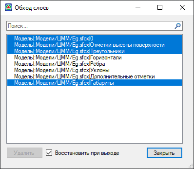

При выборе наименования какого-либо слоя в рабочих окнах программы будут отображены только те объекты, которые ему принадлежат.

* **Восстановить при выходе** – опция восстанавливает предыдущее состояние слоев при выходе из диалогового окна. Если опция отключена, то любые внесенные пользователем изменения сохраняются. Т.е. видимыми будут только те слои, которые выбраны в данном диалоговом окне, а остальные будут отключены.
* **Удалить** – опция предназначена для удаления выбранного слоя.

### Соответствие слоев

Функция предназначена для изменения слоя объекта в соответствии с слоем другого выбранного объекта. Для этого:

1. Выберите меню **Формат – Соответствие слоев**, курсор примет форму прицела.
2. Выберите левой кнопкой мыши объекты, слои которых необходимо привести в соответствие с другим слоем.
3. Выберите объект, слой которого необходимо присвоить выбранным изначально.

### На текущий слой

Функция предназначена для быстрого переназначения слоя выбранного объекта на слой, который является текущим.

Для этого:

1. Выберите элемент меню **Формат – На текущий слой**, курсор примет форму прицела.
2. Укажите необходимый объект левой клавишей мыши. Программа поменяет слой выбранного объекта на текущий.

### Копировать объекты в новый слой

Функция предназначена для копирования объектов из одного слоя в другой, для этого:

1. Выберите элемент меню **Формат – Копировать объекты в новый слой**, курсор примет форму прицела.
2. Выберите левой кнопкой мыши один или несколько объектов для копирования в новый слой, нажмите **Enter**.
3. Выберите объект, на слой которого необходимо скопировать объекты.
4. Укажите левой кнопкой мыши **Базовую точку** копируемых объектов и произведите копирование объектов.

### Изолировать слой

Функция позволяет отключить видимость всех слоев, кроме слоя объекта, который был выбран, для этого:

1. Выберите элемент меню **Формат – Изолировать слой**, курсор примет форму прицела.
2. Выделите один или группу объектов и нажмите **Enter**. Программа отключит видимость всех слоев, кроме слоев объектов которые были выбраны.

### Отключить изоляцию слоя

Функция предназначена для восстановления исходного состояния слоев (до изолирования). Для этого выберите меню **Формат – Отключить изоляцию слоя**.

### Отключить слой

Функция предназначена для отключения видимости выбранного слоя.

Для этого:

1. Выберите меню **Формат – Отключить слой**, курсор примет форму прицела.
2. Укажите левой кнопкой мыши объект, видимость слоя которого необходимо отключить.

### Включить все слои

Функция предназначена для включения видимости всех слоев проекта. Для этого выберите меню **Формат – Включить все слои**.

### Блокировать слой

Функция предназначена для предотвращения случайных, нежелательных изменений объектов на заданном слое. Для этого:

1. Выберите меню **Формат – Блокировать слой**, курсор примет форму прицела.
2. Укажите левой кнопкой мыши объект, слой которого необходимо блокировать.



Объекты на заблокированном слое по-прежнему будут видимы, к ним можно привязываться, но редактировать их будет невозможно.



### Разблокировать слой

Функция предназначена для снятия блокировки выбранного слоя. Для этого:

1. Выберите меню **Формат – Разблокировать слой**, курсор примет форму прицела.
2. Укажите объект, слой которого необходимо разблокировать.

### Объединить слои

Для сокращения количества слоев модели можно воспользоваться функцией Объединить слои. Для этого:

1. Выберите меню **Формат – Объединить слои**, курсор примет форму прицела.
2. Укажите левой кнопкой мыши объект на слое, который необходимо объединить и нажмите **Enter**.
3. Укажите объект на слое назначения.

После этого, первоначально выбранные объекты, будут перенесены на слой назначения, а их исходный слой будет удален.

### Удалить слой

Функция предназначена для удаления слоя и всех лежащих на нем объектов. Для этого:

1. Выберите меню **Формат – Удалить слой**, курсор примет форму прицела.
2. Левой кнопкой мыши выберите объект для определения слоя который необходимо удалить.

### Объединение списка слоев

Имеется возможность управлять параметрами (видимостью, цветом и т. д.) одноименных слоев всех имеющихся в проекте моделей одновременно. Например, одновременно у всех моделей можно отключить слой **Пикетаж** или заблокировать редактирование слоя **Треугольники**.

Для этого нажмите кнопку **Объединить слои**, находящуюся рядом с селектором слоев:

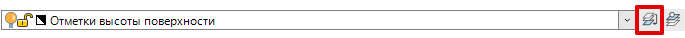

В результате все одноименные слои объединятся в единый список:

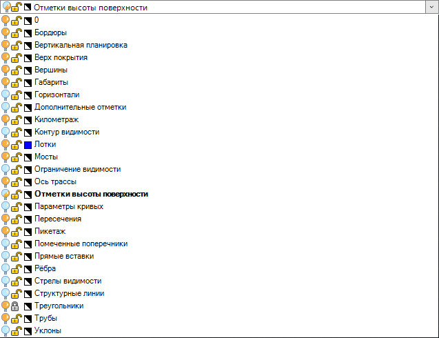

Далее измените параметры любого слоя (Видимость, Блокировку, Цвет). В результате изменения будут приняты для одноименных слоев во всех моделях проекта.



Влияние данной функции распространяется исключительно на управление слоями через селектор слоев в рабочих окнах План и 3D вид.







## Настройка отображения примитивов чертежа

### Цвета

Использование различных цветов позволяет визуально находить (определять) объекты, облегчая тем самым работу с проектом. Цвета можно присваивать как слоям, так и отдельным объектам чертежа. Задание цвета слою описано в разделе **Менеджер слоев**.

Для назначения определенного цвета выбранным объектам (не по слою):

1. Выберите данные объекты левой кнопкой мыши.
2. Выберите из селектора цветов необходимый цвет.

Если необходимо назначить текущий цвет для вновь создаваемых объектов, то его также можно выбрать из выпадающего селектора цветов. Либо воспользуйтесь элементом меню **Формат - Цвета**.

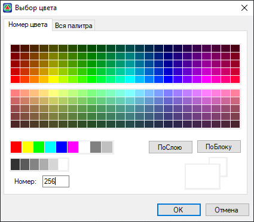

### Назначение типов линий

Для загрузки, удаления, назначения текущего типа линий из/в соответствующий селектор свойств слоя или отдельно выбранных объектов, воспользуйтесь **Диспетчером типов линий**.

Для этого выберите меню **Формат – Типы линий**, откроется диалоговое окно:

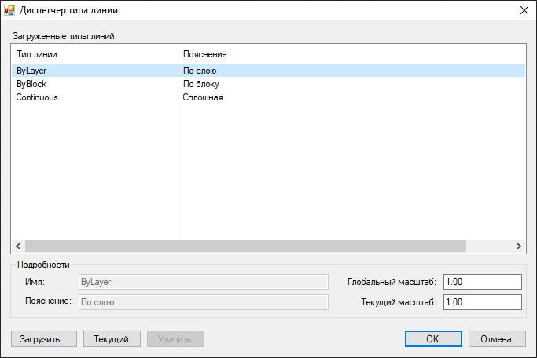

В основном графическом поле данного окна отображены загруженные типы линий.

* **Текущий** – кнопка предназначенная для установки выбранного типа линии текущим.
* **Удалить** – кнопка предназначенная для удаления выбранных типов линий.

  

  Удалить можно только неиспользуемые типы линий.

  

* **Имя/Пояснение** – поля ввода, предназначенные для задания или изменения **Имени/ Пояснения** выбранного типа линий.
* **Глобальный масштаб** – поле ввода, предназначенное для задания общего масштабного коэффициента для всех типов линий в проекте.
* **Текущий масштаб** – поле ввода, предназначенное для задания масштаба вновь создаваемых объектов.

Для загрузки дополнительных **Типов линий** воспользуйтесь кнопкой **Загрузить**. Откроется диалоговое окно:

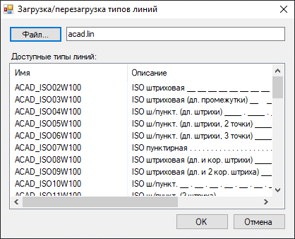

В окне загрузки отображены стандартные типы линий, имеющиеся в файле **acad.lin**.

Для загрузки других типов линий воспользуйтесь кнопкой **Файл**. Откроется диалоговое окно:

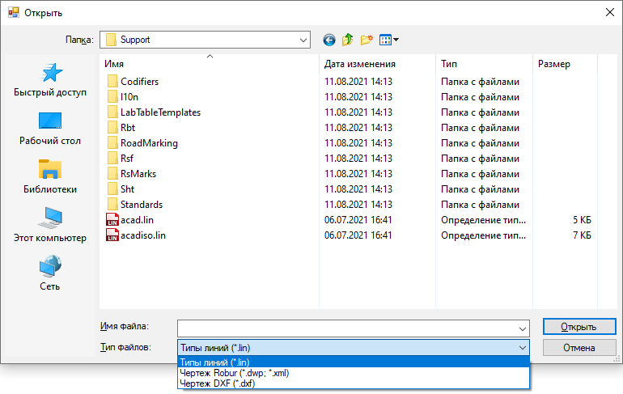

В селекторе выбора **Типов файла** укажите необходимый формат файла, из которого будет произведена загрузка **Типов линий**.

### Веса линий

Для настройки различных параметров **Весов линий**, выберите элемент меню **Формат – Веса линий**. Откроется диалоговое окно:

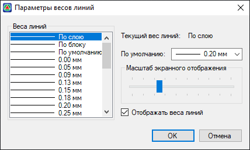

* **По умолчанию** – селектор, предназначенный для задания веса линии по умолчанию.
* **Масштаб экранного отображения** – опция, позволяющая настроить масштаб отображения весов линий в проекте.
* **Отображать веса линий** – при включенной опции, все линии в проекте будут отображаться в соответствии с весами.

### Текстовый стиль

Для создания новых текстовых стилей и настройки текущих выберите элемент меню **Формат – Текстовые стили**, откроется диалоговое окно:

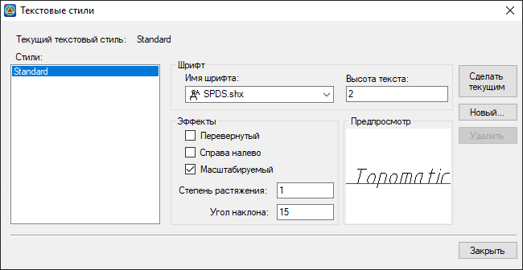

В селекторе **Имя шрифта** можно указать необходимый стиль шрифта.

**Высота текста** – поле ввода, предназначенное для задания необходимой высоты текста, выбранного стиля.

В поле **Эффекты** можно задавать различные начертания шрифта.

### Размерные стили {#dimensions}

Для создания, редактирования, задания размерного стиля по умолчанию воспользуйтесь меню **Формат – Размерные стили**. Откроется диалоговое окно:

* **Установить** - опция предназначена для установки выбранного размерного стиля текущим.
* **Изменить** – открытие окна редактирования выбранного размерного стиля.
* **Переименовать** – для изменения названия выбранного стиля.
* **Удалить** – удаление выбранного размерного стиля.
* **Загрузить/Сохранить** – для загрузки/сохранения списка размерных стилей в формате **\*.xml**

Для создания нового размерного стиля:

1. Нажмите кнопку **Создать**. Откроется диалоговое окно:

   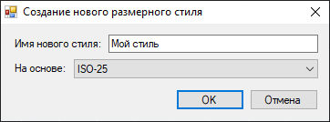

2. Введите название нового стиля. Для ускорения процесса создания нового размерного стиля, в селекторе выбора задайте ранее созданный стиль с наиболее подходящими параметрами, на основе которого будет создан новый размерный стиль. Нажмите **Ок**.

   Далее откроется диалоговое окно. Рассмотрим его основные вкладки:

#### Вкладка Линии

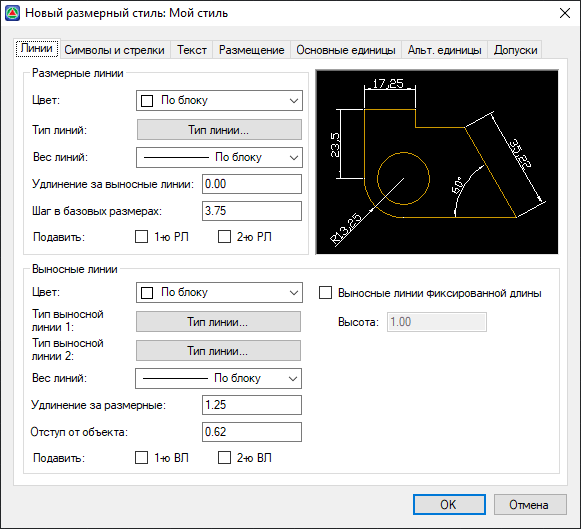

На вкладке **Линии** задаются формат и свойства размерных линий и выносных линий.

#### Вкладка Символы и Стрелки

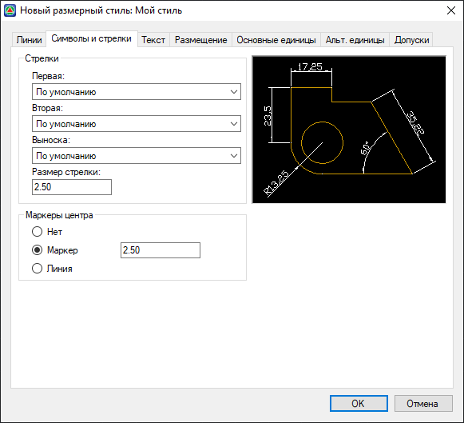

На вкладке задаются формат, размер стрелок, формат **Маркера центра** и его размер.

#### Вкладка Текст

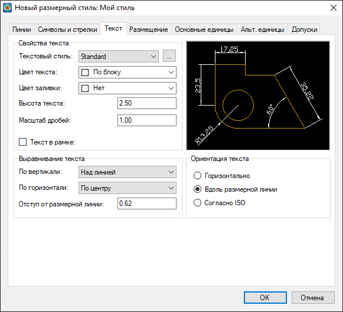

На вкладке задаются формат, размещение и выравнивание размерного текста.

#### Вкладка Размещение

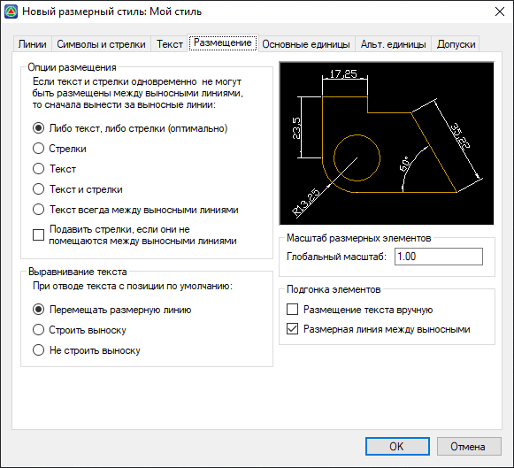

Управление положением размерного текста, стрелок, выносок и размерной линии.

#### Вкладка Основные единицы

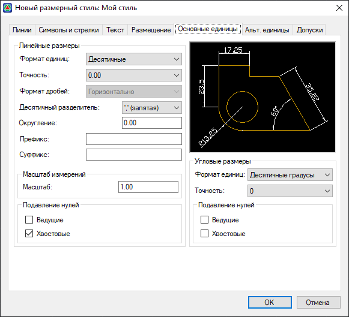

Установка формата и точности основных единиц, а также префиксов и суффиксов размерного текста.

#### Вкладка Альтернативные единицы

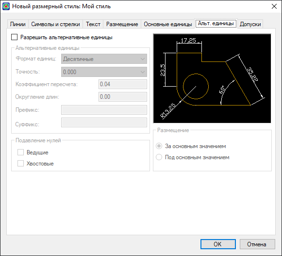

Задание формата и точности для альтернативных размерных единиц.

#### Вкладка Допуски

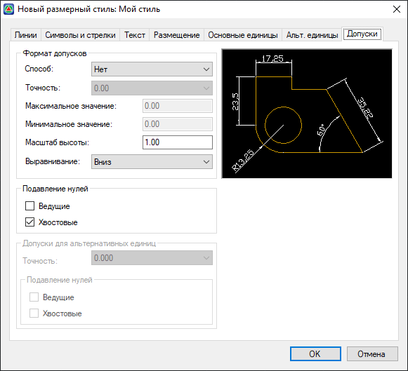

Управление отображением и форматом допусков в размерном тексте.

Задайте на вышеописанных вкладках необходимые настройки создаваемого размерного стиля и нажмите кнопку **ОК**. В результате новый стиль будет создан и отобразится в общем списке размерных стилей.

### Отображение точек

Для настройки отображения в плане объекта «точка», выберите меню **Формат – Отображение точек**, откроется диалоговое окно:

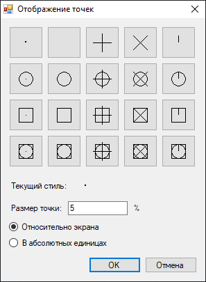

Выберите стиль отображения, нажатием на соответствующей пиктограмме левой клавишей мыши.

* **Установка размера относительно экрана** - устанавливает размер объекта точки в процентах от размера экрана. В этом случае при масштабировании экрана размер точек не меняется.
* **Установка размера в абсолютных единицах** - устанавливает размер символа точки равным числу, заданному в поле **Размер точки**, в абсолютных единицах. Размер точки увеличивается или уменьшается при увеличении или уменьшении масштабировании экрана.

### Стили мультилиний

Для того чтобы настроить стили отображения мультилиний выберите меню **Формат – Стили мультилиний**. Откроется диалоговое окно:

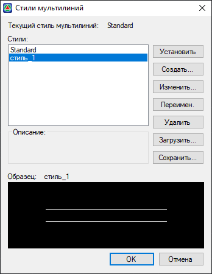

* **Установить** – устанавливает текущий стиль мультилиний.
* **Изменить** – открытие окна редактирования стиля мультилинии.
* **Переименовать** – для изменения названия выбранного стиля мультилинии.
* **Удалить** – для удаления выбранного стиля мультилинии.
* **Сохранить/Загрузить** – для сохранения/загрузки списка мультилиний в формате **\*.xml**.

Для создания нового стиля мультилиний:

1. Нажмите кнопку **Создать**. Откроется диалоговое окно:

   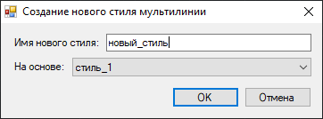

2. Введите **Имя нового стиля**.

3. Для ускорения процесса создания нового стиля мультилинии, в селекторе выбора задайте ранее созданный стиль с наиболее подходящими параметрами, на основе которого будет создан новый стиль мультилинии. Нажмите **Ок**. Откроется диалоговое окно:

   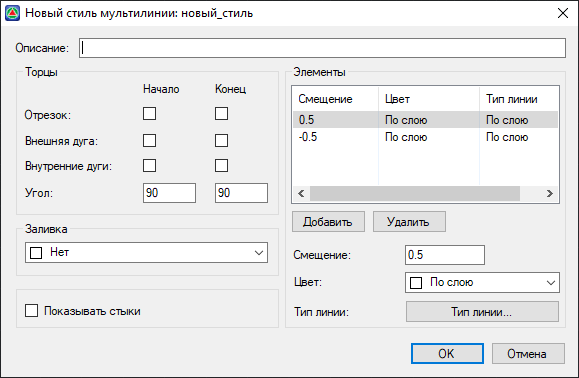

   * **Описание** – поле, для задания описания стиля.
   * **Отрезок (Начало\Конец)** – включение отображения отрезков на концах мультилинии.
   * **Внешняя дуга (Начало\Конец)** – включение отображения дуги на крайних элементах мультилинии.
   * **Внутренние дуги (Начало\Конец)** – включение отображение дуги между парами внутренних элементов. Если число элементов нечетное, то центральный элемент в соединение не включается.
   * **Угол** – задание угла поворота торцов.
   * **Заливка** – селектор выбора цвета заливки мультилинии.
   * **Показывать стыки** –  включение отображение стыков в вершинах мультилинии.
   В поле **Элементы** отображаются все элементы текущего стиля мультилинии. Каждый элемент мультилинии задается величиной смещения в соответствующем поле от центра мультилинии.
   * **Добавить\Удалить** – добавление или удаление элементов мультилинии.
   * **Цвет** – селектор выбора цвета элемента мультилинии.
   * **Тип линии** – опция, позволяющая задать тип линии элементу.

 

4. Задайте необходимые настройки создаваемого стиля мультилинии и нажмите кнопку **ОК**.





## Переименование объектов

Для изменения в проекте названий различных объектов:

1. Выберите меню **Формат – Переименовать**. Откроется диалоговое окно:

   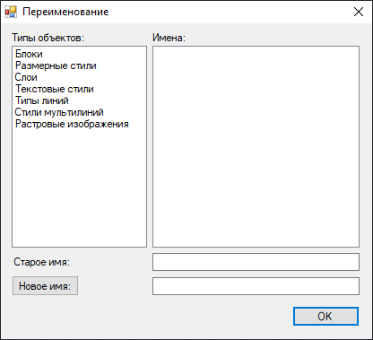

2. Выделите необходимый **Тип объекта** и **Имя**, которое хотите изменить.
3. Введите его новое название в текстовое поле и нажмите кнопку **Новое имя**.


