# Архив

## Технический коридор

Тип сегмента **Технический коридор** позволяет моделировать сегмент инженерной сети, сечение которого состоит из нескольких элементов. Данный тип сегмента можно применить, например, при проектировании сетей ТС. В таком случае технический коридор будет состоять из нескольких труб, бетонного футляра, дренажа и тд.

### Функционал рабочего окна Техкоридор

Проектирование поперечников технического коридора осуществляется в рабочем окне **Техкоридор**. В верхней части данного окна имеется два селектора:
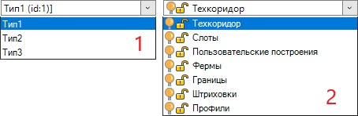

* В первом селекторе перечислены поперечники технического коридора.
* Во втором селекторе перечислены слои окна **Техкоридор**, на которых размещаются различные элементы, входящие в поперечник технического коридора. В данном списке с помощью соответствующих пиктограмм можно управлять видимостью, включать / выключать доступ к редактированию элементов в окне **Техкоридор**.

Функции рабочего окна **Техкоридор**:

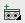 (**Добавить поперечник**) - добавить типовое поперечное сечение технического коридора;

 (**Клонировать поперечник**) - копировать типовой поперечник технического коридора с добавленными на него элементами и вспомогательными построениями;

 (**Переименовать поперечник**) - переименовать текущий типовой поперечник технического коридора;

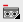 (**Удалить поперечник**) - удалить текущий типовой поперечник технического коридора.

Работа с элементами технического коридора:
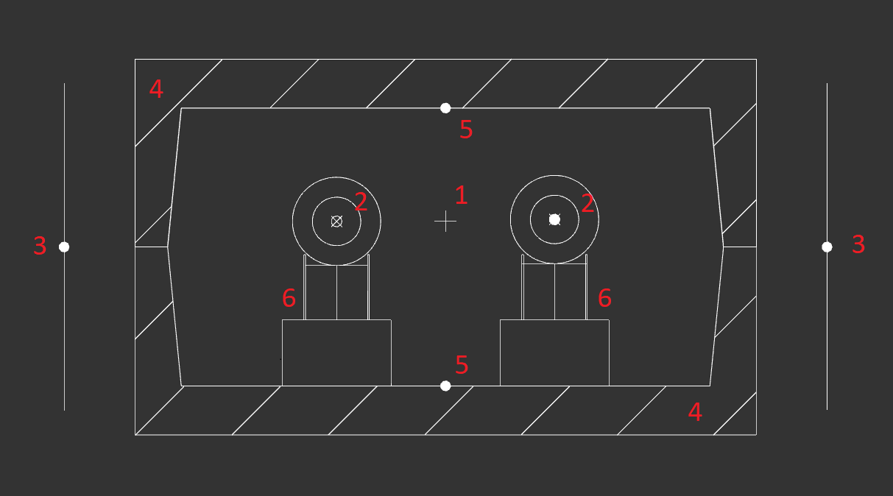

* **1** – ось технического коридора ;
* **2** – слот, в котором задана труба;
* **3** – границы технического коридора;
* **4** – контур технического коридора в виде короба;
* **5** – профиль технического коридора;
* **6** – вспомогательные построения.

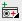 (**Добавить слот**) - добавить поперечное сечение оси сегмента с указанием ссылки на элемент **Библиотеки 3D объектов**. Для элемента типа "Слот" окно **Свойства** будет иметь следующий вид:
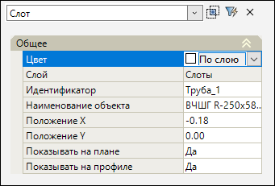

* **Цвет** – в данном выпадающем списке задается цвет выбранного элемента. По умолчанию задан цвет «По слою»;
* **Слой** - по умолчанию все элементы технического коридора расположены на именованных слоях;
* **Идентификатор** – наименование элемента в библиотеке 3D моделей. Чтобы назначить элемент нажмите на пиктограмму , откроется окно **Библиотеки 3D моделей**, выберите элемент и нажмите **Выбрать**.

* **Положение Х, Положение Y** - смещение элемента относительно оси поперечника технического коридора;
* **Показывать на плане / профиле** – в зависимости от выбранного пункта настраивается отображение элемента на плане и профиле.

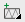 (**Добавить ферму**) - добавить поперечное сечение фермы. Для элемента типа "Ферма" окно **Свойства** будет иметь следующий вид:

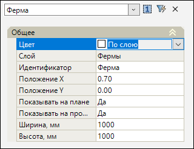

* **Ширина / Высота, мм** - редактируемые геометрические характеристики поперечного сечения фермы;

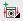 (**Добавить границы**) - добавить границы технического коридора в плане Для элемента типа "Границы" окно **Свойства** будет иметь следующий вид:
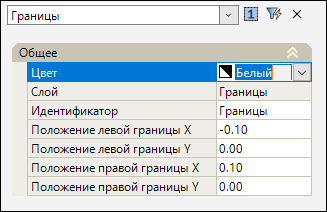

* **Положение левой / правой границы Х / Y** - смещение элемента относительно оси поперечника технического коридора;

 (**Добавить контур**) - добавить поперечное сечение контура элемента техкоридора (лотка, короба и т.д.). Окно **Свойства** для элемента типа "Штриховка" будет иметь следующий вид:
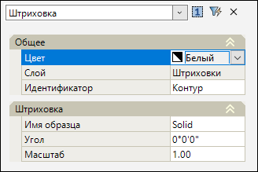

* **Имя образца** – в данном выпадающем списке задается тип штриховки контура. По умолчанию задан образец штриховки «Solid»;
* **Угол** – угол поворота штриховки контура;
* **Масштаб** – масштаб штриховки контура;

 (**Добавить профиль**) - добавить сечение профиля технического коридора. Данные по профилю можно вывести на чертеж при формировании профиля сети. Для этого:

1. В чертеже продольного профиля инженерной сети откройте окно **Редактирование шаблона**;
2. С помощью меню **Рисовать - Тэги шаблона** добавьте тэг **Отметка**;
3. В окне **Свойства** данного тэга укажите **Источник отметок - Профиль техкоридора** и укажите **Имя профиля** соответствующее свойству **Идентификатор** элемента типового поперечника техкоридора:
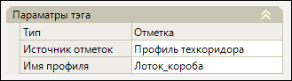

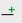 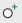 (**Добавить линию / окружность**) - данные функции применяются создания вспомогательных построений в рабочем окне **Техкоридор**;

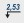 (**Добавить отметку**) - данная функция позволяет вынести значение высотной отметки точки поперечника технического коридора;

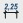 (**Добавить размер**) - данная функция предназначена для добавления размера типового поперечника технического коридора;

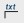 (**Добавить выноску**) - данная функция позволяет добавить выноску с дополнительной информацией в рабочем окне **Техкоридор**. Для этого выберите функцию, укажите точку вставки выноски и в динамической строке ввода задайте текст, который отобразится на выноске.



Для открытия селектора активной команды зажмите левую кнопку мыши на пиктограмме функции.



### Создание поперечника технического коридора

Для создания поперечника технического коридора:

1. На панели инструментов выберите команду **Добавить поперечник** , в динамической строке ввода введите название типового поперечника и нажмите **Enter**. На экране отобразится ось технического коридора:

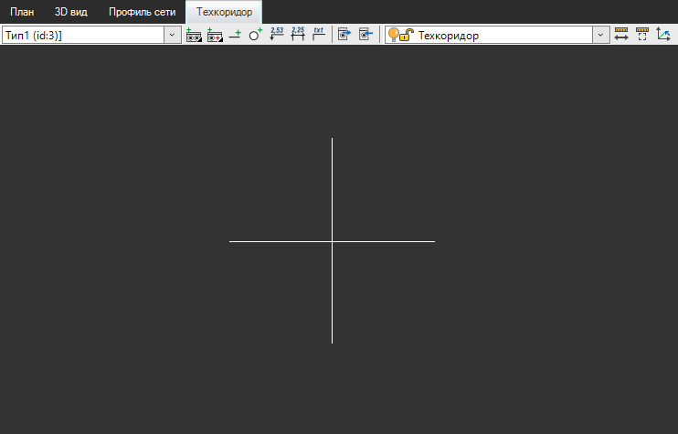

2. На панели инструментов выберите добавляемые элементы технического коридора (слот, ферму, границы, контур или профиль) и укажите их положение относительно оси техкоридора:
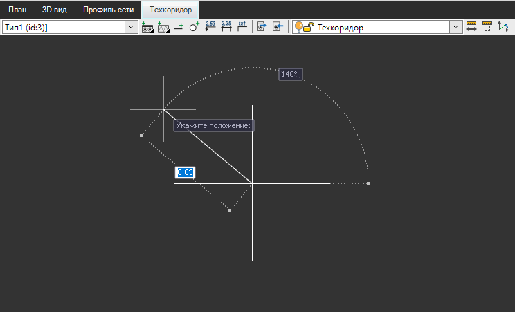

Далее в строке динамического ввода укажите наименование добавляемого элемента и нажмите **Enter** или правую кнопку мыши. В рабочем окне отобразится добавленный элемент технического коридора:
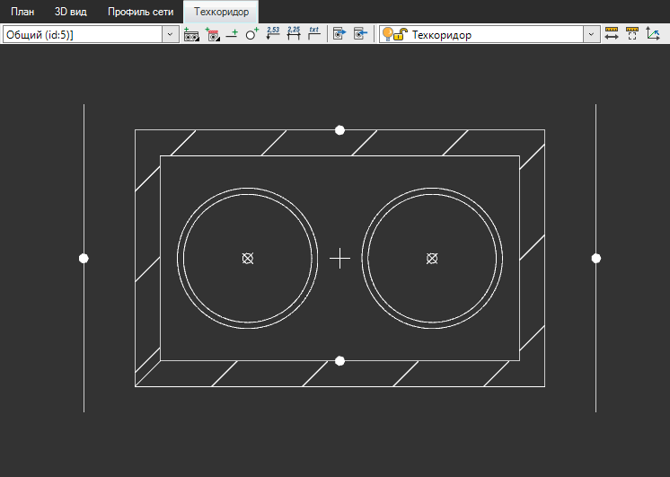

3. Настройте элементы технического коридора. Для этого выберите требуемый элемент и в окне **Свойства** введите необходимые данные.

В результате будет создан типовой поперечник технического коридора.

### Добавление поперечника технического коридора в линию сети

Для того чтобы создать линию сети с сегментами технического коридора необходимо:

1. В настройках инженерной сети в группе **Общие** выберите тип сегментов сети **Технические коридоры** и нажмите **ОК**:
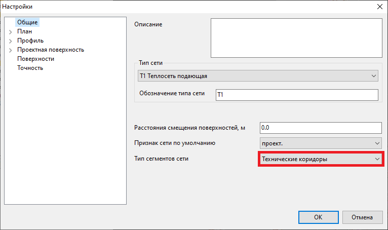

2. Создайте линию сети, используя тип сегмента **Универсальный технический коридор**.



Подробное описание ввода линии сети представлено в разделе [Создание линии сети](creation_pipeline.md)



3. Чтобы присвоить сегменту типовой поперечник технического коридора выберите на плане необходимый сегмент и в окне **Свойства** в группе **Параметры** выберите поле **Поперечник в начале** / **Поперечник в конце**:
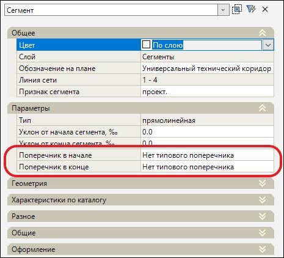

4. В выбранном поле нажмите на пиктограмму , далее из представленного динамического списка поперечников текущей модели выберите ранее добавленный поперечник:
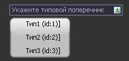

В результате будет создана линия сети с присвоенными типовыми поперечниками технического коридора.

### Назначить поперечник между узлами

Данная функция предназначена для назначения типового поперечника технического коридора всем сегментам между указанными узлами. Для этого:

1. Выберите меню **Инженерные сети – Утилиты – Назначить поперечник между узлами**;
2. Укажите узел начала, а затем узел конца участка назначения типового поперечника технического коридора;
3. Из представленного списка типовых поперечников текущей модели выберите необходимый поперечник:

В результате сегментам между указанными узлами будет назначен типовой поперечник технического коридора.

### Экспорт поперечника технического коридора

1. Для экспорта поперечника технического коридора текущей модели инженерной сети в пользовательскую **Библиотеку 3D моделей** нажмите **Экспортировать поперечник** 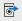;
2. Укажите название экспортируемого поперечника и нажмите **Enter**, далее выберите путь сохранения элемента поперечника технического коридора.

В результате в **Библиотеке 3D моделей** в выбранной пользовательской библиотеке появится папка **Auto**, в которую будет добавлен поперечник:
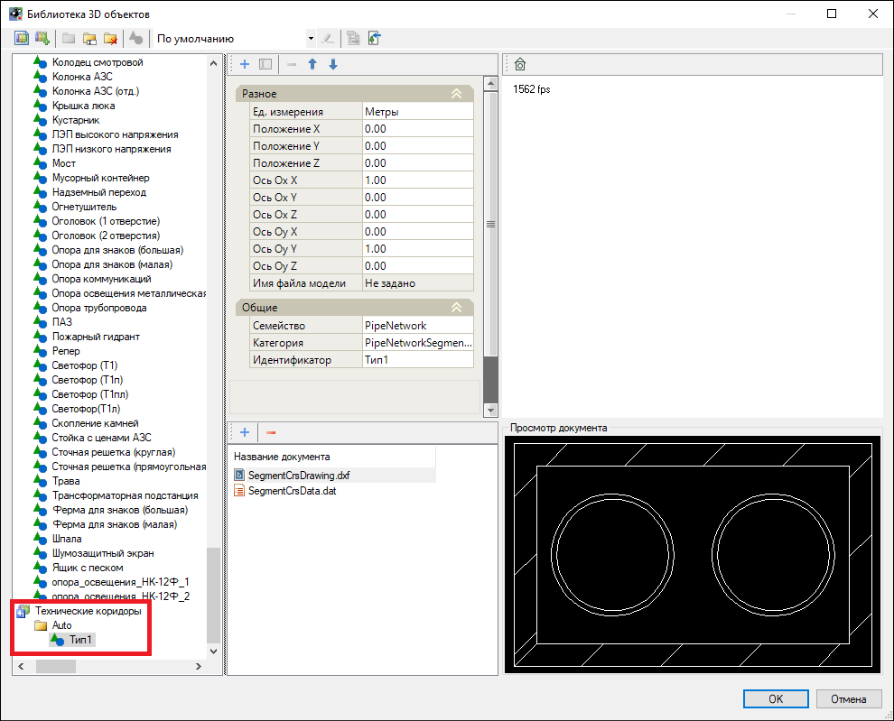



Инструкция по работе с библиотеками данных приведена в разделе [Приложение. Библиотеки данных](../../annex/libraries/libraries_info.md).



### Импорт поперечника технического коридора

1. Для импорта поперечника технического коридора в текущую модель инженерной сети нажмите **Импортировать поперечник** 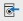, откроется окно **Библиотеки 3D моделей**, выберите импортируемый поперечник и нажмите **Выбрать**.
2. В строке динамического ввода введите новое имя импортируемого поперечника и нажмите **Enter**.

В результате импортируемый поперечник будет добавлен в текущую модель под введенным наименованием и отобразится в списке поперечников рабочего окна **Техкоридор**.