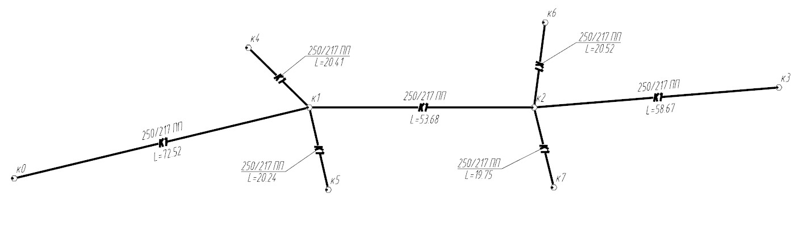
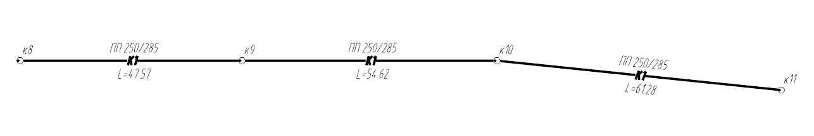
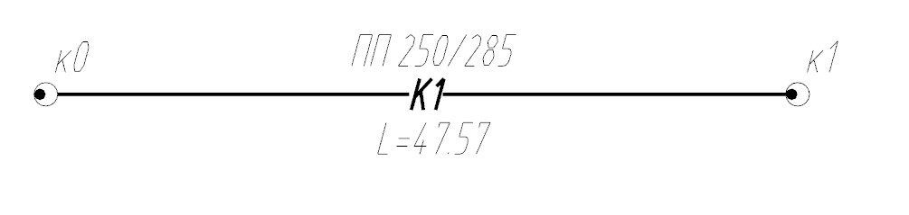

# Основные определения

**Инженерная сеть** – модель, состоящая из одной или нескольких линий сети, включающих в себя все их элементы, дополнительные объекты сети и общие настройки:

**Линия сети** – участок сети, состоящий из заданных типов узлов, соединенных сегментами инженерной сети:

**Сегмент** – конструкция (пустая ось), представляющая собой отрезок линии сети, ограниченный узлами с двух сторон, который состоит из протяженных и точечных элементов сегмента.

**Протяженный элемент** - это труба или кабель определенного типа или другой элемент, из которых складывается конструкция сложного сегмента.

**Узел** – точечный объект сети, соединенный с другими узлами инженерной сети посредством сегментов. Узлами являются характерные точки линии сети - колодцы, опоры освещения, очистные сооружения, трансформаторные подстанции, точки поворота и многое другое. Узлы могут состоять из набора элементов конструкции (стеновых и опорных колец, опор, кронштейнов, светильников и т.д.), например, сборные железобетонные колодцы.

**Вершина сегмента** – точка перелома геометрии сегмента в плане или профиле. Вершина в отличие от узла не является каким-либо объектом и не разделяет сегмент на разные составные части. Используется при создании участков ГНБ или вертикальных участков сети. Подробнее о добавлении вершин сказано в разделе [Редактирование сети](edit_elements_network_new.md).

**Универсальные сегменты** – базовые сегменты, геометрические параметры сечения которых доступны для редактирования. К универсальным сегментам относятся универсальная труба круглого и прямоугольного сечения, а также универсальный кабель.
