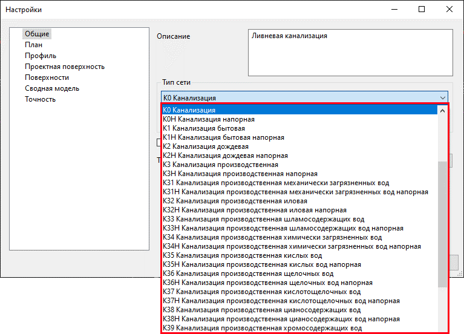
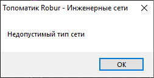
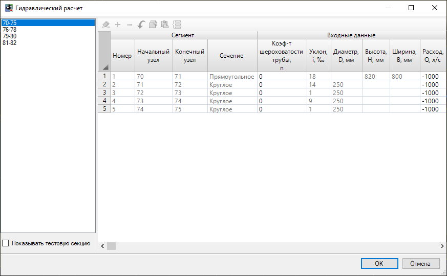
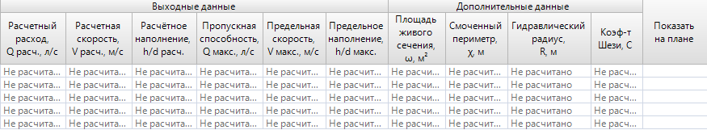
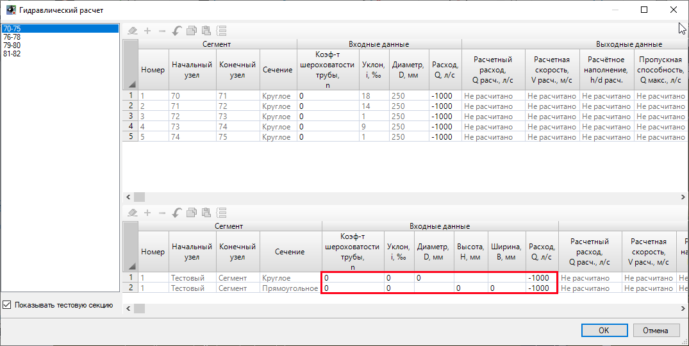
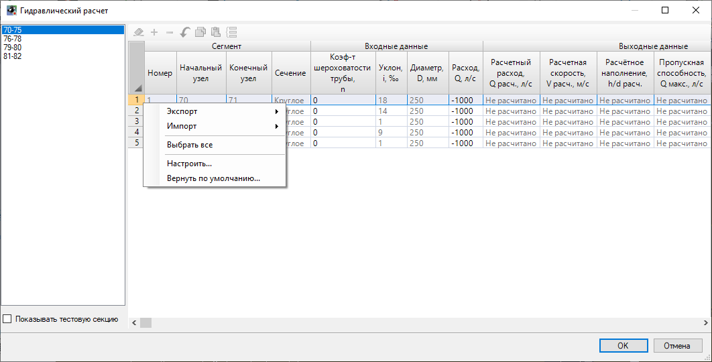
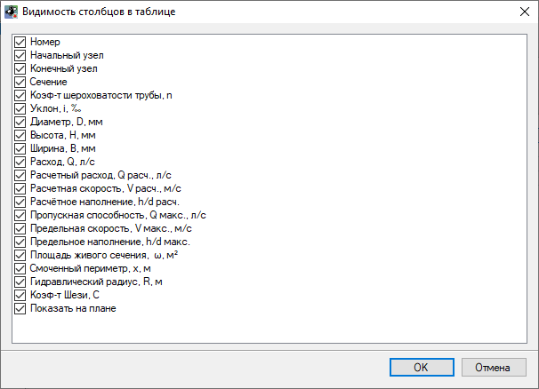
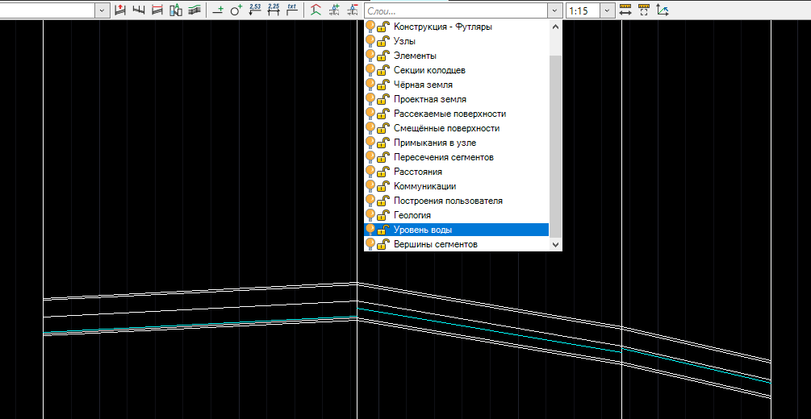

# Расчеты

Программа позволяет производить следующие типы расчетов:



Гидравлический расчет предназначен для расчета безнапорных сетей и создается для моделей, тип которых в "Настройках" модели имеет значение **К0-К39** (без «Н»):

Если **Тип сети** настроен неверно, при попытке произвести гидравлический расчет программа отправит следующее уведомление:



Гидравлический расчет выполнен согласно методике **«Таблицы для гидравлического расчета канализационных сетей и дюкеров по формуле акад. Н.Н. Павловского»** Лукиных А.А., Лукиных Н.А., Издание 4-е, доп. М., Стройиздат, 1974. 156 с.



Для произведения гидравлического расчета сети выберите функцию меню **Инженерные сети - Расчеты - Гидравлический расчет** либо выберите таблицу "Гидравлический расчет" в Структуре проекта, раздел "Расчеты":

При создании Гидравлического расчета открывается окно, в котором:

* В левой части окна представлен список линий сети, по которым производится расчет;
* В правой части представлена **расчетная таблица**;
* В нижней части представлена **тестовая секция**.

* В подразделе "Сегмент" автоматически задается информация по свойствам сегментов рассматриваемой линии сети. Расчет реализован для трубопроводов круглого и прямоугольного сечения.
* В зависимости от сечения сегмента в подразделе "Входные данные" программа автоматически заполняет геометрическую информацию по диаметру, высоте и ширине, а также значение уклона данного сегмента. Значения **коэффициента шероховатости трубы (n)** и **расхода (Q)** заполняются вручную.

* После ввода этих данных в подразделе "Выходные данные" программа автоматически произведет подсчет расчетных и предельных значений расхода / пропускной способности, скорости и наполнения трубы. Также будет произведен расчет вспомогательных переменных в разделе "Дополнительные данные".
* При нажатии на пиктограмму  в подразделе **Показать на плане**, программа отцентрирует окно План на выбранном сегменте.

Для открытия **Тестовой секции** поставьте галочку на данной функции в левом нижнем углу экрана, программа откроет дополнительный раздел таблицы. В тестовой части таблицы представлены два редактируемых сегмента круглого и прямоугольного сечения, у которых все значения входных данных сегментов вводятся пользователями вручную:

Для импорта данных расчетной таблицы во внешний формат необходимо нажать правой кнопкой мыши на обозначении порядкового номера строки и в открывшемся контекстном меню выбрать пункт **Импорт** и далее выбрать требуемый формат документа таблицы:

Команда **Настроить** позволяет отредактировать видимость столбцов в расчетной таблице:

После произведения гидравлического расчета на сегментах в окне Профиль сети и выходном чертеже профиля в слое **Уровень воды** появляется графическое отображение расчетного наполнения трубы:



При внесении изменений в таблицу гидравлического расчета необходимо воспользоваться функцией меню **Инженерные сети - Утилиты - Обновить сеть** для внесения изменений в отрисовку наполнения трубы.



