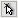
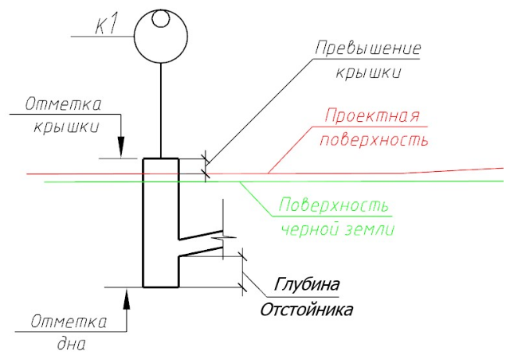
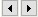
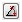
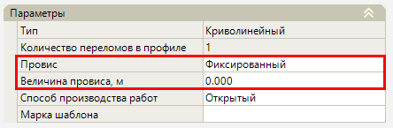
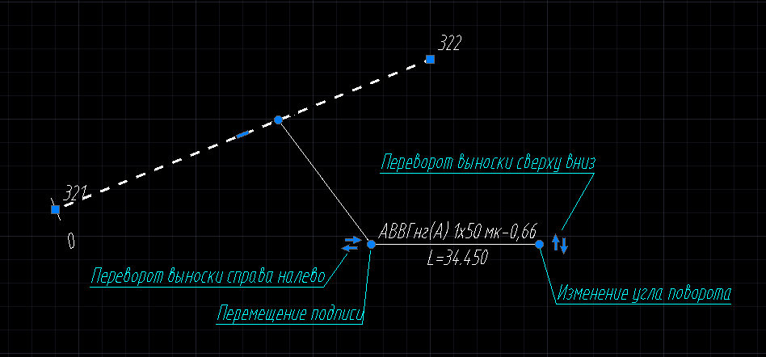
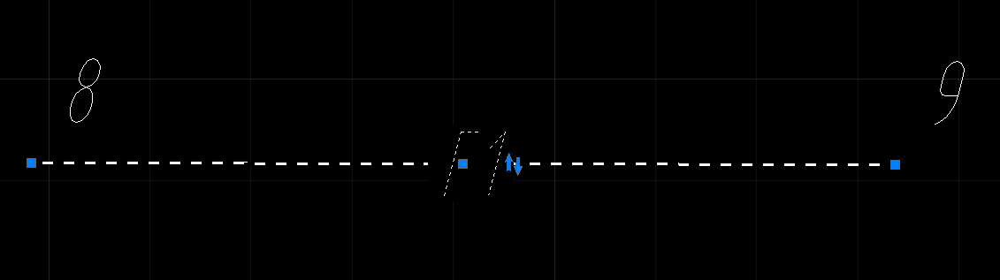

# Свойства элементов сети

Свойства [элементов сети](basic_definitions_new.md) представлены в следующих разделах:



При выборе линии сети основные её характеристики отображаются в окне **Свойства**:

## Слой

Данная группа содержит общую информацию о линии сети:

* **Слой** – по умолчанию все элементы сети расположены на именованных слоях. При необходимости изменения наименования какого-либо слоя воспользуйтесь меню **Формат - Менеджер слоев**;



Подробнее о данном функционале описано в Документации [Запуск и настройка. Работа со слоями модели.](../../../ru/install_startup/startup/working_with_layers_model/manager_layers.md)



* **Цвет** – в данном выпадающем списке задается цвет выбранного элемента;
* **Тип линии** – в данном выпадающем списке задается тип линии выбранного элемента. По умолчанию для всех линий сети задан тип линии «По слою»;
* **Масштаб типа линии** – это масштабный коэффициент, который применяется к образцу начертания линии и позволяет менять длину штрихов и других объектов, из которых линия состоит. По умолчанию для всех линий сети задан масштаб «1»;
* **Вес типа линии** – в данном выпадающем списке задается толщина типа линии выбранного элемента. По умолчанию для всех линий сети задан вес типа линии «По слою».

## Характеристики по каталогу

Данная группа содержит нередактируемые параметры, заданные в свойствах элемента в **Библиотеке 3D моделей**, а также редактируемые свойства, полученные по заданному smdx-типу элемента. Они используются для наполнения элемента "Линия сети" дополнительной атрибутивной информацией для формирования сводной информационной модели. С помощью параметра **Тип линии сети** можно заменить выбранный тип линии сети на другой, имеющийся в **Библиотеке 3D моделей**.

## Общие

* **Название** – по умолчанию наименование линии сети состоит из названий начального и конечного узла, при необходимости оно может быть изменено;
* **Тип сети** - в данном поле будет отображаться редактируемое буквенно-цифровое обозначение типа сети, предварительно заданное в **Настройках** модели инженерной сети.

## Параметры

В данной группе представлен ряд дополнительных конструктивных и информационных характеристик линии сети:

* **Количество узлов, Количество сегментов, Длина 2D** и **Длина 3D** - данные параметры показывают составляющие элементы инженерной сети и ее длину с учетом пространственного искажения;
* **Начальный пикет** - данное поле позволяет вручную назначить начальный пикет линии сети. По умолчанию каждая созданная линия сети имеет начальный пикет 0+00.00. Пикетаж линии сети приводится в свойствах узлов, ведомостях, а также отображается в окне **Профиль сети**. Подробное описание настроек профиля сети представлено [здесь](../design_profile_pipes/setup_window_profile_new.md);
* **Префикс пикетажа** - данное поле позволяет вручную ввести значение, которое будет подписываться перед значением с указанием пикетажа сети.

## Геология

* **Геологическая трасса** – в данном поле назначается ссылка на модель трассы с нанесенной на ее продольный профиль геологической информацией. В результате геологические данные (скважины и слои) будут отображаться на продольном профиле линии сети. Описание данного механизма приведено в главе [Работа с геологическими данными](../design_plan_pipes/utilities_new/geology.md).





При выборе узла инженерной сети основные его характеристики отображаются в окне **Свойства**. Рассмотрим основные свойства узла на примере дождеприемного колодца.

## Слой

* **Слой** – по умолчанию все элементы сети расположены на именованных слоях. При необходимости изменения наименования какого-либо слоя воспользуйтесь меню **Формат - Менеджер слоев**;



Подробнее о данном функционале описано в Документации [Запуск и настройка. Работа со слоями модели.](../../../ru/install_startup/startup/working_with_layers_model/manager_layers.md)



## Общие

Данная группа содержит общие сведения об элементе:

* **Название** – наименование данного узла. Отображается рядом с узлом на плане и в других рабочих окнах программы;
* **Описание** - дополнительная информация по узлу, используемая в некоторых условных знаках;
* **Признак узла** - информационная характеристика, влияющая на отображение узла в рабочих окнах программы. Узлы с признаком **Существующий** не будут учитываться в ведомостях инженерной сети; с признаком **Демонтируемый** - не будут учитываться в ведомостях инженерной сети, а также будут перечеркнуты в окне **План** и **Профиль сети**. По умолчанию, признак узла берется из настроек модели инженерной сети;
* **Линии сети** - показывает принадлежность узла к линии сети. Если узел принадлежит одной линии сети, то в графе будет написано наименование линии сети. Если узел принадлежит нескольким линиям сети, то будут перечислены наименования всех этих линий сети;
* **Пикет по линиям сети** - данная строка показывает пикетажное положение и смещение узла относительно линии сети, к которой он принадлежит;
* **Пикет по базису** - данная строка показывает пикетажное положение и смещение узла относительно оси назначенной базисной модели;
* **Положение X / Положение Y** - координаты базовой точки вставки узла. Координаты базовой точки могут задаваться графически. Для этого выделите поле с соответствующей координатой (X или Y) и нажмите кнопку , курсор будет привязан к точке вставки узла, укажите требуемое положение точки.

## Характеристики по каталогу

Данная группа содержит не редактируемые данные, такие как Общие, Оформление, Дополнительные параметры, Спецификация, Геометрия, заданные в свойствах элемента в **Библиотеке 3D моделей**:

* **Тип узла** - соответствует идентификатору элемента в **Библиотеке 3D моделей**, с помощью данного свойства можно заменить выбранный узел на другой, имеющийся в **Библиотеке 3D моделей**;
* **Сечение** - представление элемента, рассеченного плоскостью;
* **Ширина / Длина** - информационные параметры, влияющие на отображение колодца в программе и выходной документации. Данные числовые значения задаются элементу, по свойствам Ширина/Длина и тегам Width/Length из **Библиотеки 3D моделей**.

## Дополнительные параметры

В данной группе представлен ряд дополнительных настроек поведения узла в плане и на профиле:

* **Параметры плана** – данный параметр определяет поведение узла при его вводе и редактировании в окне **План**. При добавлении узла данный параметр назначается из свойств элемента **Библиотеки 3D моделей**. При необходимости пользователь может изменить данный параметр для одного или нескольких узлов. В данном поле доступны несколько вариантов для выбора. **Прямолинейный** - на узле с этим параметром не может быть перелома на плане, такой узел всегда стоит на прямолинейном участке. **По умолчанию** - на узле с этим параметром линия сети может изменять угол; 
* **Параметры профиля** – данный параметр определяет поведение узла при редактировании профиля сети. При добавлении узла данный параметр назначается из свойств элемента **Библиотеки 3D моделей**. В данном поле доступны несколько вариантов для выбора. **Прямолинейный** - на узле с этим параметром не может быть перелома сегмента в профиле сети. **Шарнирный** - на узле с этим параметром профиль сегмента может менять свой угол. **По умолчанию** - на узле с этими параметрами сегмент может разрываться и смещаться по вертикали;
* **Непрерывность параметров** – данный параметр определяет, будет ли меняться сортамент сегмента при прохождении через узел. При добавлении узла данный параметр назначается из свойств элемента **Библиотеки 3D моделей**. В данном поле доступны несколько вариантов для выбора. **Да** - при прохождении через данный узел параметры сегмента остаются неизменными. **По умолчанию** - при прохождении через данный узел параметры сегмента могут меняться.

## Параметры

В данной группе представлен ряд дополнительных конструктивных и информационных характеристик узла:

* **Марка шаблона** - в данном поле отображается наименование марки назначенной [конструкции узла](template_wells_new.md). Поле редактируемое, и позволяет внести дополнительные изменения в наименование марки. Внесенные изменения отобразятся в шаблоне конструкции узла при его сохранении;

* **Задавать крышку колодца** - данный параметр дает возможность задать отметку крышки либо превышения крышки колодца в зависимости от выбранного варианта данного свойства;



При вводе узлов отметки крышек автоматически принимаются с проектной поверхности с учетом заданной величины превышения.



* **Привязка дна** - данный параметр определяет то, как в программе будет приниматься дно колодца: **по отметке, по глубине отстойника, по высоте колодца, по секциям**;
* **Отметка крышки, Превышение крышки, Отметка дна, Глубина отстойника, Высота колодца** – данные параметры являются взаимозависимыми. К примеру, при изменении величины превышения крышки автоматически пересчитывается ее отметка. Они показаны на схеме ниже:



**Отметка дна** по умолчанию вычисляется от низа лотка трубы на глубину отстойника.



* **Погрешность раскладки колодцев** - данное поле отображает значение погрешности в миллиметрах, которое получилось при автоматической или ручной раскладке секций колодца. Погрешность раскладки это разница между расчетной высотой колодца и высотой колодца собранной из элементов колодца;



Функционал, позволяющий выполнять раскладку конструкции узла, будет описан в разделе [Конструкции узлов](template_wells_new.md)



## Секции колодца

В данной группе отображается информация о секциях, заданных при раскладке узла, а так же отображаются дополнительные свойства секций:

* **Число секций** - данное поле отображает количество созданных секций при раскладке колодцев;
* **Секция** - данное поле отображает порядковый номер секции позволяет с помощью кнопок  выбирать необходимую секцию колодца;
* **Наименование** - данное поле отображает наименование выбранной секции колодца;
* **Смещение Х, Смещение Y** - данное поле позволяет ввести или указать на плане смещение по оси Х и Y выбранной секции относительно текущего положения.
* **Поворот** - данное поле позволяет ввести угол поворота выбранной секции относительно текущего положения.

## Оформление

В данной группе задаются параметры отображения узлов в рабочих окнах и чертежах:

* **Условный знак на плане, Подпись условного знака на плане, Условный знак на профиле (подпись по ординате), Условный знак на развернутом плане** - редактируемые данные, предварительно заданные в свойствах элемента в **Библиотеке 3D моделей**. Являются графическим представлением узлов в рабочих окнах программы и при формировании чертежей. В данных свойствах заданы ссылки на элементы **Библиотеки точечных условных знаков**. При нажатии на пиктограмму  откроется окно **Библиотека точечных условных знаков**, выберите необходимый условный знак и нажмите **Выбрать**;
* **Угол поворота условного знака** - угол поворота условного знака в окне **План**.
* **Угол поворота выноски** - в поле ввода визуально, с помощью соответствующей кнопки  или при введении значения с помощью клавиатуры задается угол поворота выноски;
* В зависимости от поворота экрана или направления линии сети, с помощью выбора соответствующего пункта в списке **Перевернуть текст**, имеется возможность автоматически перевернуть текстовую подпись на 180°.
* **Скрыть выноску** - данная настройка позволяют скрыть/показать выноску узла. По умолчанию, данный признак берется из настроек модели инженерной сети.



Набор свойств может отличаться в зависимости от типа выбранного узла.







При выборе сегмента инженерной сети основные его характеристики отображаются в окне **Свойства**:

## Слой

Данная группа содержит общую информацию о сегменте:

* **Слой** – по умолчанию все элементы сети расположены на именованных слоях. Для изменения наименования какого-либо слоя воспользуйтесь меню **Сервис – Настройка**. Далее откройте группу **Оформление – Слои**, внесите необходимые изменения;



Подробнее о данном функционале описано в Документации [Запуск и настройка. Работа со слоями модели.](../../../ru/install_startup//working_with_layers_model/manager_layers.md)



* **Цвет** – в данном выпадающем списке задается цвет выбранного элемента. По умолчанию для всех сегментов сети задан цвет **«По слою»**;
* **Тип линии** – в данном выпадающем списке задается тип линии выбранного элемента. По умолчанию для всех сегментов задан тип линии «По слою»;
* **Масштаб типа линии** – это масштабный коэффициент, который применяется к образцу начертания линии и позволяет менять длину штрихов и других объектов, из которых линия состоит. По умолчанию для всех сегментов задан масштаб «1»;
* **Вес типа линии** – в данном выпадающем списке задается толщина типа линии выбранного элемента. По умолчанию для всех сегментов задан вес типа линии «По слою».

## Общие

Данная группа содержит текстовую подпись основных характеристик сегмента, автоматически подписываемых рядом с ним на плане, название узлов входящих в линию сети, признак сегмента:



Подробнее о данном функционале сказано в [Запуск и настройка. Общие настройки.](../../../ru/install_startup/startup/general_setting/design.md)



* **Обозначение на плане** - в данном поле задается наименование сегмента, которое будет отображаться в подписи сегмента на плане. При необходимости пользователь может его откорректировать;



Обозначение сегмента на плане по умолчанию назначается согласно соответствующему свойству элемента из **Библиотеки 3D моделей**.



* **Линия сети** - поле отображает наименование линии сети, к которой относится данный сегмент. Поле информационное и не доступно для редактирования;
* **Признак сегмента** - информационная характеристика, влияющая на отображение сегмента в рабочих окнах программы. Сегменты с признаком **Существующий** не будут учитываться в ведомостях инженерной сети; с признаком **Демонтируемый** - не будут учитываться в ведомостях инженерной сети, а также будут перечеркнуты в окне **План** и **Профиль сети**. По умолчанию, признак сегмента берется из настроек модели инженерной сети.

## Параметры

В данной группе представлен ряд дополнительных конструктивных и информационных характеристик сегмента:

* **Тип** - геометрическая характеристика сегмента. Если между узлами сегмент не имеет переломов, то он считается прямолинейным, если между узлами присутствуют переломы - сегмент считается криволинейным;
* **Уклон от начала сегмента/Уклон от конца сегмента** - величина уклона от начала к концу сегмента и от конца сегмента к его началу;
* **Основание** - параметр, позволяющий задать основание под конструкцией. Поле является редактируемым, имеется возможность выбрать стандартный вариант основания или задать пользовательский;
* **Толщина основания** - в данном поле задается толщина слоя основания под конструкцией;
* **Тип изоляции** - параметр, позволяющий задать тип изоляции сегмента. Поле является редактируемым, имеется возможность выбрать стандартный вариант изоляции или задать пользовательский;
* Свойство **Провис**, присущее только сегментам типа **Кабель**, по умолчанию имеют значение свойства **Нет**. При выборе значения **Фиксированный** появится дополнительное свойство **Величина провиса**. Данное свойство позволяет задать фиксированную величину провиса провода:

* **Способ производства работ** - технология, по которой будет производиться прокладка инженерной сети (открытый, закрытый);



При выборе способа производства работ **Закрытый** программа **Топоматик Robur** позволяет сформировать [чертеж продольных профилей участков ГНБ.](../formation_documentation/creation_output_drawings_new.md)



* **Марка шаблона** - в данном поле отображается наименование марки [шаблона конструкции сегмента](template_segments_new.md), заданного на выбранный сегмент. Поле редактируемое, и позволяет внести дополнительные изменения в наименование марки. Внесенные изменения отобразятся в шаблоне конструкции сегмента при его сохранении.

## Геометрия

В данной группе настраивается характерная точка на сегменте и положение этой точки в пространстве.

* **Начало сегмента / Конец сегмента** - подгруппы, содержащие информацию начала и конца текущего сегмента:
* **Название узла** - данное поле показывает наименование начального / конечного узла сегмента;
* **Отметка характерной точки** - абсолютная отметка начальной / конечной характерной точки сегмента (верх, шелыга, середина, лоток, низ);
* **Расстояние до характерной точки от черный земли, м** / **Расстояние до характерной точки от проектной земли, м** - расстояние от начальной / конечной характерной точки сечения сегмента до существующей / проектной точки земли. При изменении **Характерной точки сечения**, отметки автоматически пересчитываются;
* **Положение начала / конца сегмента** - в данном поле отображается наименование точек подключения начала / конца сегмента к узлу, если данные подключения были заданы с помощью функции **Назначить точку подключения к узлу**. Точки подключения также можно задать непосредственно в поле свойства. Для этого нажмите кнопку {{:road:creation_wells_2_.jpg?nolink|}}, в динамическом окне укажите точки подключения к узлу и нажмите **Esc** для подтверждения;



Назначение точек подключения к узлу описано далее в разделе [Подключение сегментов к назначенным точкам подключения узла](connection_segment_dots_wells_new.md).



* **Характерная точка сечения** - при вводе сегмента данное поле по умолчанию заполняется по параметрам, заданным в настройке модели инженерной сети (верх, шелыга, середина, лоток, низ). При необходимости пользователь может изменить характерную точку выбранной трубы;
* **Длина от начала / конца, м** - данное поле показывает длину сегмента от начала до конца и от конца до начала;
* **Длина 3D, м** - данное поле показывает длину сегмента с учетом пространственного искажения.

## Характеристики по каталогу

Данная группа содержит нередактируемые данные, заданные в свойствах элемента в **Библиотеке 3D моделей**. С помощью свойства **Тип сегмента** можно заменить выбранный сегмент на другой, имеющийся в **Библиотеке 3D моделей**.



Подробное описание работы с **Библиотекой 3D моделей** представлено в [Приложение. Библиотеки данных. Работа с библиотекой 3D объектов](../../../ru/annex/libraries/library_3d_models.md). 



* **Способ прокладки сегмента** - в данном поле задается тип прокладки сегментов для сводной информационной модели. При типе прокладки **Подземный** заполняется значение свойства **Глубина заложения трассы, м**; при типе прокладки **Надземный** заполняется значение свойства **Высота надземного расположения трассы, м**. Тип прокладки **По центру сегмента** автоматически задает надземное или подземное расположение сегментов при формировании сводной модели, в зависимости от положения центральной точки сегмента. По умолчанию данный признак берется из настроек модели инженерной сети.

## Оформление

В данной группе задаются параметры отображения подписи сегмента на плане, такие как:

* **Угол поворота выноски** - в поле ввода визуально, с помощью соответствующей кнопки  или при введении значения с помощью клавиатуры задается угол поворота выноски;
* В зависимости от поворота экрана или направления линии сети, с помощью выбора соответствующего пункта в списке **Перевернуть текст**, имеется возможность автоматически перевернуть текстовую подпись на 180°.
* **Скрыть выноску / скрыть тип сети** - данные настройки позволяют скрыть/показать выноску сегмента/обозначения типа сети. По умолчанию, данные признаки берутся из настроек модели инженерной сети.



Опции в данном разделе настроек могут быть применены к выбранной группе объектов.



Описанный в разделе [Запуск и настройка. Общие настройки. Оформление](../../../ru/install_startup/startup/general_setting/design.md) функционал доступен и при визуальном оформлении плана сетей.

При выделении элемента **Сегмент** на выноске появляются дополнительные вершины (грипы), с помощью которых можно осуществлять перемещение текстовой подписи, переворот выноски (слева направо и наоборот), переворот текстовой подписи (сверху вниз и наоборот), изменение угла поворота выноски:

При выделении элемента **Линия сети** для редактирования становится доступно положение обозначения типа сети:





Редактирование параметров футляра осуществляется с помощью окна **Свойства**:

## Слой

* **Слой** – по умолчанию все элементы сети расположены на именованных слоях. При необходимости изменения наименования какого-либо слоя воспользуйтесь меню **Сервис – Настройка**. Далее откройте группу **Оформление – Слои**, внесите необходимые изменения;



Подробнее о данном функционале сказано в Документации [Запуск и настройка. Работа со слоями модели.](../../../ru/install_startup/startup/working_with_layers_model/manager_layers.md)



* **Цвет** – в данном выпадающем списке задается цвет выбранного элемента. По умолчанию для всех футляров задан цвет «**По слою**»;
* **Тип линии** – в данном выпадающем списке задается тип линии выбранного элемента. По умолчанию для всех футляров задан тип линии «По слою»;
* **Масштаб типа линии** – это масштабный коэффициент, который применяется к образцу начертания линии и позволяет менять длину штрихов и других объектов, из которых линия состоит. По умолчанию для всех футляров задан масштаб «1»;
* **Вес типа линии** – в данном выпадающем списке задается толщина типа линии выбранного элемента. По умолчанию для всех футляров задан вес типа линии «По слою».

## Общие

Данная группа содержит текстовую подпись основных характеристик футляра, автоматически подписываемых рядом с ним на плане:

* **Признак сегмента** - информационная характеристика, влияющая на отображение футляра в рабочих окнах программы. Футляры с признаком **Существующий** не будут учитываться в ведомостях инженерной сети; с признаком **Демонтируемый** - не будут учитываться в ведомостях инженерной сети, а также будут перечеркнуты в окне **План** и **Профиль сети**. По умолчанию, признак футляра берется из настроек модели инженерной сети.

* **Обозначение на плане** - в данном поле задается наименование футляра, которое будет отображаться в подписи футляра на плане. При необходимости пользователь может его откорректировать;



Обозначение футляра на плане по умолчанию назначается согласно соответствующему свойству элемента из **Библиотеки 3D моделей**.



* **Линия сети** - поле отображает наименование линии сети, к которой относится данный футляр. Поле информационное и не доступно для редактирования;
* **Сегмента** - поле отображает наименование сегмента, к которому относится данный футляр. Поле информационное и не доступно для редактирования;
* **Длина в плане** – данное поле позволяет изменить длину футляра. При этом длина изменится относительно начала футляра.
* **Длина 3D, м** - данное поле показывает длину футляра с учетом пространственного искажения.

## Параметры

Параметры, представленные в данной группе, позволяют расположить ось футляра не соосно относительно оси трубы:

* **Толщина основания** - в данном поле задается толщина слоя основания под конструкцией;
* **Расстояние от оси футляра до оси сегмента / Расстояние от низа сегмента до лотка футляра** - в данных полях задается смещение оси футляра от оси сегмента по вертикали.

## Геометрия

* **Положение начала / Положение конца** – параметр, позволяющий настроить положение начала или конца футляра относительно оси, на которую он был назначен. Данный параметр можно настроить вручную с помощью числовых значений.

## Характеристики по каталогу

Данная группа содержит нередактируемые данные, заданные в свойствах элемента в **Библиотеке 3D моделей**. С помощью свойства **Тип конструкции** можно заменить выбранный футляр на другой, имеющийся в **Библиотеке 3D моделей**.

## Элементы

Данная группа позволяет добавить дополнительные элементы в футляр:

* **Контрольные трубки** - в данном поле задается наличие и расположение контрольных трубок на футляре сетей газопровода и нефтепровода.

Данная опция характерна для сетей ГС.

## Оформление

В данной группе задаются параметры отображения подписи футляра на плане, такие как:

* **Угол поворота выноски** - в поле ввода визуально, с помощью соответствующей кнопки  или при введении значения с помощью клавиатуры задается угол поворота выноски;
* В зависимости от поворота экрана или направления линии сети, с помощью выбора соответствующего пункта в списке **Перевернуть текст**, имеется возможность автоматически перевернуть текстовую подпись на 180°.
* **Скрыть выноску** - данная настройка позволяют скрыть/показать выноску футляра.
* **Показывать на плане / Показывать на профиле** - данные настройки позволяют показать/скрыть отображение футляра с выноской на плане/профиле сети.

