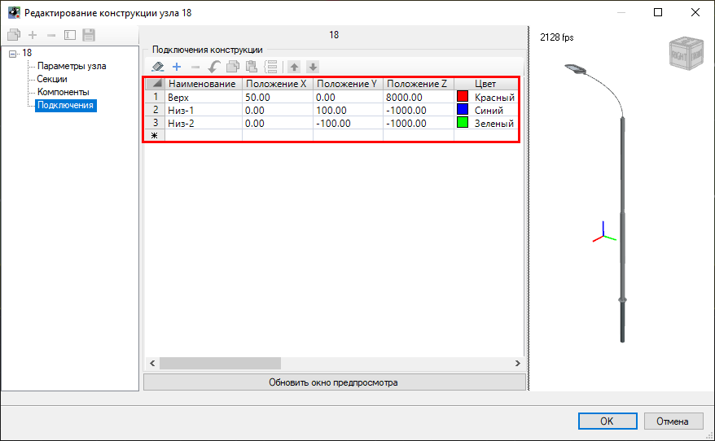
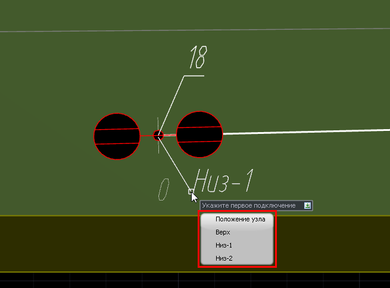
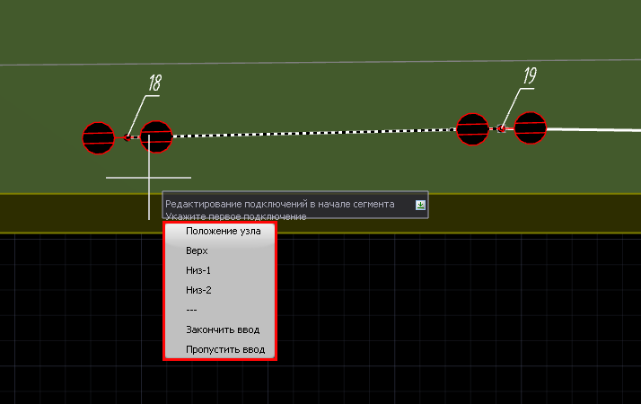
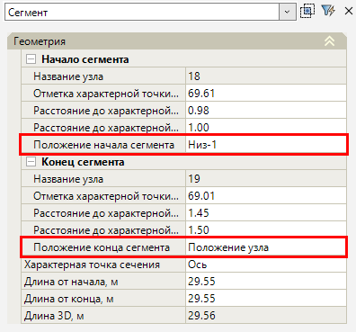
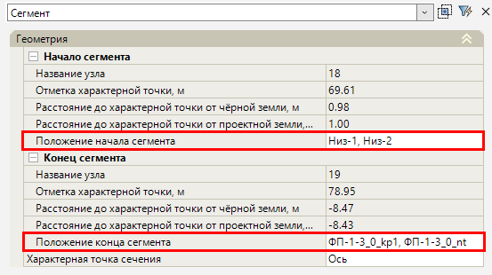

# Точки подключения

В программе предусмотрена возможность подключения сегментов к различным точкам узлов. Данные точки подключения создаются в [конструкции узла](template_wells_new.md) или напрямую при создании 3D модели элемента. Назначение точек подключения может быть произведено различными методами.

## Назначить точку подключения к узлу

Для того чтобы назначить точку подключения:

1. Выберите меню **Инженерные сети - Конструкции элементов сети - Назначить точку подключения к узлу**;
2. Укажите узел, на который была назначена конструкция с точками подключения, далее выберите сегмент, который необходимо подключить к узлу;
3. Укажите точку подключения сегмента к узлу через контекстное меню, нажав правую кнопку мыши или клавишу "вниз". Также можно назначить точку подключения к узлу двигая курсором вокруг узла, программа автоматически будет отображать название ближайших точек подключения, для подтверждения команды нажмите левую кнопку мыши:
 

## Назначить точки подключения сегментов

1. Выберите меню **Инженерные сети - Конструкции элементов сети - Назначить точки подключения сегментов**;
2. Укажите сегмент или сегменты, для которых будут назначаться точки подключения к узлам;
3. Укажите точку подключения к узлу **в начале сегмента** через автоматически отобразившееся контекстное меню:

Можно назначить несколько подключений в начале сегмента, последовательно выбирая точки подключения, или закончить редактирование подключений в начале сегмента, нажав клавиши «Закончить ввод» или «Пропустить ввод» левой кнопкой мыши.

4. Укажите точку подключения к узлу **в конце сегмента** через автоматически отобразившееся контекстное меню. Аналогичным образом можно назначить несколько подключений в конце сегмента.

Точки подключения к узлу также можно назначить при помощи свойств элемента «Сегмент» **Положение начала / конца сегмента**:

В данных свойствах отображается наименование точек подключения начала / конца сегмента к узлу, если данные подключения были заданы с помощью функций **Назначить точку подключения к узлу / Назначить точку подключения сегментов**. Точки подключения также можно задать непосредственно в поле свойства. Для этого нажмите кнопку , в динамическом окне укажите точки подключения к узлу и нажмите **Esc** для подтверждения.



Если точек подключения было задано несколько, то в свойствах элемента «Сегмент» они будут перечислены по порядку:  



В результате выбранному сегменту будет присвоено плановое и высотное положение точки подключения указанного узла.