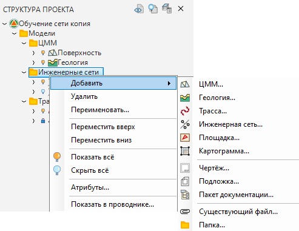
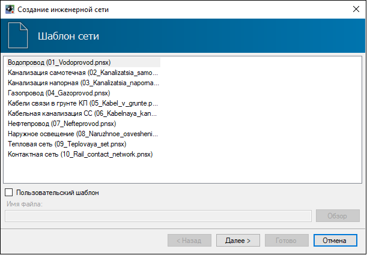
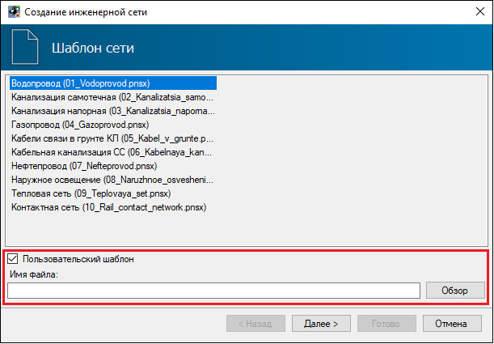
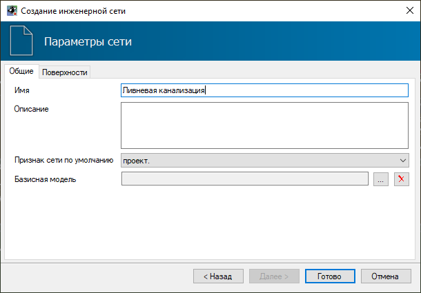
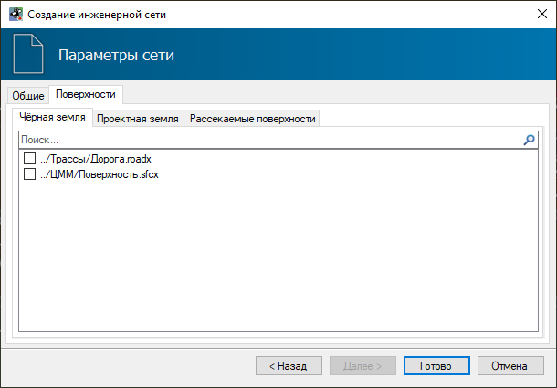
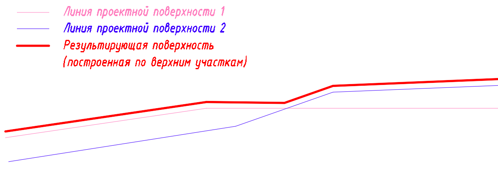

# Создание модели инженерной сети

Для создания новой модели инженерной сети выполните следующие действия:

1. В **Структуре проекта (F9)** нажмите правой кнопкой мыши на папке, в которой необходимо создать новую модель инженерной сети. Появится контекстное меню:

2. Выберите из меню пункт **Инженерная сеть**, откроется окно **Создание инженерной сети**.

На первом шаге программа предлагает выбрать один из стандартных шаблонов новой инженерной сети. Для каждого типа сети предусмотрен отдельный стандартный шаблон.

**Шаблон инженерной сети** представляет собой пустую модель инженерной сети с набором базовых настроек, характерных для данной сети. К базовым настройкам относятся настройка характерной точки на сегменте, точность отображения данных в окнах программы, настройка подпрофильных таблиц и т.п.:

Кроме того, можно установить галочку **Пользовательский шаблон** и в соответствующем поле указать путь к произвольному шаблону инженерной сети:

* Стандартные шаблоны инженерных сетей хранятся на компьютере по следующему пути: **C:\ProgramData\Topomatic\Robur Pipes\16.0\Templates\Networks**.
* Также есть возможность добавить свои шаблоны инженерной сети в папку с пользовательскими шаблонами по следующему пути: **C:\Users\....\Documents\Топоматик Robur\Templates\Networks**. После чего новые шаблоны будут отображаться в общем списке шаблонов.



Шаблон инженерной сети представляет из себя заранее настроенную модель инженерной сети без внесенных проектных данных.



Выберите необходимый шаблон и нажмите **Далее**, откроется вкладка **Общие**:

* В поле **Имя** задайте название создаваемой инженерной сети, которое отобразится в **Структуре проекта**;
* **Описание** - в данном поле может быть продублировано имя сети или задано расширенное наименование сети. При наличии в модели пересечений данное поле будет выноситься на чертеж продольного профиля в таблицу **Условные обозначения** и в **Ведомость пересечений**;
* **Признак сети по умолчанию** – информационная характеристика, влияющая на отображение сети в рабочих окнах программы и являющаяся фильтром при создании ведомостей. Данный признак будет присваиваться всем элементам сети по умолчанию, при необходимости его можно будет изменить у отдельных элементов сети в окне **Свойства**. Элементы с признаком *Демонтируемый* - будут перечеркнуты в окне План и Профиль сети; с признаком *Недействующий* и *Временный* - будут иметь дополнительную выноску в окне План.
* **Базисная модель** – в данном поле назначается модель, ось которой будет являться базисом при работе с инженерной сетью. Например, при выборе узла в окне План на панели Свойства в поле Пикет по базису будет отображаться его положение по пикету и смещению относительно базисной модели. Для того, чтобы задать Базисную модель, нажмите кнопку , откроется дополнительное окно, выберите необходимую модель и нажмите ОК.

На вкладке **Поверхности**, назначается черная (существующая) земля, проектная земля и, при необходимости, рассекаемые поверхности:

При подключении нескольких проектных или черных поверхностей за основу будут приняты верхние результирующие отметки по поверхностям. Если имеется пересечение черной и проектной поверхности, то за основную будет приниматься проектная поверхность. Рассекаемые поверхности не являются опорными и служат только для отображения сечения в окне профиля сети.



Следует избегать подключения большого количества моделей проектных и черных поверхностей, т.к. количество, а не размер данных моделей напрямую сказывается на скорости работы инженерной сети. При большом количестве подключаемых моделей следует создавать комплексные сборные модели черных и проектных поверхностей.



3. Заполните все необходимые данные и нажмите **Готово**. В результате будет создана новая модель сети с заданными настройками, наименование которой отобразится в дереве **Структуры проекта**.



Функционал по работе с данным окном был подробно описан ранее ([Запуск и настройка. Структура проекта](../../../ru/install_startup/startup/structure_project/structure_project.md)).

