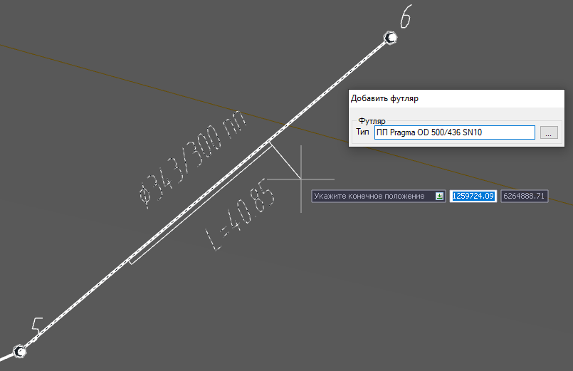
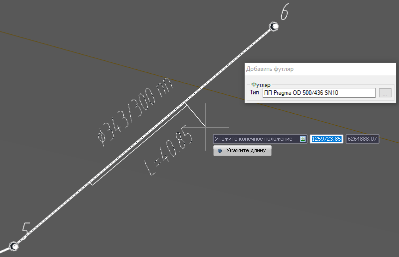
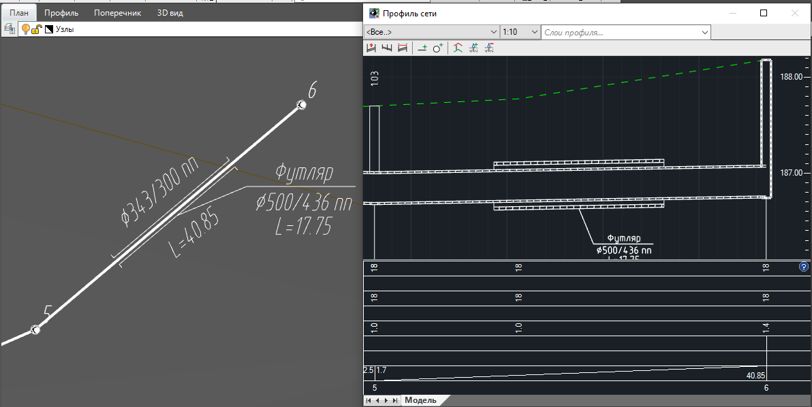
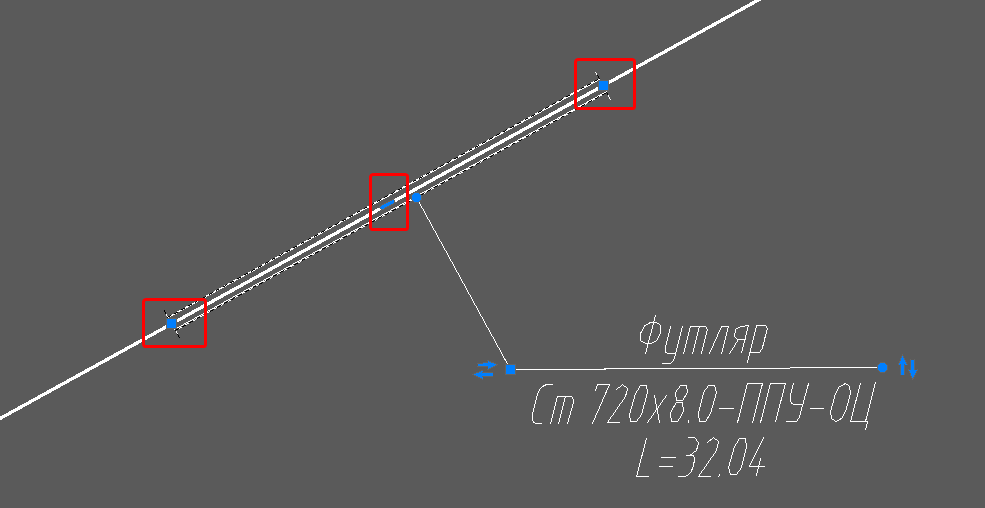

# Создание футляра

Прокладка различного типа инженерных сетей может осуществляться в футляре. В программе представлен функционал, позволяющий создавать и редактировать данные элементы. Футляры отрисовываются во всех рабочих окнах программы и учитываются при подсчете объемов работ. Футляр сегмента может задаваться в окне **План** или в окне **Профиль сети**, в зависимости от того, какое окно активно в момент выбора функции.

Для добавления футляра:

1. Выберите меню **Инженерные сети – Добавить футляр сегмента**. Курсор примет форму прицела, откроется окно выбора типа добавляемого футляра:



Выбор определенного типа элемента при вводе с помощью данного окна был подробно описан ранее в разделе [Добавить линию сети](creation_pipeline.md).



2. Левой кнопкой мыши выберите сегмент, в который будет добавляться футляр и укажите его начальное и конечное положение:



Для ввода длины футляра после указания первой точки нажмите клавишу **down** и выберите пункт **Укажите длину**, после в динамическом окне укажите длину футляра и нажмите **Ввод**. 



В результате футляр отобразится в рабочих окнах **План** и **Профиль сети**:

При необходимости после добавления футляра его положение может быть скорректировано с помощью левой кнопки мыши и специальных грипов, расположенных на концах и в центре футляра как на плане, так и на продольном профиле сети:
