# Создание линии сети

Линия сети в окне **План** может задаваться следующими способами:



Для добавления линии сети на план вручную:
1. Выберите меню **Инженерные сети - Ввод сети - Добавить линию сети**;

При вызове функции ввода линии сети откроется следующее окно:
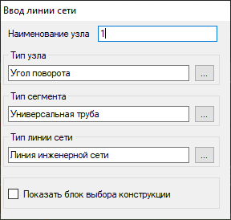

С помощью данного окна можно задавать наименование узлов, тип узлов и сегментов путем выбора их из **Библиотеки 3D моделей**, а также изменять их в процессе отрисовки линии сети.

Для того чтобы на этапе ввода линии сети назначить или изменить тип узла/сегмента нажмите в окне **Ввод линии сети** кнопку . Откроется окно **Библиотеки 3D моделей**:
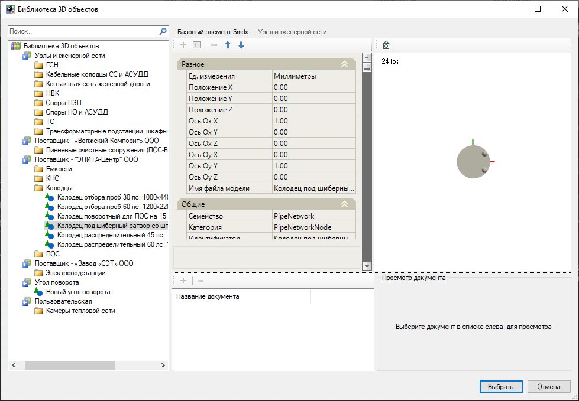

Выберите из соответствующей группы требуемый тип узла/сегмента и нажмите **Выбрать**.

2. Последовательно, нажимая левую кнопку мыши, укажите на плане положение узлов создаваемой линии сети.

Если при создании линии сети выбрать предварительно созданные узлы, то они будут подключены к добавляемой линии сети. При этом добавляемые узлы будут подсвечиваться желтым цветом:
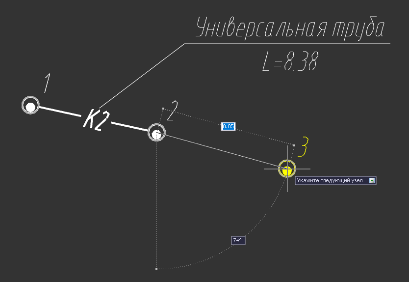
3. Для выхода из режима создания линии сети нажмите правой кнопкой мыши и выберите **Ввод** или нажмите **Esc**.

При последовательном вводе планового положения узлов можно воспользоваться различными типами объектного отслеживания. Для этого с помощью правой кнопки мыши вызовите контекстное меню и выберите дополнительную опцию:
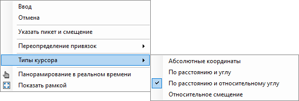

* **Указать пикет и смещение** - данный способ позволяет задать режим ввода сети относительно выбранной оси модели автомобильной или железной дороги;

Назначить режим объектного отслеживания ввода данных в контекстном меню можно в разделе «**Типы курсора**»:

* **Абсолютные координаты** - данный способ позволяет задать положение следующего узла по математическим координатам X и Y текущей системы координат:
* **По расстоянию и углу** - данный способ позволяет задать длину сегмента, а так же угол сегмента относительно оси Х системы координат:
* **По расстоянию и относительному углу** - данный способ позволяет задать длину сегмента, а так же угол сегмента относительно направления предыдущего сегмента:
* **Относительное смещение** - данный способ позволяет ввести последующий сегмент линии сети относительно смещения по оси Х и Y текущей системы координат:

В результате будет создана линия сети, которая будет состоять из узлов и сегментов, выбранных в процессе ввода.





При помощи данной функции можно создать линию сети на основе плановой геометрии выбранного примитива или линейного объекта. В каждой вершине линейного объекта будет создан узел выбранного типа, данные узлы будут соединены между собой сегментами. Профиль созданной линии будет сформирован автоматически по руководящей отметке относительно подключенных опорных поверхностей, заданных в [настройках модели сети](settings_create_model_new.md). Для этого:

1. Выберите элемент меню **Инженерные сети - Ввод сети - Создать линию сети из примитива**;
2. После вызова функции откроется окно **Ввод линии сети**:

Назначьте тип сегментов и узлов, выбрав их из **Библиотеки 3D моделей**, а также номер начального узла линии сети.



 Работа с данным окном была описана ранее в разделе [Добавить линию сети](creation_pipeline.md).



3. Выберите левой кнопкой мыши ранее отрисованный примитив или линейный объект, из которого нужно создать линию сети.

При вызове функции можно воспользоваться дополнительной опцией ввода, для этого с помощью правой кнопки мыши вызовите контекстное меню и выберите дополнительную опцию **Укажите линейный объект (по вершинам)**. Данная опция позволяет построить линию сети не по всему примитиву, а указать требуемый участок через выбор вершин начала и конца по опорному примитиву.

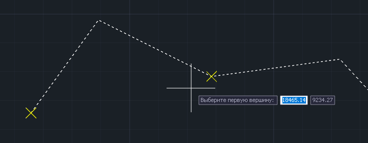





Данная функция позволяет создавать линии сети из структурных линий и 3D полилиний. Ситуационными структурными линиями с определенной семантической информацией, как правило, описываются существующие коммуникации. Преимущественно, эти структурные линии являются элементами топоплана и находятся в модели типа **ЦММ**.



Для упорядочивания данных рекомендуется создавать существующие сети в отдельной модели инженерных сетей. Работа с моделями типа **ЦММ** была описана ранее (См. [Работа с ЦММ](../../../ru/rb_survey/dtm/general_information.md)).



Для создания линии сети из структурных линий:

1. Выберите меню **Инженерные сети - Ввод сети - Создать линии сети из структурных линий**;
2. Выберите структурную линию или 3D полилинию, откроется диалоговое окно:
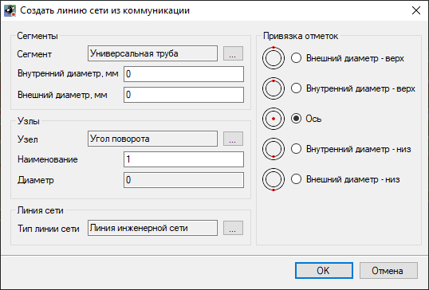

В разделах **Сегменты**, **Узлы** и **Линия сети** производится назначение типов соответствующих элементов участка сети из **Библиотеки 3D моделей**.



 При назначении элементов универсального типа значение диаметров сегментов и узлов определяется на основе семантической информации исходного линейного объекта (коммуникации). В случае назначения типов параметризированных сегментов и узлов из библиотеки программы все характеристики элементов будут приняты в соответствии с ней. 



В правой части окна, в поле **Привязка отметок**, осуществляется выбор базовой точки сегмента (отметки внешнего контура, внутреннего контура или оси сегмента), которая будет соответствовать отметкам исходной структурной линии, из которой была создана существующая линия сети.

Ниже приведены примеры привязки отметок:

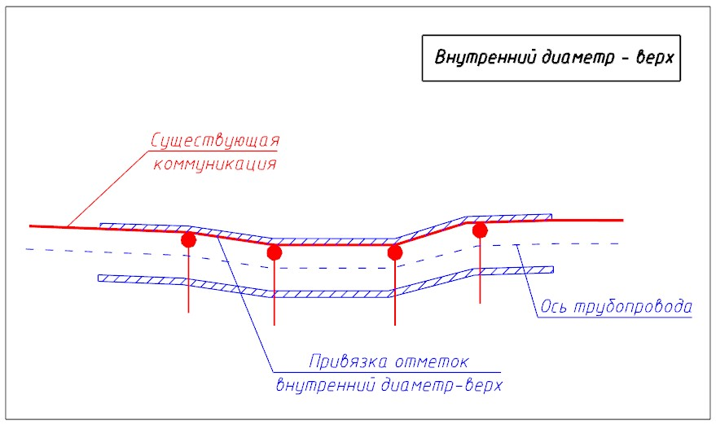 
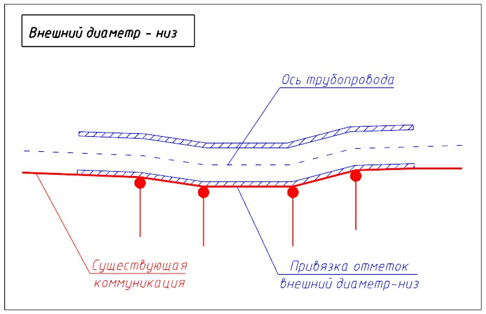

3. Задав необходимые параметры, нажмите **ОК**.

В результате по коммуникации будет создана линия сети с признаком **Существующий**:
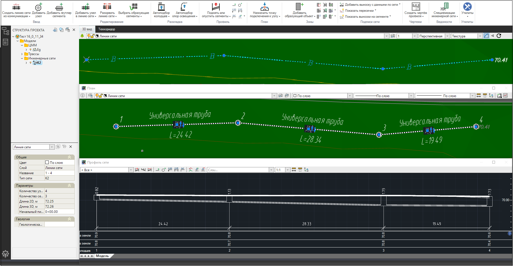

Существующие линии сети, аналогично проектируемым, отрисовываются в основных рабочих окнах программы с отображением всех основных габаритных расстояний до ближайших смежных сетей или узлов:
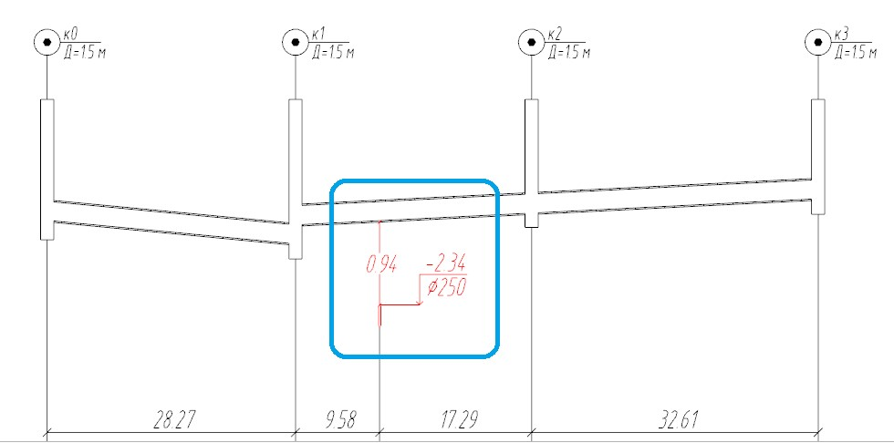





1. Выберите меню **Инженерные сети - Ввод сети - Создать линию сети по линейному объекту**;
2. После вызова функции откроется окно **Ввод линии сети**:

Назначьте тип сегментов и узлов, выбрав их из **Библиотеки 3D моделей**, а также номер начального узла линии сети. Подробнее работа с данным разделом описана в разделе [Добавить линию сети](creation_pipeline.md).

3. Выберите линейный объект, вдоль которого будет создан новая линия сети, и укажите точки начала и конца расстановки узлов;
4. Укажите сторону смещения узлов относительно линейного объекта и введите интервал расстановки узлов;
5. При необходимости введите значение смещения узлов относительно линейного объекта;
6. Нажмите **Enter** для завершения команды.

В результате на основе плановой геометрии выбранного линейного объекта и последовательного заполнения перечисленных параметров будет создана "Линия сети".





1. Выберите меню **Инженерные сети - Ввод сети - Создать линию сети по другой линии**;
2. После вызова функции откроется окно **Ввод линии сети**:

Назначьте тип сегментов и узлов, выбрав их из **Библиотеки 3D моделей**, а также номер начального узла линии сети. Подробнее работа с данным разделом описана в разделе [Добавить линию сети](creation_pipeline.md).

3. Выберите линию сети, вдоль которой будет создана новая линия, и укажите начальный и конечный узел;
4. Укажите сторону смещения узлов относительно выбранной линии сети;
5. При необходимости введите значение смещения линии сети относительно опорной линии;
6. Нажмите **Enter** для завершения команды.

В результате на основе плановой геометрии выбранной линии сети и последовательного заполнения перечисленных параметров будет создана новая "Линия сети".





Программа позволяет запроектировать воздушную контактную сеть на перегоне электрифицированной железной дороги. У Пользователя есть возможность задать требуемые величины пролетов между опорами, габарит и смещения относительно головки рельса, а так же назначить провисание контактного провода и положение зигзагов.

## Добавление линии контактной сети

Для добавления линии контактной сети необходимо:

1. При [создании](create_model_new.md) модели инженерной сети или позднее в разделе **План** [настроек сети](settings_create_model_new.md) назначить базисную модель инженерной сети:
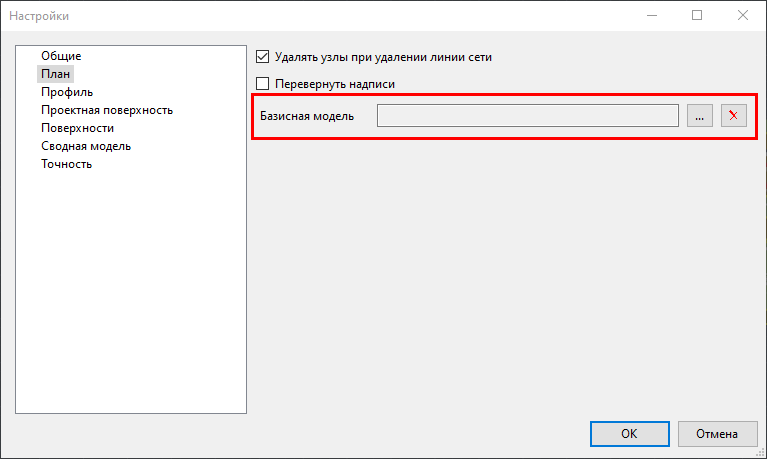

В качестве базисной модели может быть использована модель типа "железная дорога" (проектная) или модель типа "трасса" для обозначения существующей железной дороги. В первом случае при создании модели контактной сети не требуется указывать фактические и проектные поверхности - отметки будут приняты в соответствии с проектным профилем железной дороги. Во втором случае, для корректного построения линии сети, необходимо предварительно построить черный профиль по трассе (см. [Работа с трассой](../../rb_survey/alg/general_information.md)).

3. Выбрать функцию меню **Инженерные сети - Ввод сети - Добавить контактную сеть**. Если базисная модель не была ранее назначена через настройки модели инженерной сети, при добавлении линии сети появится предупреждение:
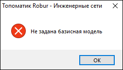

При нажатии кнопки "**ОК**" программа предложит указать базисную модель непосредственно в рабочем окне **План**, для выбора необходимо указать элемент "**ось трассы**" требуемой модели.

При вызове функции ввода контактной сети откроется окно **Ввод линии сети**, подробнее работа с ним описана в разделе [Добавить линию сети](creation_pipeline.md).

4. Укажите точку начала и точку конца линии контактной сети на оси трассы графически. При использовании правой клавиши мыши, в контекстном меню можно выбрать дополнительную опцию объектной привязки "**Указать пикет и смещение**".



Модель инженерной сети может содержать в себе неограниченное количество линий контактной сети.



5. В открывшемся окне задайте параметры расстановки опор контактной сети и нажмите **Ок**:
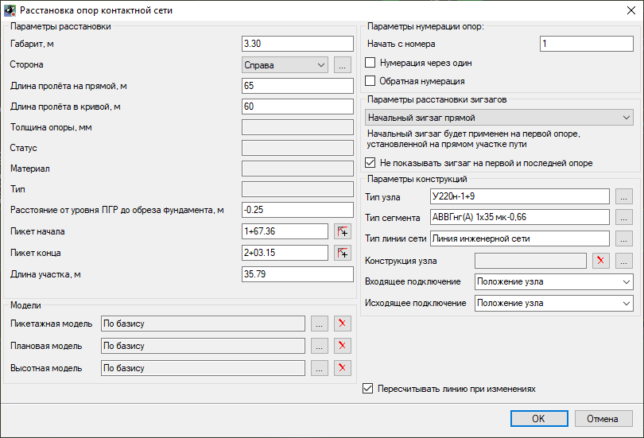

* **Габарит, м** – параметр настройки габарита контактной сети, позволяющий назначить расстояние от оси трассы до создаваемой контактной сети;
* **Сторона** - параметр, позволяющий выбрать сторону расположения контактной сети от оси трассы по направлению пикетажа. Значение можно выбрать из выпадающего списка или указать графически с плана;
* **Длина пролета на прямой / кривой**, м – параметры настройки длины пролета между опорами на прямом участке трассы или на кривой;
* **Толщина опоры / Статус / Материал / Тип** – параметры опоры контактной сети. Данные параметры назначаются в соответствии со свойствами элемента выбранной опоры из **Библиотеки 3D моделей**;
* **Расстояние от уровня ПГР до обреза фундамента**, м – расстояние от проектных отметок головки рельса железной дороги до обреза фундамента опоры контактной сети;
* **Пикет начала / Пикет конца** – параметры, позволяющие задать пикет начала или конца контактной сети относительно оси выбранной базисной модели. Значение может быть задано в строковом свойстве или указано графически с плана;
* **Длина участка, м** – значение длины вводимой линии контактной сети. Параметр зависит от значений пикета начала и пикета конца участка, при изменении параметра "длина участка" корректироваться будет пикет конца данного участка;
* В окне расстановки опор контактной сети также могут быть заданы параметры нумерации опор **Начать с номера / Нумерация через один / Обратная нумерация**.
* Параметры расстановки начального зигзага, который будет применен на первой опоре, установленной на прямом участке пути – **Нет зигзага / Начальный зигзаг прямой / Начальный зигзаг обратный**. При необходимости можно отключить отображение зигзага на первой и последней опоре рассматриваемого участка.
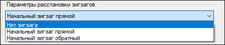
* В разделе "Параметры конструкций" можно задавать **тип узла / тип сегмента / тип линии сети** путем выбора их из **Библиотеки 3D моделей**, подробнее работа с данным разделом описана в разделе [Добавить линию сети](creation_pipeline.md).
* Параметр **Конструкция узла** позволяет выбрать шаблон раскладки узлов опор контактной сети, для выбранного шаблона задаются входящая и исходящая точки подключения, по умолчанию в качестве точки подключения задается **Положение узла**. Подробное описание работы с механизмом конструкций узлов и точек подключения приводится в разделах [конструкции узлов](template_wells_new.md) и [точки подключения](connection_segment_dots_wells_new.md).
* При включении функции **Пересчитывать линию при изменениях** контактная сеть будет пересчитываться автоматически при редактировании свойств опор или всей линии контактной сети. Отключение данного параметра позволяет оптимизировать скорость работы.



Для редактирования построенной линии контактной сети и повторного вызова окна "Расстановка опор контактной сети" используйте функцию **Инженерные сети - Утилиты - Пересчитать контактную сеть**.



## Редактирование контактной сети

При выборе узла инженерной сети основные его параметры отображаются в окне **Свойства**. Редактирование общих параметров узлов описано в соответствующем [разделе](characteristics.md), частные свойства опор контактной сети расположены в группе **Опора КС**:
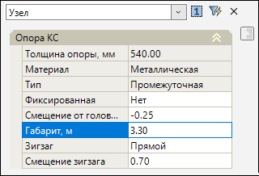

* **Толщина опоры / Материал / Тип** – параметры опоры контактной сети. Данные параметры назначаются в соответствии со свойствами элемента выбранной опоры из **Библиотеки 3D моделей**;
* Параметр **Фиксированная** определяет, будет ли изменяться положение опоры при внесении изменений в линию контактной сети. При нажатии на знак  откроется развертывающийся список: **Да / Нет**. Данный параметр автоматически принимает значение **Да** в случае внесения изменений в свойства или положение опоры;
* **Смещение от головки рельса**, м – расстояние от красной линии оси железной дороги до обреза фундамента опоры контактной сети;
* **Габарит**, м – параметр настройки габарита контактной сети (при положительном значении контактная сеть располагается справа; при отрицательном - слева от оси трассы);
* **Зигзаг** - параметр, определяющий положение зигзага на выбранной опоре. При нажатии на знак  откроется развертывающийся список: **Нет / Прямой / Обратный**;
* Параметр **Смещение зигзага** определяет смещение зигзага выбранной опоры.

Плановое положение и угол поворота опоры контактной сети, габарит, смещение зигзага и положение выносок также могут быть изменены при помощи соответствующих грипов в плане:
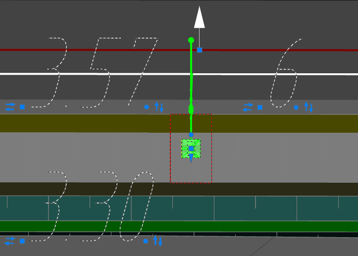

