# Траншеи и котлованы (в разработке)

Программа «Топоматик Robur» позволяет создавать траншеи и котлованы в модели инженерной сети. Способы добавления траншей:

* Траншея может быть создана **вручную** при последовательном указании вершин траншеи или по объектам **сегмент / узел / линейный объект**, выбранный в окне План;
* Траншея может быть создана при работе с [конструкцией сегмента](template_segments_new.md).



Раздел в разработке. Общие принципы работы с механизмом приведены в видео ["Траншеи и котлованы"](https://rutube.ru/video/48f9a567e412e793190e8b4491e9f882/?r=wd).



# Добавить траншею

Для создания поверхности траншеи выполните следующие действия:

1. Выберите меню **Инженерные сети – Земляные работы – Добавить траншею**;
2. По умолчанию выбран режим ручного ввода траншеи, для выбора других режимов нажмите клавишу **вниз** или нажмите правую кнопку мыши и выберите необходимый режим в контекстном меню:
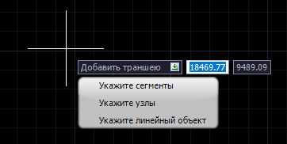

* При **ручном** вводе задайте начальную точку, затем в поле динамического ввода укажите глубину траншеи. Далее укажите остальные вершины траншеи и завершите команду клавишей Enter, либо нажмите правую кнопку мыши и нажмите Ввод;
* **Укажите сегменты** - выделите сегменты, которым необходимо добавить траншею. Команда останется в активном состоянии до подтверждения ввода данных с помощью клавиши Enter или команды Ввод;
* **Укажите узлы** – выделите необходимые узлы, нажмите правую кнопку мыши / клавишу Enter и введите глубину под объектом в строке динамического ввода, для подтверждения ввода данных нажмите правую кнопку мыши, далее введите длину и ширину котлована, для подтверждения команды нажмите правую кнопку мыши.
* **Укажите линейные объекты** – выделите необходимые линейные объекты, нажмите правую кнопку мыши / клавишу Enter и введите глубину под объектом в строке динамического ввода, для подтверждения ввода данных нажмите правую кнопку мыши.



Если перед вызовом команды было выбрано несколько сегментов / узлов, то будет предложено создать траншеи или котлованы на выбранные элементы.



В результате по выбранному элементу будет построена траншея / котлован:
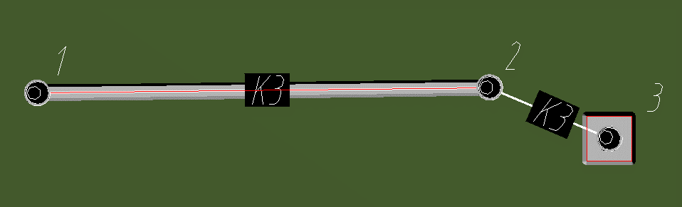

* **1-2** - траншея по указанному сегменту;
* **3** - котлован по указанному узлу.

Таким образом мы получаем поверхность траншеи, высота которой строится по самым нижним отметкам поверхностей, заданным в [Настройках модели инженерной сети](settings_create_model_new.md).

Траншея состоит из осевой линии, поверхности траншеи и из слоев траншеи – 3D тел. Для данных элементов в **Менеджере слоев модели** есть отдельные слои, параметры которых могут быть настроены для всей текущей модели. К ним относятся - Траншеи, Траншеи - слои, Треугольники, Структурные линии, Отметки высоты поверхности и Дополнительные отметки.

## Свойства

Параметры траншеи доступны для редактирования через окно **Свойства** и могут отличатся в зависимости от типа траншеи:
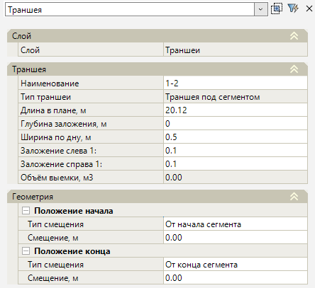

### Слой

* **Слой** - данное поле отображает слой элемента;

### Траншея

В данной группе представлены конструктивные параметры и информационные характеристики доступные для редактирования, такие как:

* **Наименование** - по умолчанию наименование для траншеи принимается по названию узлов начала и конца сегмента, для котлована по названию узла. При необходимости наименование редактируется;
* **Тип траншеи** - в данном поле отображается тип принятой траншеи: траншея под сегментом, котлован или траншея.
* **Длина в плане, м** – в данном поле по умолчанию отображается длина траншеи на Плане сети. При необходимости длина редактируется.
* **Глубина заложения, м** – расстояние от низа сегмента/базовой точки узла, на которую была назначена траншея, до дна траншеи. Для траншеи данный параметр по умолчанию берется из соответствующей характеристики сегмента.
* **Ширина по дну** – в данном поле задается размер ширины траншеи по дну.
* **Заложение слева / справа** - в данном поле задается заложение откоса в траншее или заложение стенок котлована. При вертикальном заложении стенок для правильной триангуляции поверхности необходимо вместо значения «0» указать приближенное значение, например, 0,01.
* **Объем выемки** - в данном поле рассчитывается объем выемки грунта при использовании функции **Построить слои траншеи**.

### Геометрия

В данной группе отображаются параметры присоединения траншеи к сегменту:

* **Положение начала/конца** – параметр, позволяющий настроить положение начала или конца траншеи относительно оси, на которую он был назначен. Данный параметр можно настроить вручную с помощью числовых значений и выбора типа привязки.

### Первый слой – Пятый слой

В программе предусмотрено до 5 слоев засыпки траншеи/котлована. Для каждого слоя можно задать Наименование, Высоту и Цвет слоя. Объем засыпки слоя рассчитывается при использовании функции **Построить слои траншей**. Поверхность слоев траншей / котлованов располагается послойно в элементах типа "Участок".



Подробнее о создании Ведомости земляных работ описано в документации [Инженерные сети. Формирование выходной документации, Формирование ведомостей](../formation_documentation/creation_output_statements_new.md)





**Обваловка траншеи**

Построение обваловки сегментов происходит аналогично построению траншеи. Разница заключается в положении отметок сегмента выше привязанных поверхностей, а также в свойстве **Глубина заложения**, которая задается с отрицательным значением, так как данный параметр по умолчанию задается от низа сегмента/базовой точки узла.

Таким образом мы получаем поверхность обваловки траншеи, высота которой строится по самым верхним отметкам поверхностей, заданных в [Настройках модели инженерной сети](settings_create_model_new.md).



# Построить слои траншей

Данная функция выстраивает твердые тела слоев по поверхности траншеи и опорным поверхностям модели, что позволяет наиболее точно рассчитать объемы выемки и объемы обратной засыпки. Для построения слоев и расчета объемов земляных работ:

1. Выберите меню **Инженерные сети – Земляные работы – Построить слои траншеи**;
2. По умолчанию выбран режим ручного выбора траншеи / котлована, для выбора всех элементов нажмите клавишу "вниз" или нажмите правую кнопку мыши и выберите режим **Выбрать все**:
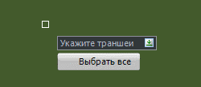

В результате по выбранным объектам будут построены слои, тела которых отобразятся на 3D виде, а в свойствах траншеи / котлована по заданным параметрам автоматически заполнятся объемы выемки и обратной засыпки по каждому заданному слою.

Тела слоев траншеи учитывают объемы сегмента с заданной ранее конструкцией, то есть исключают из объемов обратной засыпки слоев трубы и футляры:
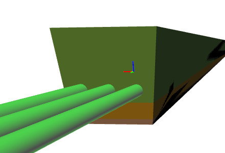

Построение слоев траншеи на 3D виде с отключенным слоем "Сегменты - элементы продольные":
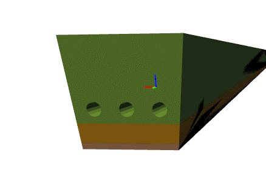

Тела слоев котлованов строятся по любым типам узлов, при этом из объемов обратной засыпки исключаются секции колодцев, заданные через [механизм назначения конструкции узла](template_wells_new.md), объемы конструкций по другим узлам на данный момент не исключаются:
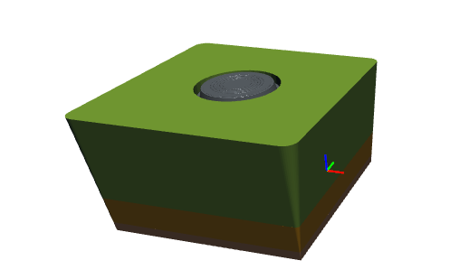

Построение слоев котлована на 3D виде с отключенным слоем "Узлы - элементы":
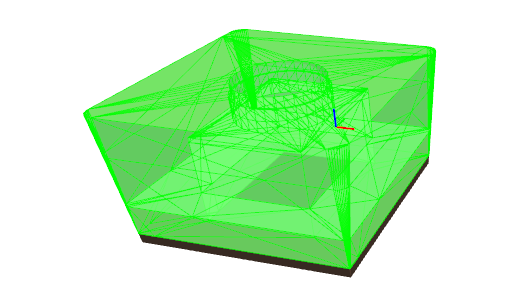



Подсчет объемов земляных работ за вычетом секций колодцев возможен только в случае добавления котлована с привязкой на узел.



# Подрезать траншеи

Данная функция позволяет исключить дублирования объемов в точках пересечения траншей и котлованов. Для подрезки тел слоев:

1. Выберите меню **Инженерные сети – Земляные работы – Подрезать траншеи**;
2. По умолчанию выбран режим ручного выбора траншеи / котлована, для выбора всех элементов нажмите клавишу "вниз" или нажмите правую кнопку мыши и выберите режим **Выбрать все**.

Пересечение тел слоев на 3D виде:
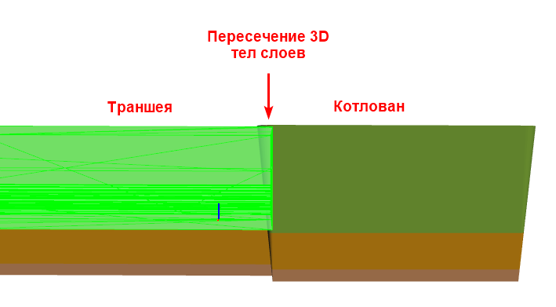

Таким образом на 3D виде получаются подрезанные тела слоев траншей в местах их пересечений.
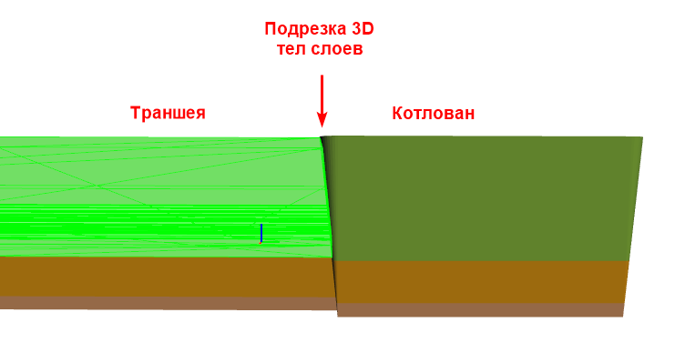



В свойствах траншей / котлованов объемы земляных работ будут автоматически пересчитаны. Подрезка ведется только для траншей, которые пересекаются с котлованами.



# Перестроить траншеи

Данная функция позволяет при изменении геометрического положения образующих объектов или свойств траншей перестроить поверхность траншей, то есть треугольники, из которых они состоят.

Для перестроения поверхностей траншей выберите меню **Инженерные сети – Земляные работы – Перестроить траншеи**. В информационном окне подтвердите перестроение поверхности траншей.

Изменение геометрического положения узла и сегмента:
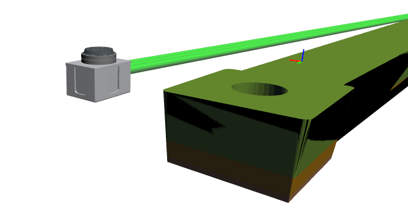

Таким образом на 3D виде перестраивается поверхность траншеи:

# Перестроить слои траншеи

Данная функция позволяет перестроить слои траншей, то есть их 3D тела, по которым получаются объемы выемки и обратной засыпки, относительно перестроенной поверхности траншеи. Для перестроения 3D-тел слоев:

1. Выберите меню **Инженерные сети – Земляные работы – Перестроить слои траншей**;
2. По умолчанию выбран режим ручного выбора объекта, для выбора всех элементов нажмите клавишу "вниз" или нажмите правую кнопку мыши и выберите режим **Выбрать все**.

Изменение геометрического положения узла и сегмента, а также поверхности траншеи:
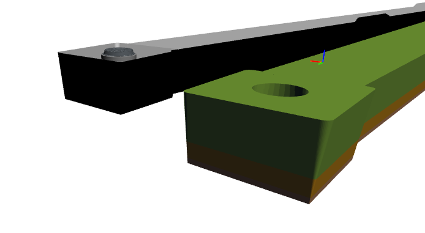

Таким образом на 3D виде перестраиваются 3D-тела слоев траншеи и котлована:
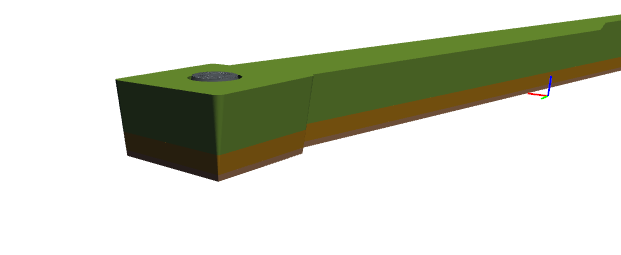

# Переместить траншеи в конструкцию

Данная функция позволяет переместить траншеи, созданные в предыдущих версиях программы, в новый формат. Для этого:

1. Выберите меню **Инженерные сети – Земляные работы – Переместить траншеи в конструкции**;
2. Данную функцию необходимо применить один раз:
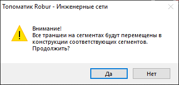

Все ранее созданные траншеи обновятся до новой версии и будут автоматически включены в конструкции сегментов, по которым они были созданы.