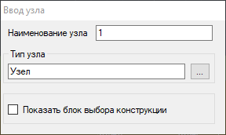
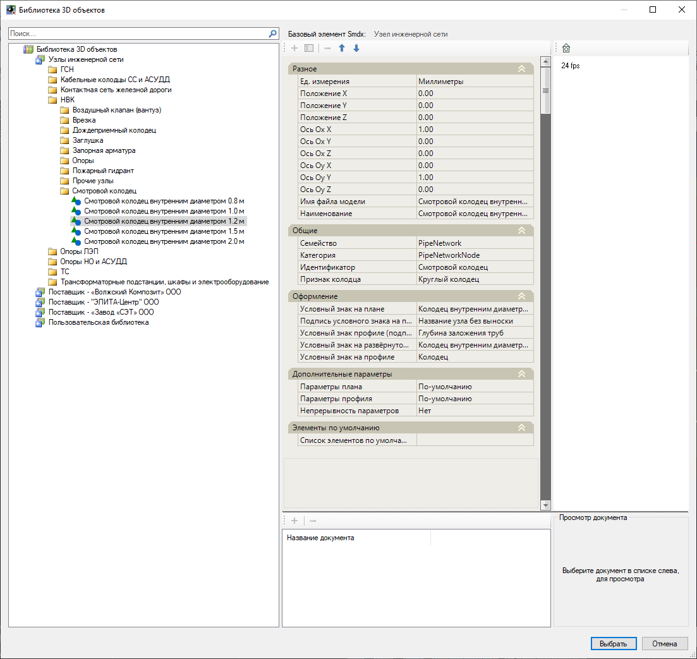
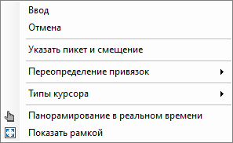
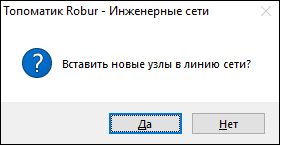

# Создание узла сети

Узел сети в окне **План** может задаваться следующими способами:



Для добавления узла:

1. Выберите меню **Инженерные сети - Ввод сети - Добавить узел**, откроется окно **Ввод узла**:

2. В данном окне можно выбрать тип вводимого узла, а также его **Наименование** в виде начального номера или буквенно-цифрового обозначения.

Для того чтобы выбрать тип узла в окне **Ввод узла** нажмите кнопку , откроется окно **Библиотека 3D моделей**:



1. Если при дальнейшем вводе необходимо сменить тип узла, повторите данное действие, выбрав новый тип из библиотеки.
2. Заменить узел на другой можно не только на этапе ввода, но и при редактировании самого узла. Способы редактирования параметров узлов описаны в данном [разделе](characteristics.md).
3. Если наименование узла содержит число, то при последующем добавлении узлов его числовой порядок будет автоматически продолжен.
4. При включении опции **Показать блок выбора конструкции** откроется дополнительное окно назначения конструкции узла по [шаблону](template_wells_new.md).



3. Левой кнопкой мыши последовательно укажите на плане положение создаваемых узлов;
4. Для выхода из режима ввода нажмите правую кнопку мыши и выберите **Ввод** или нажмите **Esc**.

В результате будут созданы узлы, которым будет присвоено заданное наименование, условное обозначение и характеристики в соответствии с выбранным типом из **Библиотеки 3D моделей**.



Указать положение узла на плане можно относительно оси модели, имеющей пикетаж (трассы, автомобильной дороги, железной дороги). Для этого:

1. Выполните **п.1**, далее с помощью правой кнопки мыши или клавиши "вниз" вызовите контекстное меню и выберите пункт **Указать пикет и смещение**:

2. Укажите ось модели, относительно которой будет назначен узел;
3. С помощью курсора укажите положение узла на плане или в строке динамического ввода укажите пикет и смещение узла относительно оси модели;
4. При необходимости повторите вышеописанные действия начиная с вызова контекстного меню. 







Данная функция позволяет создавать узлы сети из примитивов. Для этого:

1. Выберите меню **Инженерные сети - Ввод сети - Создать узел из примитива**, откроется окно **Ввод узла**. В данном окне выберите тип вводимого узла и его наименование:



 Работа с окном **Ввод узла** подробнее описана в разделе [Добавить узел](creation_wells_new.md). 



2. Укажите примитивы, из которых необходимо создать узлы и нажмите правую кнопку мыши.

В результате из выбранных примитивов будут созданы узлы:

* При выборе примитива **Отрезок**, узлы будут созданы в его в вершинах;
* При выборе примитива **Точка** (положение Z равно 0), узел будет создан по выбранной точке;
* При выборе примитива **Круг** или **Эллипс**, узел будет создан в центре окружности;
* При выборе примитива **Дуга**, узлы будут созданы в ее вершинах;
* При выборе в качестве примитива **Вхождение блока**, узел будет создан в базовой точке блока.

При создании узла плановое положение (положение X, Y) узла принимается по выбранному примитиву, а отметка Z по подключенной поверхности. Подключение опорных поверхностей описано в разделе [Настройки модели инженерной сети](settings_create_model_new.md).





Данная функция позволяет создавать узлы сети по объектам модели типа "ЦММ", точкам и структурным линиям. Для этого:

1. Выберите меню **Инженерные сети - Ввод сети - Создать узел по ЦММ**, откроется окно **Ввод узла**. В данном окне выберите тип вводимого узла и его наименование:



 Работа с окном **Ввод узла** подробнее описана в разделе [Добавить узел](creation_wells_new.md). 



2. Укажите объект поверхности ЦММ, по которому необходимо создать узлы и нажмите правую кнопку мыши.

В результате будут созданы узлы, пространственное положение которых (положение Х, Y, Z) будет приниматься по отметкам выбранных объектов модели ЦММ. При выборе структурной линии в качестве опорного объекта, узлы будут созданы в каждой её вершине.





Данная функция предназначена для создания узлов на заданном расстоянии вдоль выбранного линейного объекта (структурной линии, полилинии, дуги, трассы и т.д.). Для этого:

1. Выберите меню **Инженерные сети - Ввод сети - Создать узлы вдоль линейного объекта**, откроется окно **Ввод узла**. В данном окне выберите тип вводимого узла и его наименование



 Работа с окном **Ввод узла** подробнее описана в разделе [Добавить узел](creation_wells_new.md). 



2. Выберите линейный объект, вдоль которого будут созданы узлы и укажите точки начала и конца расстановки узлов;
3. Укажите сторону смещения узлов относительно линейного объекта и введите интервал между узлами;
4. При необходимости введите значение смещения узлов относительно линейного объекта;
5. Нажмите **Enter** для завершения команды.



Узлы могут быть размещены непосредственно на объекте или смещены относительно него. При создании узлов относительно объекта линии сети сети с нулевым смещением, чтобы автоматически включить узлы в выбранный участок сети, выберите **Да** в открывшемся окне:



