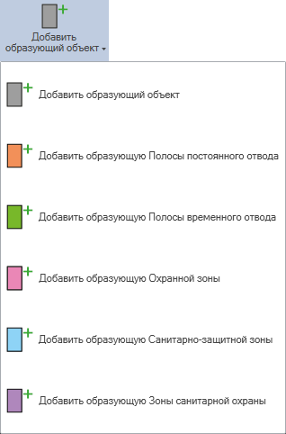
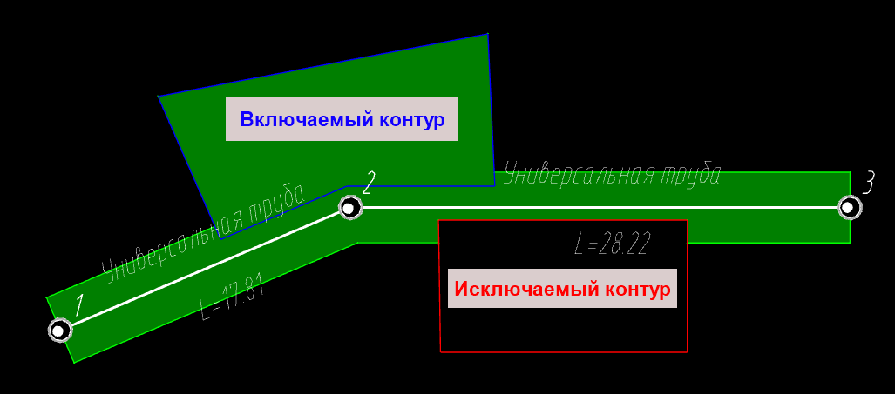
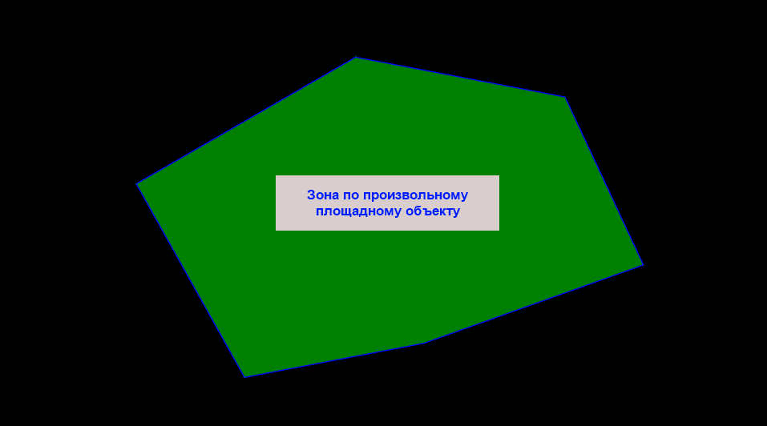
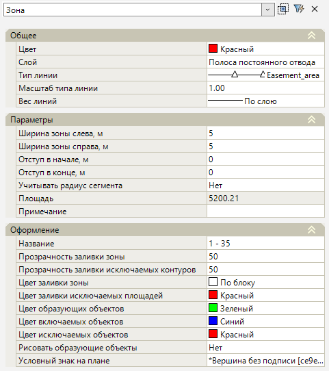

# Зоны отвода

Используя геометрию инженерной сети и вспомогательные построения, программа позволяет смоделировать на плане различные зоны: полосы постоянного и временного отвода, охранную зону, санитарно-защитную зону, зону санитарной охраны и зону общего типа.

Все зоны формируются единым механизмом. Отличие между ними заключается в том, что **зона общего типа** создается в текущем слое, а остальные зоны и полосы отвода создаются в слоях с определенным наименованием, предустановленным цветом, и их границы отображаются определенным типом линии.

## Добавить образующий объект

Для создания **Зоны по умолчанию** выполните следующие действия:

1. Выберите меню **Инженерные сети - Зоны отвода - Добавить образующий объект**;
2. Выберите опорный объект. Если необходимо добавить объекты к уже созданной зоне, то сначала укажите созданную зону, а затем новые образующие объекты.

В результате вокруг образующего объекта добавится зона в текущем слое.

Зоны с предустановленными настройками можно задать в ленточном меню, в разделе **Инженерные сети - Зоны отвода**:



Образующим объектом может быть любой примитив, в том числе линия сети.



## Удалить образующий объект

Для удаления образующего объекта из созданной зоны выполните следующие действия:

1. Выберите меню **Инженерные сети - Зоны отвода - Удалить образующий объект**;
2. Укажите созданную зону, а затем образующий объект, который необходимо удалить. Для подтверждения команды нажмите ПКМ.

В результате образующий объект будет исключен из построения зоны.



Зона должна состоять как минимум из одного образующего объекта. При удалении всех образующих объектов зона также будет удалена.



## Добавить включаемый/исключаемый контур

По умолчанию при создании зоны программа использует геометрию образующего объекта. При необходимости к стандартной геометрии зоны могут быть добавлены включаемые и исключаемые контуры.

Для добавления **включаемого/исключаемого контура** выполните следующие действия:

1. Выберите меню **Инженерные сети - Зоны отвода - Добавить включаемый / исключаемый контур**;
2. Укажите зону, в которую нужно добавить включаемый или исключаемый контур, а затем сам контур, для подтверждения команды нажмите ПКМ.

В результате к указанной зоне будет добавлен или исключен выбранный контур.

Если необходимо добавить зону по произвольному площадному объекту, то можно указать его в качестве исходного объекта для функции **Добавить включаемый контур**. Тип добавляемой зоны можно выбрать в разделе меню **Инженерные сети – Зоны отвода**.

## Объединить зоны / Добавить в составную зону

В программе представлен функционал для объединения различных зон. Для объединения зон выполните следующие действия:

1. Выберите меню **Инженерные сети - Зоны отвода - Объединить зоны**;
2. Выберите зоны, которые необходимо объединить, нажмите **Enter** на клавиатуре или подтвердите выбор через ПКМ.

В результате, используя геометрию указанных зон, программа создаст составную зону выбранного типа.

В программе предусмотрено неограниченное количество уровней объединения. Например, составная зона может состоять как из простых зон, так и из других составных зон. Для того чтобы добавить зону в составную зону, можно воспользоваться функциями меню **Инженерная сеть – Зоны отвода – Добавить в составную зону**.

## Обновить зону и образующие элементы

В процессе проектирования геометрия инженерной сети, а также включаемых и исключаемых контуров может измениться. Чтобы актуализировать построенные зоны, выполните следующие действия:

1. Выберите меню **Инженерные сети – Зоны отвода – Обновить зону и образующие элементы**;
2. Укажите зону или составную зону.

В результате, если для обновления была выбрана простая зона, программа обновит только её. Если для обновления была выбрана составная зона, программа обновит её и все простые и составные зоны, из которых она состоит.



Если контур зоны был доработан вручную, то при обновлении все изменения будут отменены, а зона перестроится по образующим объектам и заданным значениям свойств.



## Нумерация зоны

Программа по умолчанию нумерует вершины зон. Для того чтобы пронумеровать зоны вручную, выполните следующие действия:

1. Выберите меню **Инженерные сети – Зоны отвода – Нумерация зоны**;
2. Выберите зону, нумерацию которой нужно изменить, и укажите нумеруемый контур. Контуры, доступные для выбора, будут подсвечены зеленым цветом;
3. Выберите вершину начала нумерации, а затем вершину, в направлении которой должна пойти нумерация контура, затем в динамическом окне укажите номер начальной вершины и подтвердите.

В результате программа пронумерует выбранный контур в заданном порядке. Нумерация вершин отобразится в **Свойствах** зоны, в строке **Название**.

## Свойства зоны

Настройка параметров зон осуществляется в окне **Свойства**:

### Общее

В данной группе задаются общие настройки при редактировании зон, такие как **Цвет, Слой, Тип линии, Масштаб типа линии, Вес линии**.

### Параметры

В данной группе представлен ряд дополнительных конструктивных и информационных характеристик зон:

* **Ширина зоны слева / справа** - в данном поле задается ширина контура зоны слева / справа от образующего элемента;
* **Отступ в начале / в конце** - в данном поле задается дополнительное приращение зоны в начале / в конце образующего объекта;
* **Учитывать радиус сегмента** - в данном поле задается, будет ли учитываться радиус сегмента инженерной сети при расчете ширины зоны;
* **Площадь** - в данном поле отображается площадь зоны в квадратных метрах;
* **Примечание** - строковое свойство, значение которого можно вывести в **Ведомость площадей зоны**.

### Оформление

В данной группе задаются параметры отображения контура зоны на плане, такие как:

* **Название** - в данном поле отображается наименование зоны. По умолчанию название формируется как «начальный – конечный» номер вершины. При необходимости название может быть задано произвольное;
* **Рисовать образующие элементы** - при включении данной опции при наведении курсором мыши на контур зоны образующий элемент будет подсвечиваться зеленым цветом;
* **Условный знак на плане** - условный знак переломов контура зоны. По умолчанию условный знак - точка без подписи. При необходимости из **Библиотеки точечных условных знаков** можно выбрать другое условное обозначение.

По заданным зонам формируются **Ведомость вершин зоны** и **Ведомость площадей зоны**. Процесс формирования ведомостей описан в соответствующем [разделе](../formation_documentation/creation_output_statements_new.md).