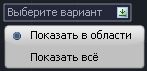
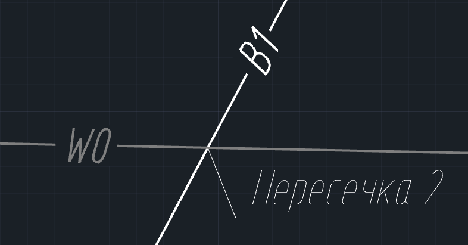
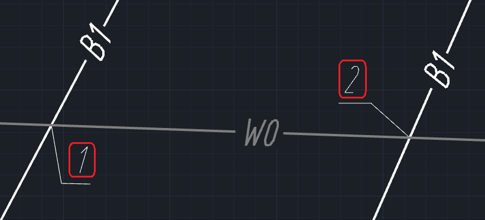
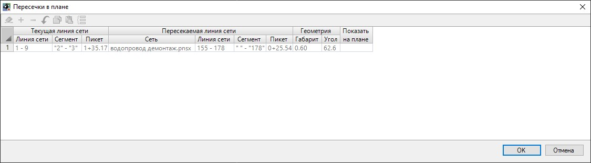

# Пересечения сетей (в разработке)



Раздел в разработке



## Показать пересечения / Скрыть пересечения

Данная функция позволяет отобразить / скрыть пересечения текущей модели инженерной сети на плане. Для этого:

1. Выберите меню **Инженерные сети – Пересечения в плане – Показать пересечения / Скрыть пересечения**;
2. Укажите один из вариантов поиска пересечений инженерных сетей:

* **Показать в области** - секущей рамкой укажите область выбора пересечений сети;
* **Показать все** - функция будет применена ко всем пересечениям текущей модели инженерной сети.

Выбранные пересечения инженерных сетей будут показаны (с помощью выноски "Пересечений") / скрыты (выноска "Пересечение" будет скрыта) на плане, а так же отображены в **Ведомости пересечений** и на **Чертежах пересечений**:

## Нумеровать пересечения

Данная функция позволяет автоматически пронумеровать пересечения инженерных сетей по порядку их создания.

Для этого выберите меню **Инженерные сети – Пересечения в плане – Нумеровать пересечения**.

В результате отображенные пересечения будут пронумерованы по порядку начиная от первой созданной выноски. Пересечение будет отображена выноской с цифровым значением на плане:



Чтобы изменить название пересечения выберите необходимое пересечение, в окне **Свойства** в строке **Наименование** введите необходимое имя пересечения.



## Обновить пересечения в плане

Данная функция предназначена для обновления пересечений при изменении пересекаемой инженерной сети. Например, когда пересекаемая инженерная сеть изменила своё плановое местоположение.

Для этого выберите меню **Инженерные сети – Пересечения в плане – Обновить пересечения в плане**.

## Найти пересечения

Данная функция отображает информацию о всех пересечениях текущей модели инженерной сети.

Для этого выберите меню **Инженерные сети – Пересечения в плане – Найти пересечения**, откроется диалоговое окно:

* В разделе **Текущая линия сети** отображено наименование линии сети текущей модели, название пересекаемого сегмента текущей сети, в столбце "Пикет" отображается пикетное положение текущей линии сети в точке пересечения;
* В разделе **Пересекаемая линия сети** отображено название модели пересекаемой инженерной сети, наименование пересекаемой линии сети и название пересекаемого сегмента, в столбце "Пикет" отображается пикетное положение пересекаемой линии сети в точке пересечения;
* В разделе **Геометрия** отображается **Габарит** - расстояние по вертикали между сегментами пересекающихся линий сети и **Угол** между сегментами пересекающихся линий сети;
* **Показать на плане** данная опция позволяет центрировать экран в точку пересечения линий сети на плане. Для этого нажмите пиктограмму .