# Редактирование сети

Для редактирования элементов сети предусмотрены следующие функции:

## Добавить узел в линию сети

Данная функция позволяет включить дополнительный узел в сегмент линии сети. Для этого:

1. Выберите элемент меню "Инженерные сети - Редактирование сети - **Добавить узел в линию сети**", курсор примет форму прицела;
2. Укажите сегмент линии сети, в который должен быть добавлен узел, откроется окно **Ввод узла**:
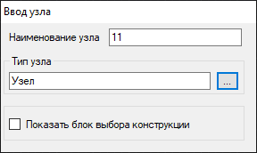

Если дополнительный узел не был предварительно введен на плане, то с помощью данного окна можно указать его тип и наименование.

3. Левой кнопкой мыши укажите положение нового узла на плане:
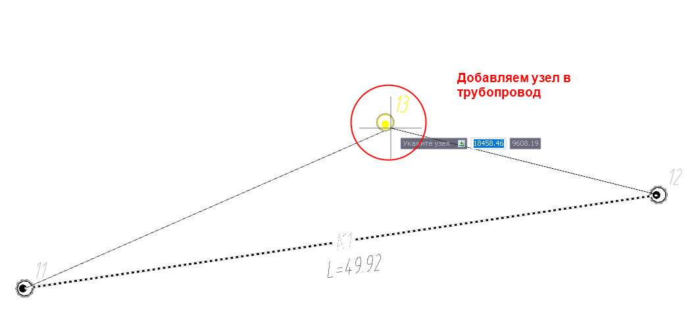
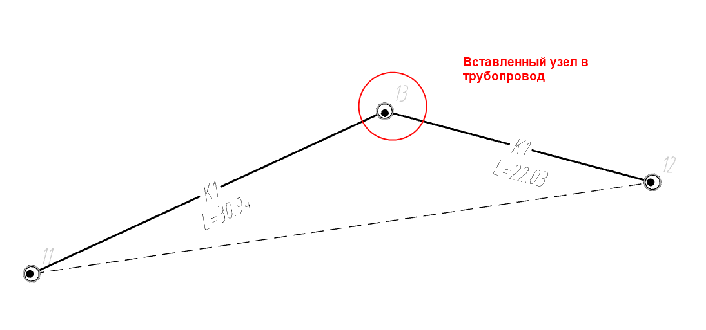

Если узел был предварительно указан в плане, то его можно выбрать в качестве целевого объекта. Таким образом возможно замоделировать врезку на сегменте.

## Удалить узел из линии сети

Данная функция позволяет удалить выбранный узел из линии сети. Для этого:

1. Выберите элемент меню "Инженерные сети - Редактирование сети - **Удалить узел из линии сети**", курсор примет форму прицела;
2. Укажите линию сети, из построения которой необходимо исключить требуемый узел;
3. Укажите узел, который нужно удалить из линии сети.

В результате узел не будет удален из проекта и останется в окне План, но будет исключен из построения линии сети:
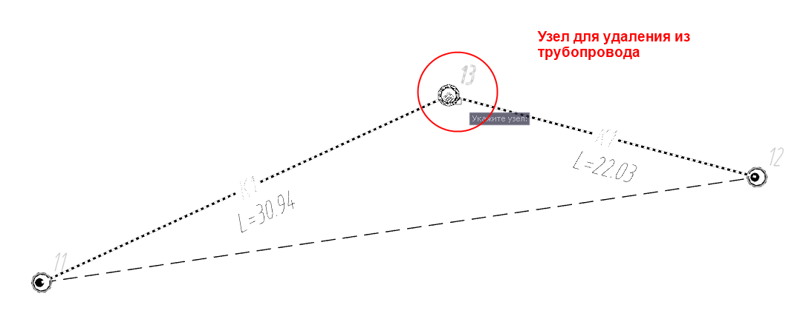
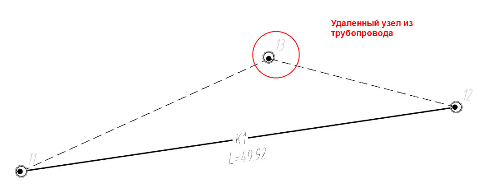

## Переместить узлы относительно линейного объекта

Данная функция позволяет переместить плановое положение созданных узлов на заданное расстояние относительно линейного объекта. Для этого:

1. Выберите меню "Инженерные сети – Редактирование сети – **Переместить узлы относительно линейного объекта**";
2. Выделите узлы, которые необходимо переместить, и нажмите правую кнопку мыши;
3. Выберите линейный объект, относительно которого будут смещены узлы, и укажите сторону смещения;
4. В динамической строке задайте расстояние от линейного объекта, на которое будут смещены узлы, и нажмите **Enter**.
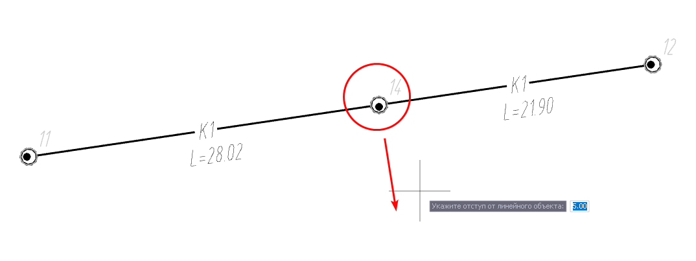
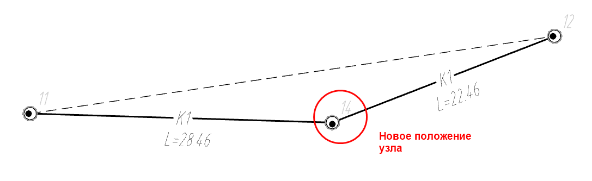

## Развернуть узлы к линейному объекту

Данная функция позволяет поворачивать узлы относительно выбранного линейного объекта. Для этого:

1. Выберите меню "Инженерные сети – Редактирование сети – **Развернуть узлы к линейному объекту**";
2. Выберите необходимые узлы и нажмите правую кнопку мыши, далее укажите линейный объект:
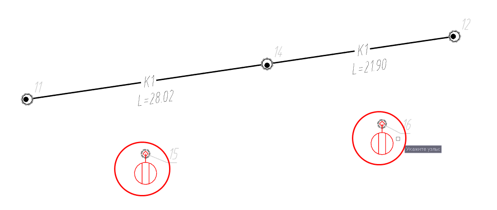

В результате выбранные узлы будут развернуты перпендикулярно линейному объекту:
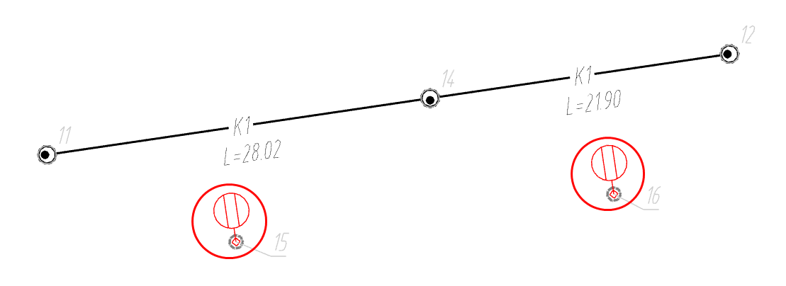



Каждый узел имеет свою систему координат. При использовании функции **ось OX** узла разворачивается перпендикулярно линейному объекту.



## Изменить узел

Данная функция позволяет заменить в линии сети один узел на другой. Для этого:

1. Выберите элемент меню "Инженерные сети - Редактирование сети - **Изменить узел**", курсор примет форму прицела;
2. Выберите линию сети, в которой необходимо заменить узел, далее последовательно укажите левой кнопкой мыши узел, который необходимо исключить из линии сети, а затем тот узел, который должен быть включен в данную линию сети.
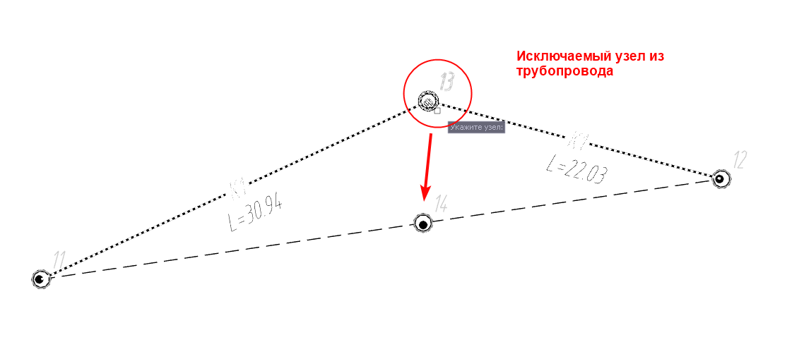
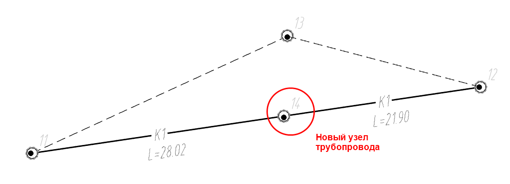

В результате узел, который изначально был включен в линию сети будет сохранен на плане, но будет исключен из состава выбранной линии сети. Линия сети будет проходить через добавленный узел.

## Добавить вершину в сегмент линии сети

Данная функция позволяет добавить дополнительную вершину в сегмент линии сети. Данный функционал используется в т.ч. для моделирования участков ГНБ и вертикальных участков сетей. Для этого:

1. Выберите сегмент на Плане или Профиле сети, появятся соответствующие грипы, выберите грип в виде прямоугольника и нажмите на него правой кнопкой мыши, отобразится контекстное меню:
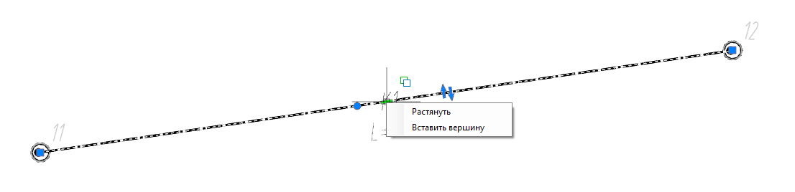
2. Из контекстного меню выберите **Вставить вершину** и с помощью курсора мыши укажите место вставки вершины на экране:
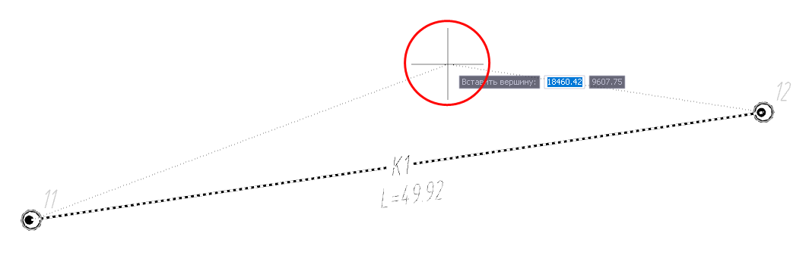

В результате в сегмент линии сети будет добавлена вершина. Сегмент поделится на две части - до и после вершины. При выделении сегмента на каждой вновь образованной части появится прямоугольный грип. Повторяя операцию, можно многократно добавлять дополнительные вершины.



Для дополнительных действий с добавленной вершиной сегмента нажмите правой кнопкой на грип вершины в виде квадрата. Откроется контекстное меню: 
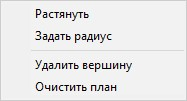

* Команда **Задать радиус** позволяет задать радиус сегменту в выбранной вершине. Чтобы задать радиус сегменту выберите пункт **Задать радиус**, в строке динамического ввода задайте величину радиуса и нажмите **Enter**;
* Команда **Растянуть** позволяет переместить выбранную вершину;
* Чтобы удалить выбранную вершину, выберите команду **Удалить вершину**;
* Команда **Очистить план** удаляет все добавленные вершины на данном сегменте. Сегмент принимает изначальное положение.



## Разорвать линию сети

Данная функция позволяет разорвать линию сети на две части в заданном узле. Для этого:

1. Выберите элемент меню "Инженерные сети - Редактирование сети - **Разорвать линию сети**";
2. Укажите линию сети, которую необходимо разорвать.
3. Укажите узел, в котором должна быть разорвана линия сети.

В результате выбранная линия сети будет разделена на две части - до и после выбранного узла.

## Объединить линию сети

Данная функция позволяет объединить две линии сети в одну. Для этого:

1. Выберите элемент меню "Инженерные сети - Редактирование сети - **Объединить линию сети**";
2. Последовательно выберите линии сети, которые необходимо объединить.



Объединить между собой можно только те линии сети, которые имеют общий узел. Объединенной линии сети присваивается название и направление той линии сети, которую при объединении указали первой. 



## Развернуть линию сети

Данная функция позволяет изменить направление линии сети, разворачивая ее зеркально. Для этого:

1. Выберите элемент меню "Инженерные сети - Редактирование сети - **Развернуть линию сети**";
2. Укажите линию сети, которую необходимо развернуть, и нажмите правой кнопкой мыши или **Enter**.

В результате линия сети зеркально изменит свое направление на **Плане** и **Профиле сети**.

## Выбрать образующие узлы

Для выбора всех узлов, принадлежащих выбранной линии сети:

1. Выберите элемент меню "Инженерные сети - Редактирование сети - **Выбрать образующие узлы**";
2. Выберите линию сети, в которой необходимо выбрать все образующие узлы, для подтверждения команды нажмите правой кнопкой мыши

## Выбрать образующие сегменты

Для выбора всех сегментов, принадлежащих выбранной линии сети:

1. Выберите элемент меню "Инженерные сети - Редактирование сети - **Выбрать образующие сегменты**";
2. Выберите линию сети, в которой необходимо выбрать все образующие сегменты, для подтверждения команды нажмите правой кнопкой мыши.



Так же функции **Выбрать образующие узлы** и **Выбрать образующие сегменты** могут быть выбраны из контекстного меню в окне **План**. Для этого выберите линию сети, нажмите правой клавишей мыши и выберите требуемый пункт в открывшемся контекстном меню.

