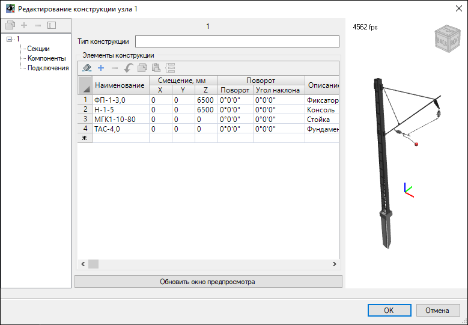

# Редактор конструкции узла

Программа «Топоматик Robur» позволяет вручную настроить конструкции узлов, которые состоят из набора элементов конструкции, спецификации и заданных точек подключения. Для того чтобы отредактировать конструкцию отдельного узла:

1. Выберите меню **Инженерные сети - Раскладка секций узлов - Редактор конструкции узла**;
2. Выберите узел, конструкцию которого необходимо отредактировать;
3. Откроется окно "**Редактирование конструкции узла (№) ...**" с конструкцией выбранного узла, внесите необходимые изменения в конструкцию узла и нажмите "**ОК**" для сохранения изменений:



Работа с окном конструкции узла описана в разделе [Альбомы типовых конструкций](../../../empty_page.md).

