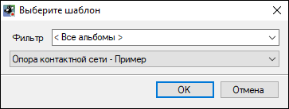
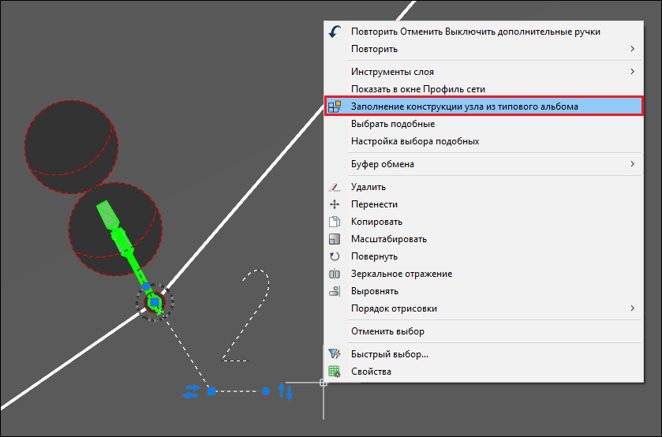
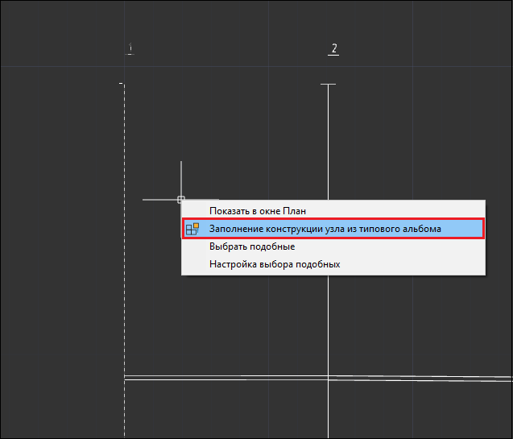

# Заполнение конструкции узла из типового альбома

Для заполнения конструкции узла из типового альбома:

1. В окне **План** или **Профиль сети** выберите узлы, которым необходимо задать параметры по заранее созданному альбому типовой конструкции.
2. Выберите меню **Инженерные сети – Раскладка секций узлов – Заполнение конструкции узла из типового альбома**. Откроется диалоговое окно:

В данном окне вы можете отфильтровать альбомы раскладки по типу конструкции, затем выберите альбом, по которому будут заданы параметры узла и нажмите **ОК**. В результате выбранные узлы будут разложены на секции по заданному альбому. Раскладка секций узлов будет отображена в рабочих окнах программы и выходной документации.

Также функция **Заполнение конструкции узла из типового альбома** может быть выбрана из контекстного меню в окне **План** или в окне **Профиль сети**. Для этого выберите узлы, нажмите правой клавишей мыши и выберите команду **Заполнение конструкции узла из типового альбома** в открывшемся контекстном меню:



 Функционал по созданию альбомов типовых конструкций узлов описан в разделе [Альбомы типовых конструкций](../../../empty_page.md).

