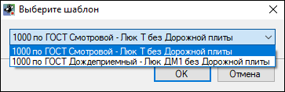
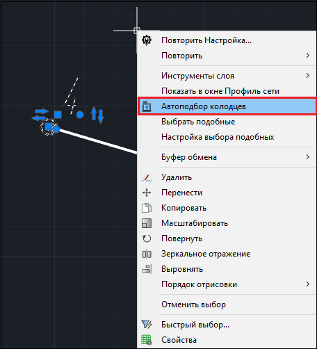
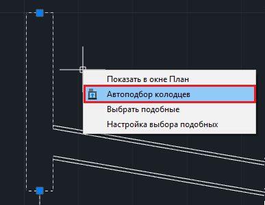
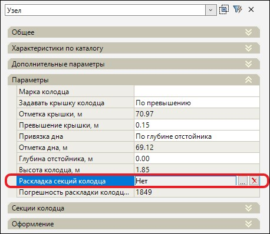
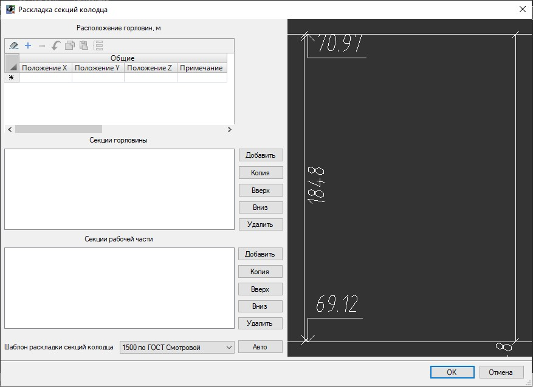
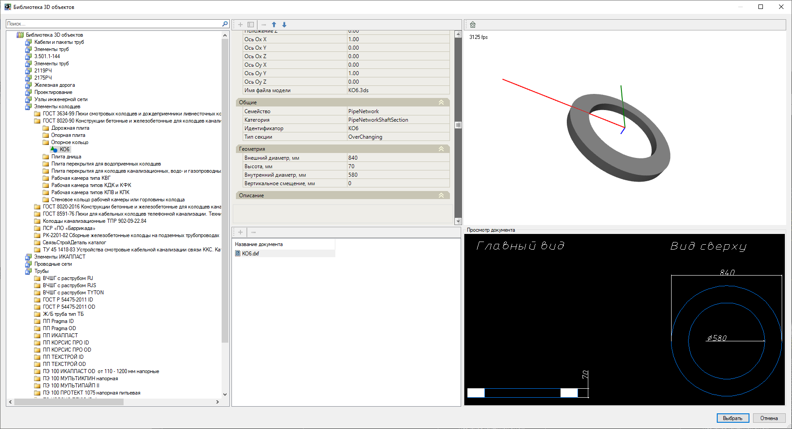
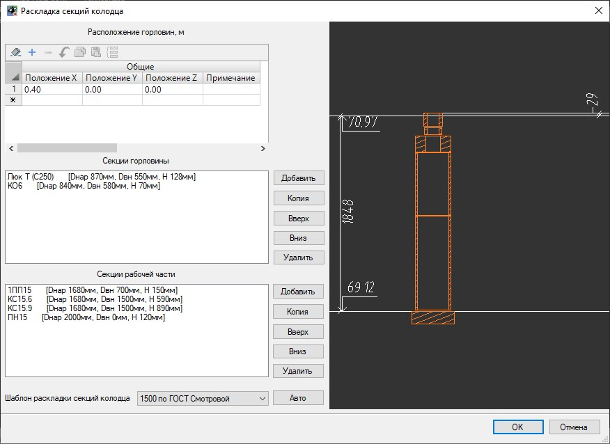
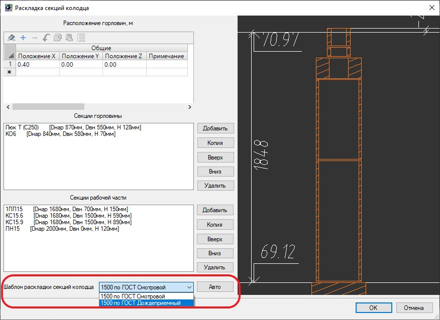
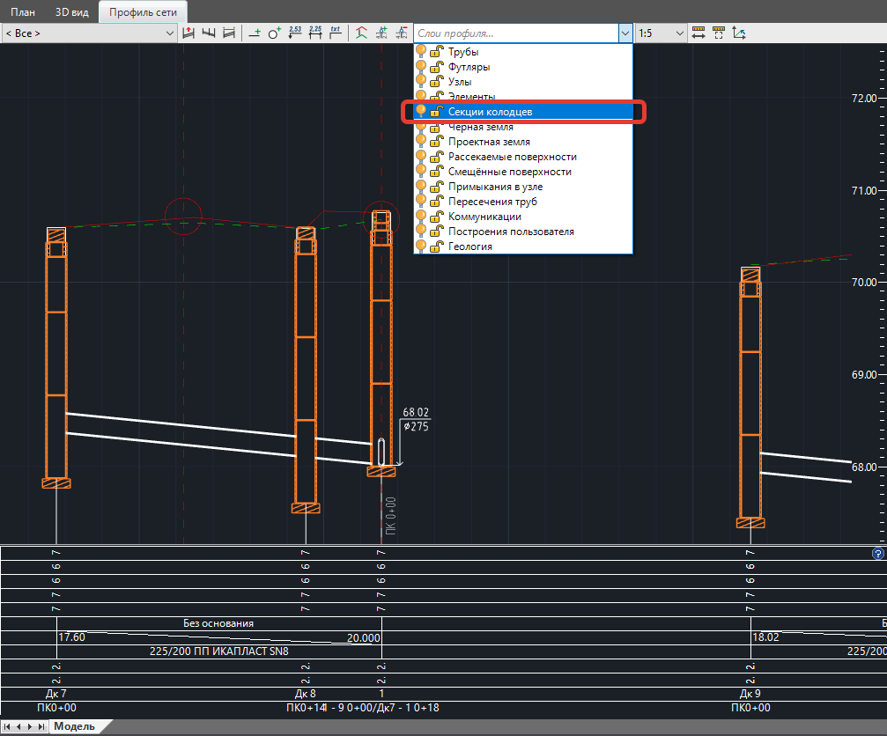

# Раскладка секций колодцев

Функционалом программы предусмотрена возможность автоматического подбора секций колодцев при помощи предварительно заданных шаблонов раскладки колодцев, а также ручной ввод секций колодцев и редактирование существующей раскладки секций колодцев.

## Раскладка секций группы колодцев

Для раскладки секций группы колодцев:

1. В окне **План** или **Профиль сети** выберите группу узлов колодцев;



Автоматическая раскладка секций группы колодцев возможна в том случае, если выбраны колодцы одинакового диаметра.



2. Выберите меню **Инженерные сети – Раскладка секций узлов – Автоподбор колодцев**. Откроется диалоговое окно, в котором будут представлены шаблоны, соответствующие диаметру выбранной группы колодцев:

Выберите шаблон, по которому будет производиться раскладка секций колодцев и нажмите **ОК**. В результате выбранные узлы колодцев будут разложены на секции по данному шаблону, раскладка секций колодцев отобразится в окне **Профиль сети** и **3D вид**.

Так же функция **Автоподбор колодцев** может быть выбрана из контекстного меню в окне **План** или в окне **Профиль сети**. Для этого выберите узлы колодцев, нажмите правой клавишей мыши и выберите команду **Автоподбор колодцев** в открывшемся контекстном меню:

## Раскладка секций одного колодца

Данный функционал предназначен для раскладки секций одного узла колодца. Например, когда необходимо отредактировать раскладку, подобранную программой автоматически согласно шаблону раскладки колодца при использовании функции **Автоподбор колодцев**.

Для раскладки секций одного колодца вручную:

1. Выберите узел в окне **План** или в окне **Профиль сети**, на панели **Свойства** отобразятся параметры выбранного узла. В строке **Раскладка секций колодца** будет отображен статус раскладки колодца:

* **Нет** – для данного колодца не делалась раскладка секций колодца;
* **Ручная** – для данного колодца раскладка секций делалась вручную или была сделана автоматическая раскладка секций колодца, а затем данная раскладка была откорректирована вручную;
* **Авто** – для данного колодца была сделана автоматическая раскладка секций колодцев. Полученный набор элементов вручную не корректировался.

2. В поле **Раскладка секций колодца** с правой стороны нажмите пиктограмму , откроется окно **Раскладка секций колодца**:

* В левой части окна списком отображается состав раскладки секций колодца (**Секции горловины** и **Секции рабочей части**) и **Расположение горловин** колодца относительно оси координат;
* В правой части окна отображается эскиз раскладки колодца. На эскизе показаны отметка крышки колодца, отметка дна колодца, глубина колодца и погрешность раскладки колодца.



**Положительное значение** погрешности раскладки колодца значит, что граница самого верхнего элемента в раскладке колодца находится ниже отметки крышки колодца. **Отрицательное значение** погрешности значит, что граница самого верхнего элемента в раскладке находится выше отметки крышки колодца.



3. Чтобы добавить секции горловины и рабочей части колодца, нажмите кнопку **Добавить**. Откроется окно **Библиотеки 3D объектов**, выберите необходимый элемент и нажмите **Выбрать**:

Добавленные секции колодца раскладываются снизу вверх:

* Чтобы удалить секцию из раскладки, выделите её в левой части окна и нажмите кнопку **Удалить**;
* Чтобы сделать копию секции колодца, выделите её в левой части окна и нажмите кнопку **Копия**;
* Для перемещения секции колодца в раскладке воспользуйтесь кнопками **Вверх** и **Вниз**.

Находясь в окне **Раскладка секций колодца**, можно также воспользоваться функцией автоматической раскладки, для этого выберите шаблон раскладки секций колодца и нажмите кнопку **Авто**:



В поле **Шаблон раскладки секций колодца** программа предложит выбрать варианты шаблонов раскладки, совпадающие по диаметру с выбранным типом узла колодца.



4. Для завершения раскладки колодца и сохранения результата нажмите **ОК**.

В окне **Профиль сети** у всех колодцев, для которых была сделана раскладка, будут отображены секции колодцев. По умолчанию секции колодцев помещаются в слой **Секции колодцев** и могут быть отключены в окне **Профиль сети**:



 Функционал по созданию шаблонов раскладки секций колодцев описан в разделе [Шаблоны раскладки колодцев](template_wells_new.md).

