# Настройки модели инженерной сети

Для настройки модели инженерной сети:

1. В окне **Структура проекта** нажмите правой кнопкой мыши на наименовании соответствующей модели сети. В открывшемся контекстном меню выберите пункт **Настройки**:

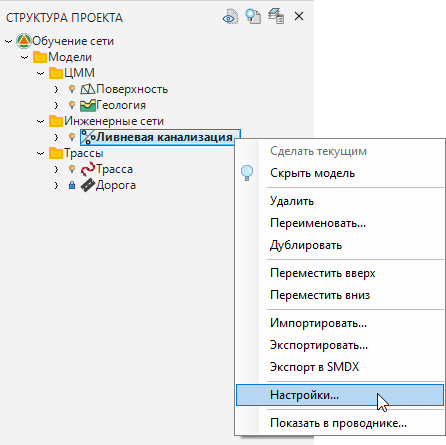

2. Откроется окно **Настройки**. В левой его части представлены основные группы настроек:

## Общие

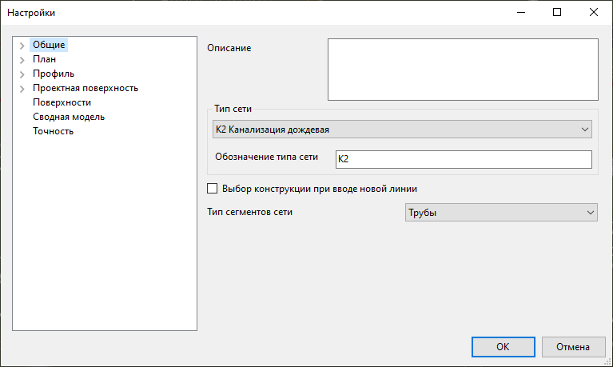

* **Описание** – в данном поле может быть продублировано имя сети или задано расширенное наименование сети. При наличии в модели пересечений данное поле будет выноситься на чертеж продольного профиля в таблицу **Условные обозначения** и в **Ведомость пересечений**;
* **Тип сети** – в данном поле из выпадающего списка выбирается наименование сети. В поле **Обозначение типа сети** в зависимости от выбранного типа сети автоматически будет устанавливаться буквенно-цифровое обозначение сети. При необходимости в данном поле можно с помощью клавиатуры задать индивидуальное обозначение сети, которое будет отображаться на линии сети в окне **План**;
* **Выбор конструкции при вводе новой линии** – при создании новой линии сети или добавлении узла, если данная опция включена, то в окне **Ввод линии сети / Ввод узла** будет автоматически включено диалоговое окно назначения [конструкции узла](template_wells_new.md) или [сегмента](template_segments_new.md);
* **Признак сети по умолчанию** – информационная характеристика, влияющая на отображение сети в рабочих окнах программы. Сети с признаком **Существующий** не будут учитываться при подсчете ведомостей объемов; с признаком **Демонтируемый** - не будут учитываться при подсчете ведомостей объемов, а также будут перечеркнуты в окне **План** и **Профиль сети**;
* **Тип сегментов сети** – данная настройка определяет из каких типов протяженных элементов (труб или кабелей) будет состоять инженерная сеть. Также данная настройка позволяет фильтровать список сегментов при обращении к **Библиотеке 3D моделей**, в зависимости от выбора типа сегмента сети. Например, если выбран тип сегмента сети *Трубы*, то при выборе сегмента в библиотеке 3D моделей программа автоматически покажет только каталоги с элементами, smdx-тип которых соответствует типу «Труба» и его подтипам.

### Параметры элементов

В данной подгруппе задается признак сети и основные параметры элементов сети:
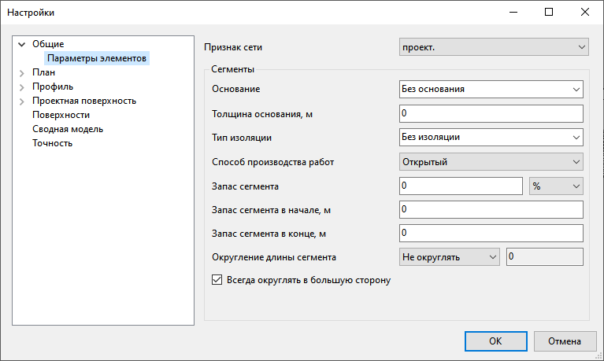

* **Признак сети по умолчанию** – информационная характеристика, влияющая на отображение сети в рабочих окнах программы и являющаяся фильтром при создании ведомостей. Данный признак будет присваиваться всем элементам сети по умолчанию, при необходимости его можно будет изменить у отдельных элементов сети в окне **Свойства**. Элементы с признаком *Демонтируемый* - будут перечеркнуты в окне План и Профиль сети; с признаком *Недействующий* и *Временный* - будут иметь дополнительную выноску в окне План.
* **Основание** - параметр, позволяющий задать основание под сегментом для всех новых элементов в модели. Поле является редактируемым, имеется возможность выбрать стандартный вариант основания или задать пользовательский. Значение данного параметра попадет в соответствующую графу подпрофильной таблицы;
* **Толщина основания** - в данном поле задается толщина слоя основания под сегментом для всех новых элементов в модели. Значение этого свойства автоматически будет задано в качестве толщины первого слоя траншеи «Подготовка», если она будет введена по данному сегменту;
* **Тип изоляции** - параметр, позволяющий задать тип изоляции сегмента для всех новых элементов в модели. Поле является редактируемым, имеется возможность выбрать стандартный вариант изоляции или задать пользовательский;
* **Способ производства работ** – технология, по которой будет производиться прокладка инженерной сети – открытый / закрытый. Если сегменту задан тип производства работ «**Закрытый**», то для данного сегмента можно [создать чертеж ГНБ](../../../ru/pipes/formation_documentation/creation_output_drawings_new.md).

* **Запас сегмента** – в данном поле задается дополнительный запас трубы или кабеля в метрах или процентах от общей длины сегмента в 3D. Значение данного свойства впоследствии учитывается в ведомостях при расчете длины с учетом запаса сегмента. Данный признак будет присваиваться всем протяженным элементам сегментов по умолчанию, при необходимости его можно будет изменить у отдельных элементов в окне **Свойства**;
* **Запас сегмента в начале / конце** – данные настройки позволяют задать запас в начале и в конце сегмента. Данный признак будет присваиваться всем протяженным элементам сегментов по умолчанию, при необходимости его можно будет изменить у отдельных элементов сети в окне **Свойства**;
* **Округление длины сегмента** – в данном поле задается кратность округления длины сегмента в метрах, которая будет учитываться при расчете длины сегмента с учетом запаса. При необходимости можно выбрать опцию - **Не округлять**. Данный признак будет присваиваться всем элементам сети по умолчанию, при необходимости его можно будет изменить у отдельных элементов сети в окне **Свойства**.

## План

В данной группе настраиваются блоки подписей основных элементов сети, задаются дополнительные настройки поведения сети:
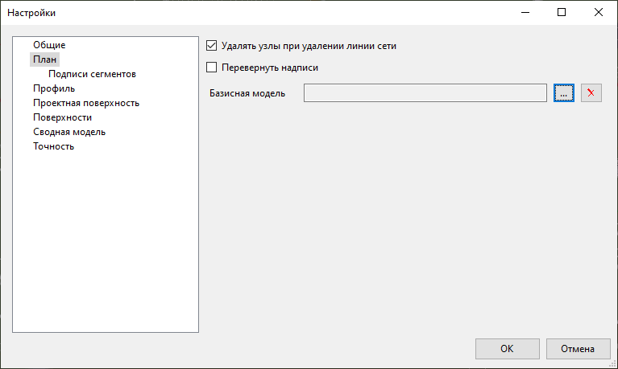

* **Удалять узлы при удалении линии сети** – данная опция определяет, будут ли удалены или сохранены узлы при удалении линии сети или сегмента сети;
* **Перевернуть надписи** – при активной опции, надписи (например, диаметр и длина трубы) вдоль линии сети будут повернуты на 180°;
* **Базисная модель** – в данном поле назначается модель, ось которой будет являться базисом при работе с инженерной сетью. Например, при выборе узла в окне План на панели Свойства в поле Пикет по базису будет отображаться его положение по пикету и смещению относительно базисной модели. Для того, чтобы задать Базисную модель, нажмите кнопку , откроется дополнительное окно, выберите необходимую модель и нажмите **ОК**.

### Подписи сегментов

В данной подгруппе задается стиль подписи сегментов, протяженных элементов и футляров для отображения в окне **План**:
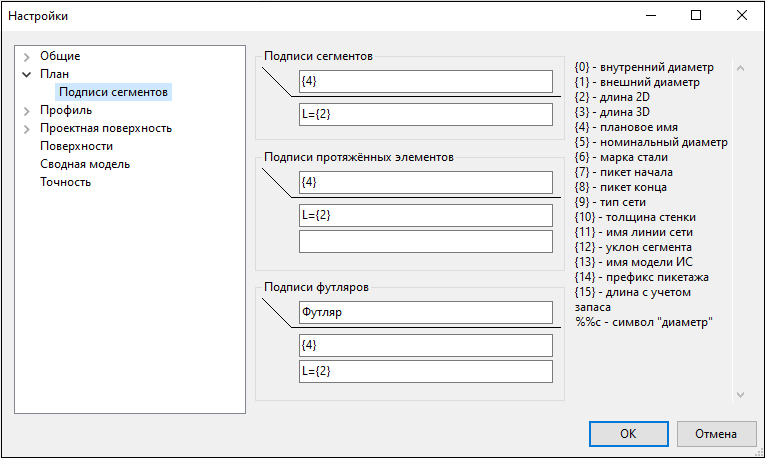

Подпись над и под выноской формируется отдельно в соответствующих строках в виде определенного набора значений (для формирования требуемого вида подписи).

Введенные значения в строках могут содержать буквенные, цифровые и символьные значения, а также специальные переменные (Теги), которые заключены в фигурные скобки.

При формировании подписи на плане данные теги будут преобразованы в определенные характеристики сегментов. Список тегов и характеристики сегментов, которые они определяют, показаны в правой части окна:
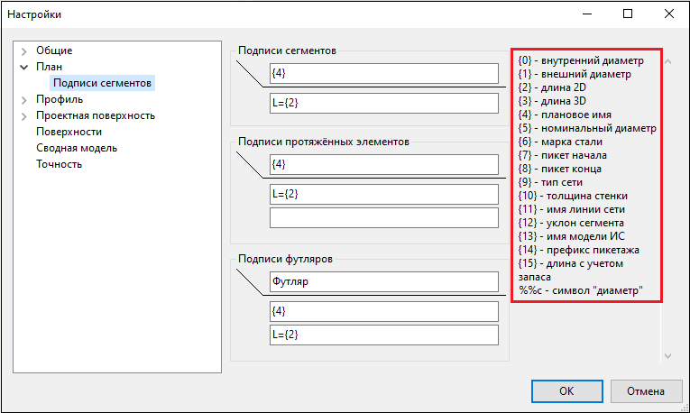



 Параметр {4} - плановое имя - свойство заданное индивидуально для каждого элемента сегмента в **Библиотеке 3D моделей**. Подробное описание работы с **Библиотекой 3D моделей** представлено в главе [Приложение. Библиотеки данных. Работа с библиотекой 3D объектов](../../../ru/annex/libraries/library_3d_models.md). 



Ниже показан пример формирования подписи, в которой использованы буквенные (К), цифровые (1), символьные (%, -) значения и теги ({0}, {1}, {3}):
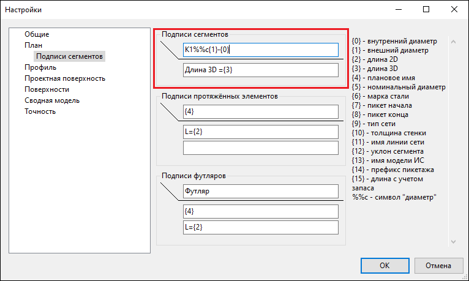

## Профиль

В данной группе задаются настройки отображения элементов сети в окне**Профиль сети**:
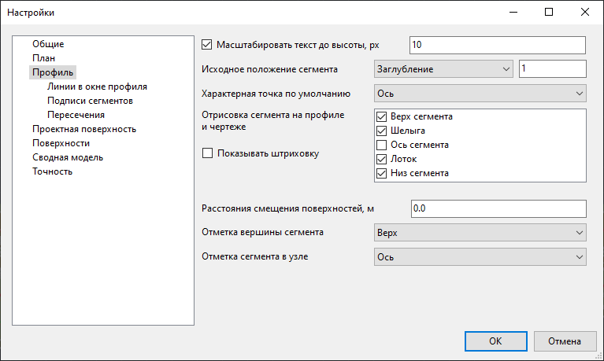

* **Масштабировать текст до высоты** - данная настройка включает режим отображения подписей и выносок на профиле, с включением которого при изменении масштаба отображения в окне **Профиль сети** текст всегда отображается с высотой, заданной в данной настройке;
* **Исходное положение сегмента** - данная настройка позволяет выбрать, по какому параметру будет задано смещение сегмента - **Заглубление** или **Превышение**, а также задать величину данного смещения до характерной точки сегмента, которое выставляется в свойствах каждого сегмента при вводе линии сети;
* **Характерная точка по умолчанию** - в данном поле задается характерная точка, которую программа выставляет по умолчанию в свойствах каждого сегмента при вводе линии сети;
* **Отрисовка сегмента на профиле и чертеже** - данная настройка позволяет выбрать, по каким характерным линиям будет отрисован сегмент на профиле инженерной сети;
* **Расстояния смещения поверхностей, м** – в данном поле через знак «;» задаются глубины, на которые смещается совмещенная линия поверхности проектной/фактической земли для моделирования глубины промерзания грунта и т.д.;
* **Отметка вершины сегмента** – данная настройка позволяет выбрать характерную точку вершины сегмента, по которой будет выставлена высотная отметка на профиле сети;
* **Отметка сегмента в узле** – данная настройка позволяет выбрать характерную точку сегмента, высотная отметка которой будет выставлена в узле на профиле сети.

### Линии в окне профиля

В данной подгруппе настраивается стиль отображения линии черной земли и проектной земли, а также цвет отображения элементов секций колодцев на профиле сети.
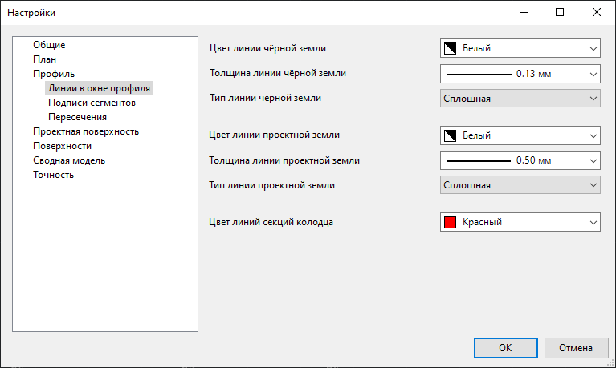



Данный блок настроек относится только к отображению в окне **Профиль сети**. Для отображения этих линий на чертеже используются настройки, заданные в шаблоне чертежа.



### Подписи сегментов

В данной подгруппе настраивается стиль подписи футляров в окне **Профиль сети**, а так же отображение контрольных трубок на плане, развернутом плане и подписей на профиле сети:
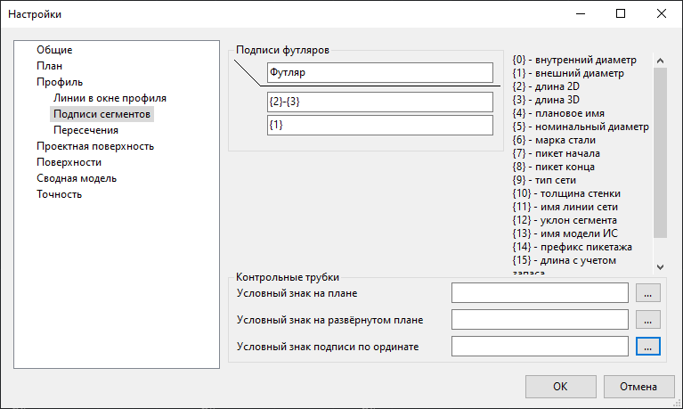

* Настройка подписей футляров на профиле сети осуществляется аналогично настройке подписей сегментов в подгруппе **План**;
* Для настройки отображения условных знаков контрольных трубок нажмите кнопку , откроется окно **Библиотека точечных условных знаков**, выберите необходимый условный знак и подтвердите выбор.

### Пересечения

В данной подгруппе назначаются стили оформления пересечений с другими моделями инженерных сетей - подписи отметок, цвет и отрисовка контуров на примыканиях к узлам и пересечениях на сегментах:
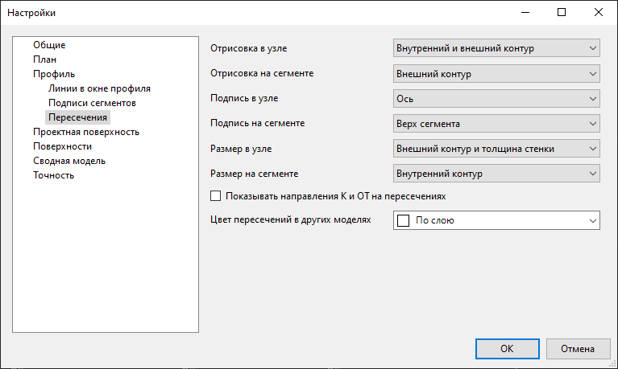

* **Отрисовка в узле / на сегменте** – данная настройка позволяет выбрать, по каким характерным линиям контура будет отрисовано пересечение сегмента на профиле сети, при примыкании к узлу либо пересечении на сегменте;
* **Подпись в узле / на сегменте** – данная настройка позволяет выбрать характерную точку, по которой будет выставлена высотная отметка сегмента на профиле сети, при примыкании к узлу либо пересечении на сегменте;
* **Размер в узле / на сегменте** – данная опция позволяет выбрать габаритные размеры каких характерных линий будут подписаны на выноске сегмента на профиле сети, при примыкании к узлу либо пересечении на сегменте;
* **Показывать направление К и ОТ на пересечениях** - данная настройка модифицирует подпись примыкающего в узле сегмента. К подписи добавляется информация о том, в какую сторону направлен уклон примыкающего сегмента - **К** данному узлу или **ОТ** него;
* **Цвет пересечений в других моделях** - данная настройка позволяет выбрать, каким цветом будут обозначены сегменты данной сети при пересечении с другими моделями инженерных сетей.

## Проектная поверхность

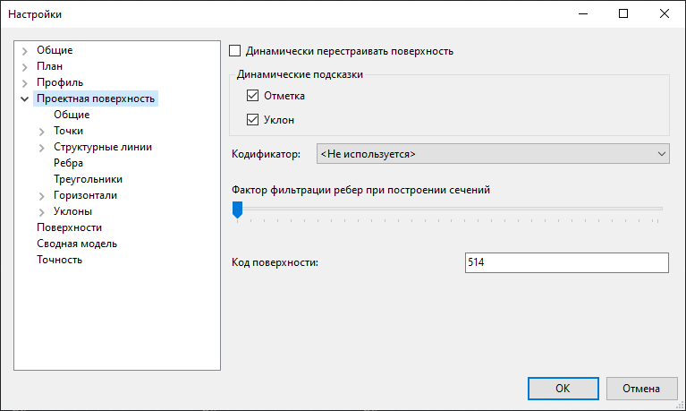

В данной группе настраивается проектная поверхность, с помощью которой производится построение котлованов под узлы и траншей под сегменты. Настройки проектной поверхности аналогичны [настройкам модели ЦММ](../../rb_survey/dtm/sfc/edit/setting_display_elements_surface.md).

## Поверхности

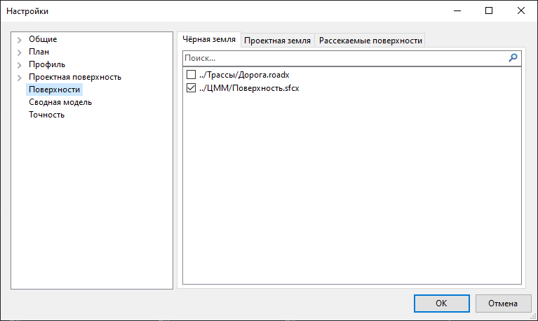

В данной группе для модели сети назначается черная (существующая) земля, проектная земля и, при необходимости, рассекаемые поверхности. Описание данного подраздела приводится в разделе [Создание модели инженерной сети](create_model_new.md).



Следует избегать подключения большого количества моделей проектных и черных поверхностей, т.к. количество, а не размер данных моделей напрямую сказывается на скорости работы инженерной сети. При большом количестве подключаемых моделей следует создавать комплексные сборные модели черных и проектных поверхностей.



## Сводная модель

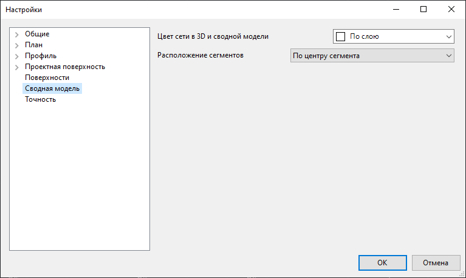

* **Цвет сети в 3D и сводной модели** - в данных настройках задается цветовая палитра отображения сети в рабочем окне **3D вид** и на информационной модели;
* **Расположение сегментов** – в данном поле задается тип прокладки сегментов в сводной информационной модели. При типе прокладки «*Подземный*» заполняется значение свойства «Глубина заложения трассы, м»; при типе прокладки «*Надземный*» заполняется значение свойства «Высота надземного расположения трассы, м». Тип прокладки «*По центру сегмента*» автоматически задает надземное или подземное расположение сегментов при формировании сводной модели, в зависимости от положения центральной точки сегмента.

## Точность

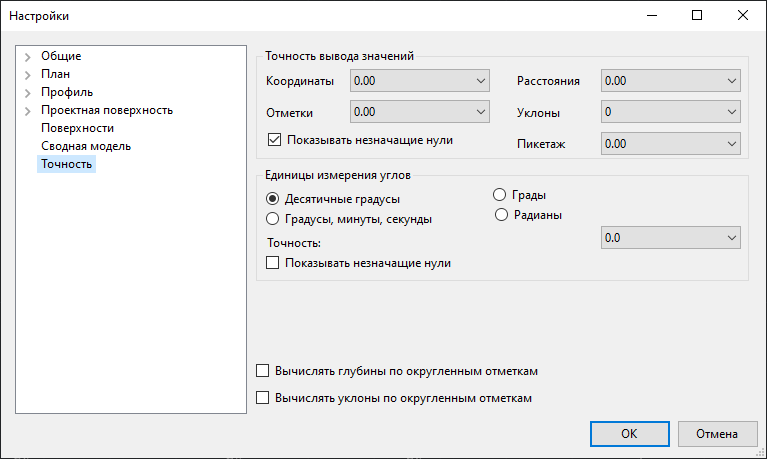

* В поле **Точность вывода значений** задается необходимое количество знаков после запятой для координат, отметок, расстояний, уклонов и пикетажа. Данная точность округления используется для отображения данных инженерной сети в рабочих окнах **План**, **Профиль сети**, а также при формировании чертежей и ведомостей;
* В поле **Единицы измерения углов** задаются различные единицы измерения углов;
* **Показывать незначащие нули** – данная опция позволяет на отображаемых данных инженерной сети (расстояние, отметка и т.д.) отключать/включать видимость конечных (незначащих) нулей в дробной части числа в зависимости от заданной настройки точности округления;
* По умолчанию программа все данные вычисляет с максимальной точностью, после чего округляет получившиеся значения до точности, указанной в поле **Точность вывода значений**. При включении опций «**Вычислять глубины по округленным отметкам / Вычислять уклоны по округленным отметкам**» программа для вычисления глубин и уклонов использует не максимально точные параметры, а округленные значения.