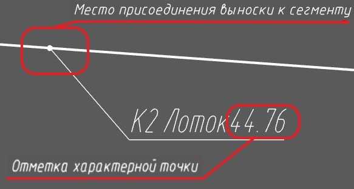
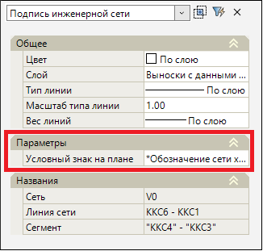
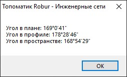

# Дополнительные функции

## Добавить выноску с данными по сети

Для типа моделей проекта **Инженерные сети**  в [менеджере слоев](../../../../ru/install_startup/startup/working_with_layers_model/manager_layers.md) автоматически создается слой **Выноски с данными по сети**, который с помощью выносок отображает дополнительную информацию по сегментам и узлам, принадлежащим данной модели инженерной сети.

Видимость данного слоя должна быть включена в менеджере слоев с помощью индикатора лампочки  для дальнейшей работы с выносками схемы сети.

Чтобы добавить выноску с данными о характерной точке сегмента:

1. Выберите меню **Инженерные сети - Выноски с данными сети - Добавить выноску с данными по сети**;
2. Укажите сегмент, которому необходимо добавить выноску.

По умолчанию выноске назначается обозначение типа сети, характерная точка сечения сегмента и отметка характерной точки. Точка привязки выноски может меняться с помощью соответствующих грипов. В зависимости от места привязки выноски к сегменту отметка характерной точки будет меняться:

Для изменения информации в выноске, в окне **Свойства** ей назначается другой условный знак на плане из **Библиотеки точечных условных знаков**. Для этого в редактируемом поле свойства нажмите команду , выберите вариант точечного условного знака и нажмите **Выбрать**.

## Позиционирование по пикету базиса

Данная функция позволяет центрировать экран в окне **План** на положение, соответствующее пикету и смещению базисной модели инженерной сети. Например, когда необходимо найти узел линии сети, предварительно зная его пикетажное положение относительно оси модели. Для этого:

1. Выберите меню **Инженерные сети - Утилиты - Позиционирование по пикету базиса**;
2. В динамической строке введите пикет и смещение линии сети и нажмите **Enter**.

В результате рабочее окно **План** центрируется на положение, соответствующее пикету и смещению базисной модели инженерной сети.



Данная функция применяется для моделей инженерных сетей, у которых предварительно назначена **Базисная модель**. Назначение базисной модели представлено в [Настройках модели инженерной сети](../settings_create_model_new.md).



## Угол между сегментами

Для измерения угла между двумя смежными сегментами сети:

1. Выберите меню **Инженерные сети - Утилиты - Угол между сегментами**;
2. Укажите первый и второй смежные сегменты.

В результате откроется информационное окно с данными об угле между сегментами в плане, профиле и пространстве:
