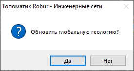
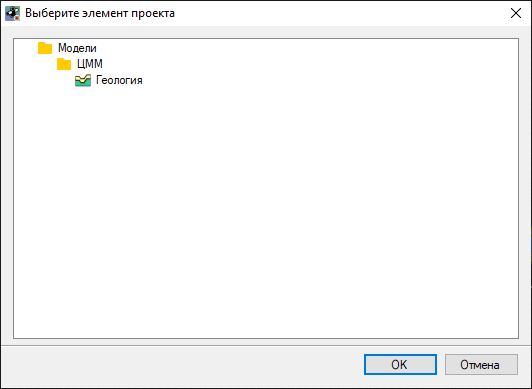
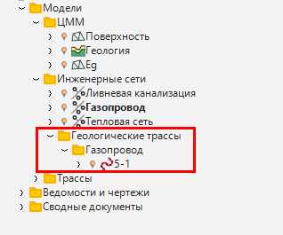
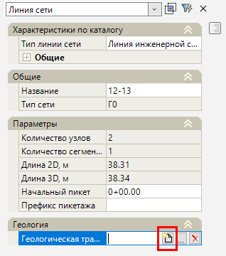
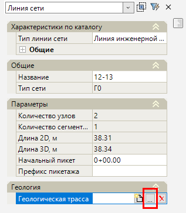
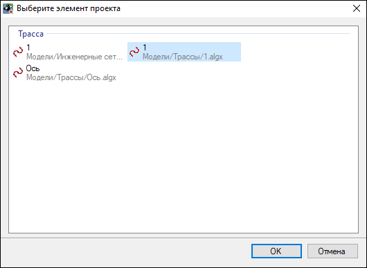

# Работа с геологическими данными

Данный функционал предназначен для создания геологической трассы инженерной сети и отображения геологических данных в окне Профиль сети и на выходных чертежах.

### Создание геологических трасс

Функция **Создать геологическую трассу** позволяет создать геологическую трассу инженерной сети, с возможностью нанесения на ее профиль геологического разреза и выработок.

Для создания геологической трассы по линии сети:

1. Выберите меню **Инженерные сети – Утилиты – Создать геологическую трассу**;
2. Укажите требуемые линии сети на плане или нажмите клавишу «вниз» - **Выбрать все**;
3. Возникнет следующее окно:

    Если на данном этапе выбрать **"Да"**, то см.п.4. Если выбрать **"Нет"**, то см.п.5.
4. При выборе **"Да"** откроется окно выбора целевой модели Геологии. Выбранная модель Геологии будет являться исходной базой данных с информацией о легенде грунтов и глобальных выработках. Разрез 3D вида данной модели станет основой для создания профиля геологической трассы линии сети:

5. В результате в структуре проекта будет добавлена папка "Геологические трассы". В этой папке будут созданы геологические трассы с названием линии сети, в которую будет автоматически скопирован профиль по фактической земле:

6. Если была выбрана модель Геологии, то по ней будет снесен изначальный разрез по 3Д-телу геологических слоев. Если модель Геологии выбрана не была (см.п.3), то трасса будет получена без снесения разреза. Редактирование разреза производится в окне "Профиль" в модели Трасса при помощи функций меню **Геология**.



Геологические данные, нанесенные на профиль трассы, будут отображены на "Профиле сети" и на выходных чертежах. В менеджере слоев они будут иметь свой слой с названием **Геология**.



Создать новую модель трассы для линии сети возможно вручную через окно "Свойства" в разделе "Геологическая трасса. Ссылка на нее автоматически пропишется в свойствах линии сети, а сама модель будет создана согласно п.5:

Для ссылки на существующий файл геологической трассы нажмите кнопку  :

Откроется окно выбора элемента проекта, выберите требуемый элемент и нажмите **ОК**:

### Обновление геологических трасс

Данная функция предназначена для обновления положения и параметров геологической трассы инженерной сети, если положение сети или строение исходной модели Геологии было изменено.

1. Выберите меню **Инженерные сети – Утилиты – Обновить геологические трассы**;
2. Возникнет следующее окно:

3. При выборе значения **Да** повторно откроется окно выбора целевой модели Геологии, что позволяет совместить плановое положение геологической трассы с измененным положением линии сети, а по выбранной модели геологии будет получен новый разрез.

В окне **Профиль сети** возможность редактирования геологических данных отсутствует. Корректировка геологических данных линии сети производится в модели геологической трассы. Данные изменения отображаются в окне **Профиль сети** инженерной сети при применении функции меню "Инженерные сети - Утилиты - **Обновить сеть**".



Функционал по созданию и редактированию геологических разрезов подробно описан ранее (см. [Обработка геологических изысканий](../../../../ru/rb_survey/glg/creation_legend_ground.md)).

