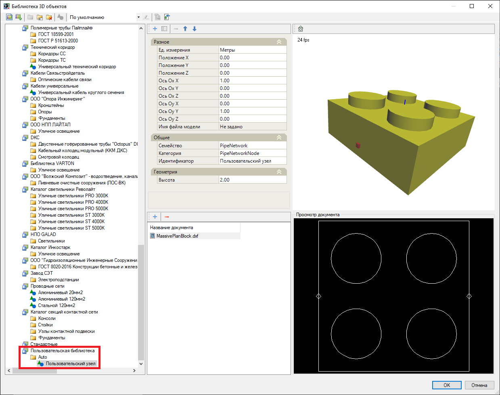

# Добавить объемный узел в библиотеку

Данная функция позволяет объемный узел, контур и точки подключения которого были заданы из примитивов, добавить в **Библиотеку 3D моделей**. Для этого:

1. Выберите меню **Инженерные сети - Утилиты - Добавить объемный узел в библиотеку**;
2. Укажите примитивы, из которых состоит узел, нажмите правую кнопку мыши, далее на плане укажите базовую точку вставки узла и в строке динамического ввода задайте высоту узла. Для подтверждения команды нажмите правую кнопку мыши;
3. В строке динамического ввода введите имя объемного узла и нажмите **Enter**, далее укажите пользовательскую библиотеку 3D моделей, в которую будет сохранен данный объемный узел.



Чтобы добавить объемный узел, предварительно создайте пользовательскую библиотеку в **Библиотеке 3D моделей**. Общие принципы работы с библиотеками данных представлены в приложении [Приложение. Библиотеки данных](../../../annex/libraries/libraries_info.md).



В результате в **Библиотеке 3D моделей** в выбранной пользовательской библиотеке появится новая папка **Auto**, в которую будет добавлен объемный узел:



Положение точек подключения к объемному узлу назначается при помощи функции меню **Рисовать - Текст - Многострочный / Однострочный**. Высотные отметки точек подключения назначаются через свойство *Положение Z* элемента "Текст", название вводимых точек подключения зависит от содержания данного текста.

