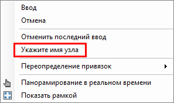
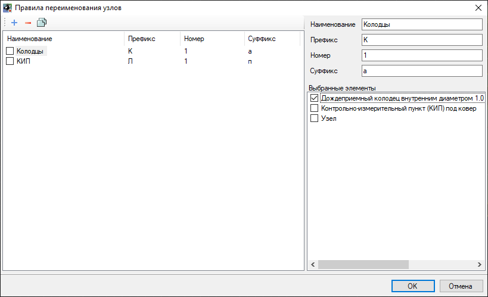

# Переименование узлов

## Переименовать узлы

Данная функция позволяет изменять название созданных узлов. Для этого:

1. Выберите меню **Инженерные сети – Утилиты – Переименовать узлы**;
2. В динамической строке введите имя, которое необходимо присвоить узлу и нажмите **Enter**;
3. Укажите первый узел, которому необходимо изменить название, следом укажите остальные узлы. Переименованные в узлы будут подсвечены красным цветом.



В случае, если имя узла будет содержать цифровое значение, программа предложит переименовать последующие узлы по порядку, начиная от первого переименованного узла (например, если у первого узла будет присвоено имя «1», то последующим узлам будет присвоено имя «2», «3»,…).

Изменить имя последующего узла можно вызвав контекстное меню нажав правую кнопку мыши или клавишу «вниз»:

 



## Переименовать узлы по правилам

Данная функция позволяет создавать правила, по которым будут переименовываться узлы различных типов, относящиеся к одной линии сети. Для этого:

1. Выберите меню **Инженерные сети - Утилиты - Переименовать узлы по правилам**;
2. Укажите редактируемую линию сети и нажмите **Enter**;
3. В открывшемся окне задайте правила переименования узлов и нажмите **ОК**.

* В верхнем поле слева создаются, удаляются или дублируются правила переименования узлов с помощью пиктограмм .
* После создания правила в верхнем правом поле задается его Наименование, Префикс, Номер и Суффикс. Программа будет автоматически переименовывать узлы по порядку начиная с последней цифры числового значения, указанного в Номере.
* В **Выбранных элементах** необходимо указать типы узлов, для которых будет применимо созданное правило.



Если **Выбранный элемент** повторяется в нескольких правилах, то для него будет действовать то правило, которое находится выше в перечне правил.

