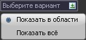
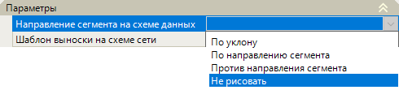
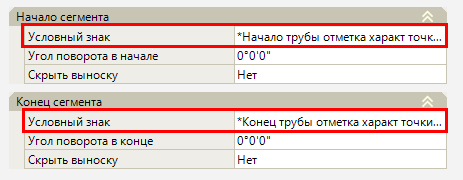
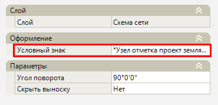

# Схема сети

Для типа моделей проекта **Инженерные сети**  в [менеджере слоев](../../../../ru/install_startup/startup/working_with_layers_model/manager_layers.md) автоматически создается слой **Схема сети**, который с помощью выносок отображает дополнительную информацию по сегментам и узлам, принадлежащим данной модели инженерной сети.

Видимость данного слоя должна быть включена в менеджере слоев с помощью индикатора лампочки  для дальнейшей работы с выносками схемы сети.

## Показать выноски на сегменте / Скрыть выноски на сегменте

Данная функция позволяет показать / скрыть выноски с дополнительными данными в начале и конце сегмента. Для этого:

1. Выберите меню **Инженерные сети - Схема сети - Показать выноски на сегменте / Скрыть выноски на сегменте**;
2. Укажите один из вариантов отображения / скрытия выносок:

* **Показать в области** - секущей рамкой укажите область отображения / скрытия выносок;
* **Показать все** - при выборе данного пункта будут показаны / скрыты все выноски в начале и конце сегментов текущей модели инженерной сети.

В результате на плане будут отображены / скрыты выноски с дополнительными данными по сегментам.

В окне **Свойства** отображаются настройки выноски сегмента на схеме сети:

* **Направление сегмента на схеме данных** - в данном поле из выпадающего списка выбирается отрисовка вектора направления сегмента (по уклону, по направлению сегмента, против направления сегмента, не рисовать):

* **Шаблон выноски на схеме сети** - в данном поле может быть записана дополнительная информация для сегмента схемы сети, которая отображается на выноске под подписью сегмента. По умолчанию в данном поле прописано значение уклона сегмента.
* **Условный знак начала/конца сегмента** - данная функция позволяет назначить другую подпись условного знака на плане из **Библиотеки точечных условных знаков**. Для этого в редактируемом поле свойства нажмите команду , выберите вариант подписи точечного условного знака и нажмите **Выбрать**:

* **Скрыть выноску начала/конца сегмента** – данная функция позволяет вручную показать или скрыть выноски начала/конца редактируемого сегмента, выбрав в редактируемом поле команду "Да" или "Нет".

## Показать выноски по узлу / Скрыть выноски по узлу

Данная функция позволяет показать / скрыть выноски с дополнительными данными по узлу. Для этого:

1. Выберите меню **Инженерные сети – Схема сети – Показать выноски по узлу / Скрыть выноски по узлу**;
2. Укажите один из вариантов отображения / скрытия выносок:

* **Показать в области** - секущей рамкой укажите область отображения / скрытия выносок;
* **Показать все** - при выборе данного пункта будут показаны / скрыты все выноски в узлах текущей модели инженерной сети.

В результате на плане будут отображены / скрыты выноски с дополнительными данными по узлам.

В окне **Свойства** отображаются настройки выноски узла на схеме сети:

* **Условный знак узла** - данная функция позволяет назначить другую подпись условного знака на плане из **Библиотеки точечных условных знаков**. Для этого в редактируемом поле свойства нажмите команду , выберите вариант подписи точечного условного знака и нажмите **Выбрать**:

* **Скрыть выноску узла** – данная функция позволяет вручную показать или скрыть выноску редактируемого узла, выбрав в поле команду "Да" или "Нет".