# Редактирование профиля сети

Параметры элементов, выбранных в окне **Профиль сети**, можно изменять с помощью стандартного окна **Свойства**. Редактирование ([узлов](../design_plan_pipes/characteristics.md) и [сегментов](../design_plan_pipes/characteristics.md)) в данном окне было описано ранее.

Также редактирование элементов сети в окне **Профиль сети** может производиться визуально с помощью специальных ручек (грипов). Для разных типов элементов набор грипов отличается. При выделении в окне **Профиль** левой кнопкой мыши узла колодца появятся соответствующие грипы:
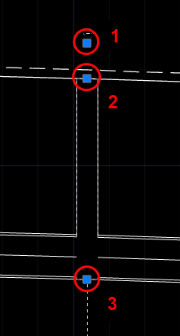

1. Перемещение подписи узла;
2. Визуальное изменение отметки крышки колодца;
3. Визуальное изменение отметки дна колодца.

При выделении в окне **Профиль** элемента **Сегмент** появятся соответствующие грипы: 
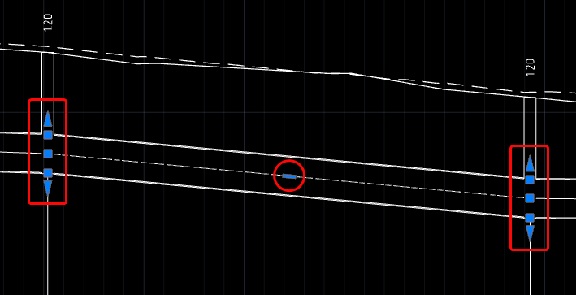

* Грипы в начале и в конце выбранного сегмента позволяют редактировать соответствующие отметки начала и конца сегмента;
* Грип в виде треугольника позволяет перемещать сегмент параллельно относительно исходного положения, т.е. уклон сегмента при изменении отметки не меняется;
* Грип в виде квадрата позволяет изменять начальную или конечную отметку сегмента с изменением уклона. В этом случае при изменении отметок с одной стороны, с другой ее стороны отметки остаются неизменными;
* Грип в виде прямоугольника позволяет перемещать прямой элемент сегмента параллельно относительно исходного положения, т.е. уклон сегмента при изменении отметки не меняется.

С каждой стороны сегмента имеется по две пары грипов (три квадратных и два треугольных), расположенных в его нижней и верхней частях. При перемещении выбранного элемента за нижние грипы имеется возможность привязки к лотку смежного сегмента. При перемещении выбранного элемента за верхние грипы увязка двух смежных сегментов осуществляется по шелыге.

Также добавлен ряд дополнительных функций для редактирования в контекстном меню, вызванном при нажатии правой кнопкой мыши на грипе:
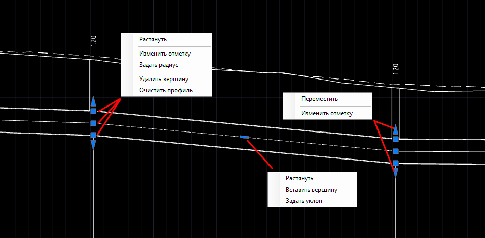

* **Переместить** - функция позволяет визуально редактировать соответствующие отметки начала или конца сегмента;
* **Изменить отметку** - при выборе данной функции появится динамическая строка, где в зависимости от выбранного грипа можно задать отметку характерной точки сегмента;
* **Растянуть** - функция позволяет перемещать выбранную вершину сегмента в плоскости;
* **Задать уклон** – при выборе данной функции откроется окно **Уклон сегмента профиля**:
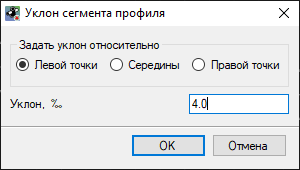

1. В поле **Уклон** задайте числовое значение продольного уклона сегмента.
2. В поле **Задать уклон относительно** выбирается базовая точка сегмента, относительно которой будет задаваться уклон, его же отметка останется неизменной:
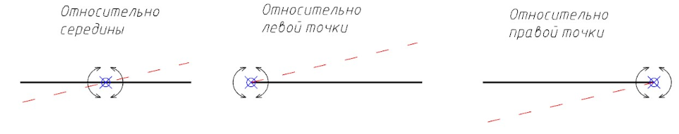

* **Вставить вершину** - функция предназначена для добавления дополнительной вершины на сегменте, для последующего придания сегменту более сложного очертания в профиле;
* **Удалить вершину** - функция предназначена для удаления вершины профиля сегмента;
* **Задать радиус** - функция добавляет в дополнительную вершину на сегменте кривую заданного радиуса:
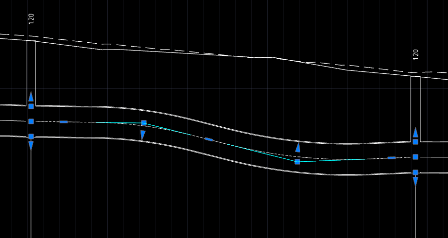
* **Очистить профиль** - при выборе данного пункта на сегменте удаляются все дополнительные вершины.

Положение выносных линий с подписями характеристик и отметок подключаемых сегментов, а также габаритных размеров до пересекаемых коммуникаций (как проектных, так и существующих) также может редактироваться с помощью грипов.
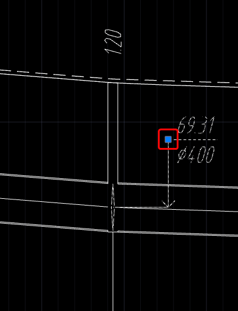

Заданное расположение подписей сохраняется при создании макета чертежа или при формировании чертежа продольного профиля сети.

## Поднять или опустить сегменты

Данная функция позволяет поднять/опустить выбранные сегменты, не меняя уклона. Чтобы поднять или опустить сегменты, выполните следующие действия:

1. Выберите меню **Инженерные сети - Профиль сети - Поднять или опустить сегменты**, курсор примет форму прицела. Укажите сегменты, которые необходимо поднять/опустить, и нажмите **Enter**.
2. В динамическом окне задайте разницу отметок, на которую нужно сместить выбранные сегменты или нажмите клавишу "down", далее выберите **Указать разницу отметок графически** и укажите первичное положение точки (первая точка), относительно которой будет происходить смещение сегмента и её новое положение (вторая точка):
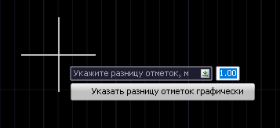

В результате выбранные сегменты будут смещены в плоскости вертикально на указанное расстояние относительно исходного положения.

## Выровнять сегменты между узлами

Данная функция позволяет выстроить сегменты между двумя указанными узлами в одну линию. Для автоматического выстраивания сегментов выполните следующие действия:

1. Выберите меню **Инженерные сети - Профиль сети - Выровнять сегменты между узлами**, укажите первый узел и абсолютную отметку характерной точки сегмента у первого узла, затем укажите второй узел и абсолютную отметку характерной точки сегмента у второго узла и нажмите **Enter**.
2. В выпавшем контекстном меню выберите характерную точку, по которой необходимо выровнять сегменты:
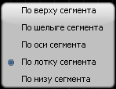

В результате выбранный сегмент будет выровнен по указанным точкам привязки к узлам.



Точку привязки сегмента можно задать визуально или нажать клавишу "down", выбрать пункт **Ввести отметку** и задать абсолютную отметку характерной точки сегмента: 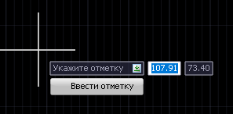



## Автоматическое выравнивание сегментов

Данная функция позволяет автоматически выстроить сегменты в одну линию относительно основного сегмента. Для этого:

1. Выберите меню **Инженерные сети - Профиль сети - Автоматическое выравнивание сегментов**, курсор примет форму прицела. Укажите сегмент, относительно которого необходимо выполнить выравнивание, а затем выравниваемые сегменты и нажмите **Enter**.
2. В контекстном меню выберите характерную точку основного сегмента, по которой нужно выровнять сегменты:

В результате сегменты будут автоматически выровнены на основе первого выбранного сегмента.
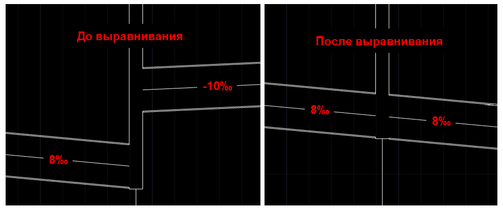



При автоматическом выравнивании первый сегмент является основным, поэтому другие выделенные сегменты примут такую же величину уклона относительно выбранной характерной точки, как и первый сегмент. 



## Автоматическое построение профилей дождеприемных соединений

Данная функция позволяет автоматически построить профиль соединений дождеприемных колодцев. Для этого выполните следующие действия:

1. Выберите меню **Инженерные сети - Профиль сети - Автоматическое построение профилей дождеприемных соединений**. Выберите необходимые сегменты и нажмите правую кнопку мыши;
2. Укажите стартовую глубину заложения сегмента и нажмите правую кнопку мыши, далее введите необходимый уклон сегмента и нажмите правую кнопку мыши.

В результате будет построен профиль дождеприемных соединений, учитывающий заданную глубину и уклон сегмента.



Автоматическое выравнивание возможно произвести только в случае, когда выбранные сегменты сопрягаются с узлами с типом идентификатора "Дождеприемный колодец".



## Построить профиль с учётом рельефа

Данная функция позволяет построить профиль сети параллельно рельефу на заданной глубине. Для этого:

1. Выберите меню **Инженерные сети - Профиль сети - Построить профиль с учётом рельефа**, укажите сегменты, профиль которых необходимо построить параллельно рельефу и нажмите правую кнопку мыши;
2. В открывшемся окне введите глубину заложения от характерной точки сегмента до проектной поверхности (если проектная поверхность отсутствует, то при построении будет учтена черная земля) и нажмите **ОК**:
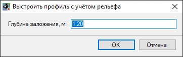



По умолчанию программа предлагает значение **Глубины заложения**, заданное в **Настройках модели – Профиль – Исходное положение сегмента**: 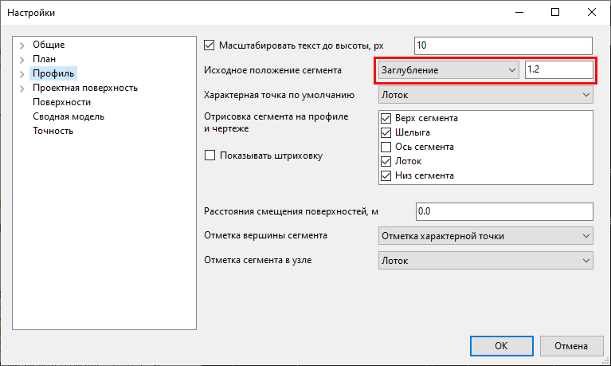 



В результате профиль сети будет построен параллельно рельефу с учетом точек перелома на нем. Программа автоматически задаст вершины на оси сегмента по спроецированным точкам перелома рельефа:
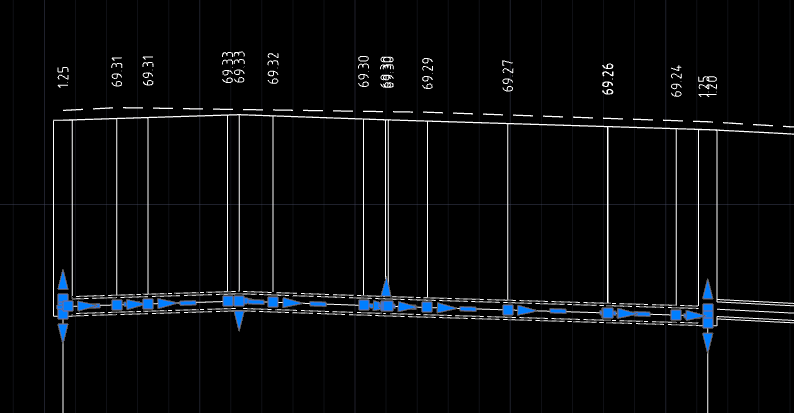

## Пользовательские построения

Данная группа 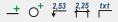 позволяет вводить дополнительные построения и информацию на Профиле сети, для этого выберите меню **Инженерные сети - Профиль сети - ...** и, в зависимости от необходимой функции, выберите:

* **Добавить отрезок / окружность** - данные функции применяются для построения дополнительных элементов сети на профиле;
* **Добавить отметку** - данная функция позволяет вынести дополнительную отметку на профиле, указав точку вставки выноски с отметкой. Отметка указанной точки принимается автоматически;
* **Добавить размер** - данная функция предназначена для добавления размера на профиле;
* **Добавить выноску** - данная функция предназначена для создания выноски с дополнительной информацией. Для этого выберите функцию, укажите точку вставки выноски и введите необходимый текст, который отобразится на выноске.

В результате на профиле отобразится дополнительная информация и графические построения.

## Добавить / Скрыть точку профиля

Данные функции 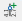  позволяют добавлять дополнительные отметки в шапку профиля, указав точки на профиле и скрывать и скрывать их. Чтобы добавить дополнительную точку профиля выполните следующие действия:

1. Выберите меню **Инженерные сети - Профиль сети - Добавить точку профиля**;
2. Укажите необходимую точку на профиле.

В результате в шапке профиля отобразятся отметки добавленной точки.

Чтобы скрыть лишние скрыть точки на профиле:

1. Выберите меню **Инженерные сети - Профиль сети - Скрыть точку профиля**, точки профиля отобразятся в виде вертикальных линий;
2. Укажите рамкой скрываемые точки (вертикальные линии).

В результате из шапки профиля будут удалены указанные отметки.

## Показать источник поверхности

Данная функция  отображает информацию о используемых поверхностях выбранной точки продольного профиля инженерной сети. Чтобы показать источник поверхности выполните следующие действия:

1. Выберите меню **Инженерные сети - Профиль сети - Показать источник поверхности**. Информация будет динамически изменяться в зависимости от выбранной точки:
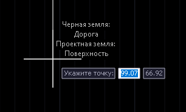



Подробное описание назначения поверхностей представлено в разделе [Настройки модели инженерной сети](../design_plan_pipes/settings_create_model_new.md)



## Групповое редактирование элементов сети

При выборе группы элементов их общие параметры могут быть отредактированы с помощью окна **Свойства**. К примеру, при назначении в окне **Свойства** требуемого значения продольного уклона оно будет назначено всем сегментам, выбранным в окне **Профиль сети**.

Выбор в окне **Профиль сети** осуществляется стандартными способами - указанием элементов поочередно, секущей рамкой, выбором подобных или с помощью функции **Быстрый выбор**. Например, для выбора всех протяженных элементов сегмента длиной с учетом запаса больше 10 м с помощью функции **Быстрый выбор**:

1. Выберите меню **Сервис – Быстрый выбор** либо нажмите кнопку  в окне **Свойств**, откроется окно **Быстрый выбор**:
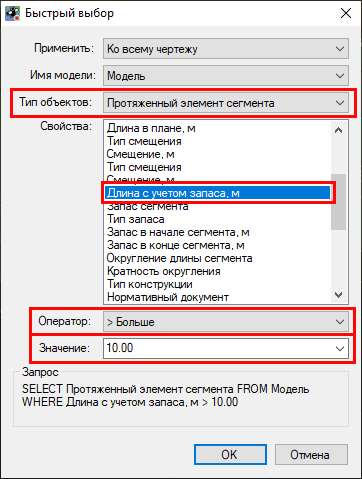

2. Задайте необходимые параметры, показанные на рисунке выше, и нажмите **ОК**. В результате в окне **Профиль сети** будут выбраны все **Протяженные элементы сегмента**, у которых длина с учетом запаса больше 10 м:
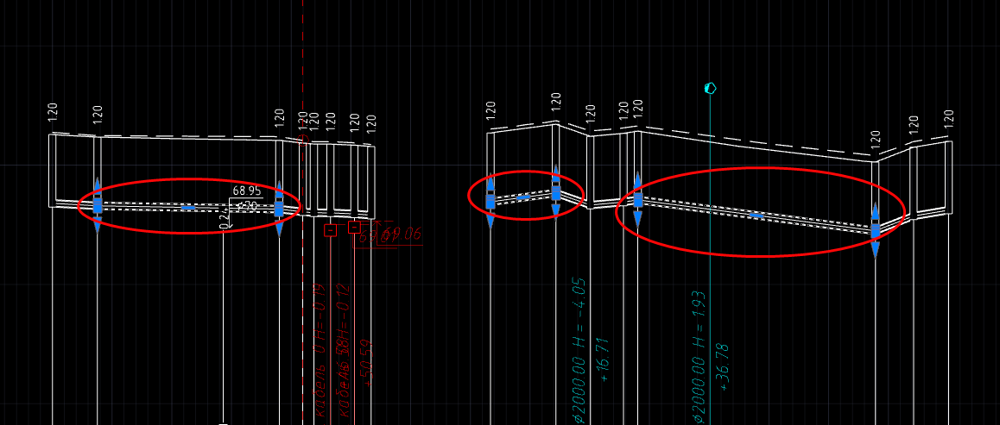



Модель редактируемой сети является полностью динамической. К примеру, любые изменения характеристик сети, задаваемые в окнах **План** или **Профиль сети**, автоматически приводят к обновлению всех взаимосвязанных данных в рабочих окнах программы.

