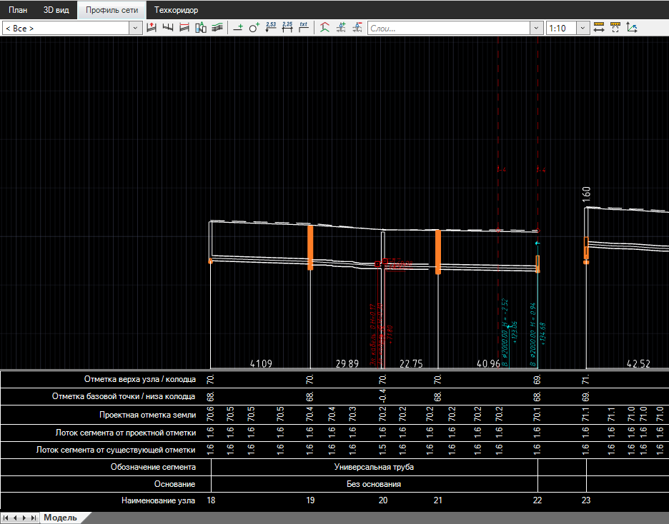
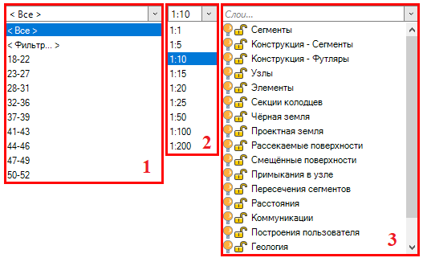
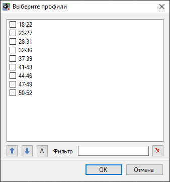
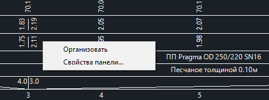
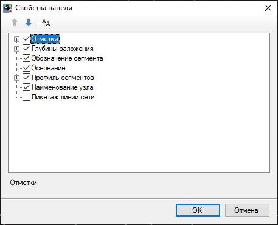

# Общие сведения и настройка окна Профиль сети

Проектирование продольного профиля инженерной сети осуществляется в рабочем окне **Профиль сети**. В данном рабочем окне отображаются продольные сечения всех линий сети текущей модели, подключения сегментов в узлах инженерной сети, а также пересечения с другими коммуникациями

В верхней части данного окна имеется три селектора:

С помощью первого селектора выбираются наименования линий сети, которые будут отображаться в окне **Профиль сети**:

* Для того чтобы отобразить профиль необходимой линии сети, выберите ее наименование из списка;
* Для того чтобы отобразить все линии сети текущей модели инженерной сети, выберите в данном списке пункт <**Все**>;
* Для того чтобы настроить отображение определенных линий сети, выберите в списке пункт <**Фильтр**>. В открывшемся окне можно воспользоваться полем **Фильтр** для поиска нужной линии сети. Также с помощью кнопок  можно перемещать линии сети вверх/вниз по списку, настраивая последовательность их отображения в окне **Профиль сети**. Чтобы сортировать названия профилей сети по алфавиту нажмите пиктограмму . Отметьте наименования тех сетей, которые должны отображаться в окне **Профиль сети** и нажмите **ОК**:

С помощью второго селектора настраивается искажение отображаемых данных в окне **Профиль сети** в зависимости от отношения горизонтального и вертикального масштабов.

В третьем селекторе перечислены слои окна **Профиль сети**, на которых размещаются различные элементы инженерной сети. В данном списке с помощью соответствующих пиктограмм можно управлять видимостью, включать/выключать возможность редактирования элементов слоев в окне **Профиль сети**.

В нижней части окна, в шапке профиля, отображаются различные данные (отметки, уклоны и т. д.) по профилям линий сети. Для их настройки в области шапки профиля нажмите правую кнопку мыши и выберите пункт меню **Свойства панели**:

В открывшемся окне включите/выключите отображение необходимых данных и нажмите **ОК**:

Для выравнивания сетки профиля сети по высоте нажмите функцию **Организовать**.



Скрытие/отображение характеристик в сетке профиля сети не влияет на формирование чертежа продольного профиля сети. Чертеж продольного профиля сети создается в соответствии с шаблоном чертежа (см. раздел [Создание чертежа продольного профиля сети](../formation_documentation/creation_output_drawings_new.md)).


