# Создание чертежей

**Топоматик Robur Инженерные сети** позволяет сформировать следующие выходные чертежи:



План сети, отображаемый в рабочем окне программы, может быть сохранен в виде чертежа следующими способами:

1. Экспортом всего ситуационного плана в файл чертежа.

Метод экспорта ситуационного плана позволяет сохранять в файл чертежа выбранного формата (**dwg, dxf, dwp, pdf** и т. п.) все элементы моделей, отображаемые в окне **План**.

Для этого выберите меню **Проект - Экспортировать - Ситуация**, в открывшемся диалоговом окне задайте необходимые настройки экспорта данных в чертеж:
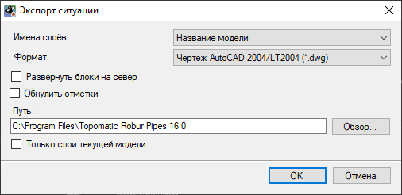



Экспорт данных плана в чертеж был описан ранее ([Чертежи и ведомости. Создание чертежа ситуационного плана](../../doc/create_drawings_plan.md)).



2. Выполнением на плане предварительной раскладки листов, а затем созданием по ним соответствующих чертежей.



Механизмы раскладки листов на плане, настройка их шаблонов, а также формирование на их основе чертежей различных форматов была описана ранее ([ЦММ, Топографический план, Оформление, Формирование планшетов](../../rb_survey/dtm/planchet/topographic_plan/formation_tablets.md)).



3. Также имеется возможность быстрого импорта/экспорта примитивов чертежа плана из внешнего редактора (AutoCAD / NanoCAD). Для того чтобы импортировать ситуацию из среды AutoCAD / NanoCAD в Топоматик Robur, выберите меню **Рисовать - Внешний редактор - Импорт из внешнего редактора AutoCAD / Импорт из внешнего редактора NanoCAD**. В открывшемся окне программы AutoCAD / NanoCAD укажите примитивы, которые необходимо импортировать, и нажмите правую кнопку мыши. Примитивы будут импортированы в Топоматик Robur и отобразятся в рабочем окне **План**.

Для того чтобы экспортировать ситуацию в AutoCAD / NanoCAD из программы Топоматик Robur, выберите меню **Рисовать - Внешний редактор - Экспорт в внешний редактор AutoCAD / Экспорт в внешний редактор NanoCAD**. Курсор примет форму прицела. Укажите примитивы, которые необходимо экспортировать, и нажмите правую кнопку мыши. Примитивы будут экспортированы в AutoCAD / NanoCAD и появятся в открывшемся окне программы.





Программа **Топоматик Robur** позволяет создать чертеж продольного профиля инженерной сети по заданному шаблону. Чтобы создать чертеж профиля, выполните следующие действия:

1. Выберите меню **Инженерные сети - Чертежи - Создать чертеж профиля**;
2. Откроется окно **Мастер формирования чертежа**. На **Шаге 1** выберите необходимые настройки и нажмите кнопку **Далее**:

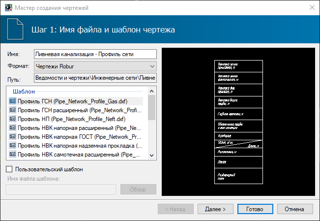

* **Имя** - в данном поле отображается наименование создаваемого файла чертежа. Данное поле редактируемое;
* **Формат** - в данном поле выбирается формат формируемого чертежа. По умолчанию чертежи представлены в формате **Robur**;
* **Путь** - путь сохранения выгружаемого файла в структуре проекта;

* В поле **Шаблон** представлены стандартные шаблоны чертежей, согласно которым будет формироваться чертеж.



При необходимости использования пользовательского шаблона установите опцию **Пользовательский шаблон** и выберите соответствующий файл с помощью кнопки **Обзор**. Механизмы настройки индивидуальных шаблонов чертежей описаны в [Чертежи и ведомости, Редактирование динамических выходных чертежей](../../doc/edit_dynamic_drawing/general_information.md).



3. На **Шаге 2** необходимо задать основные настройки формирования чертежа, затем нажмите кнопку **Далее**:
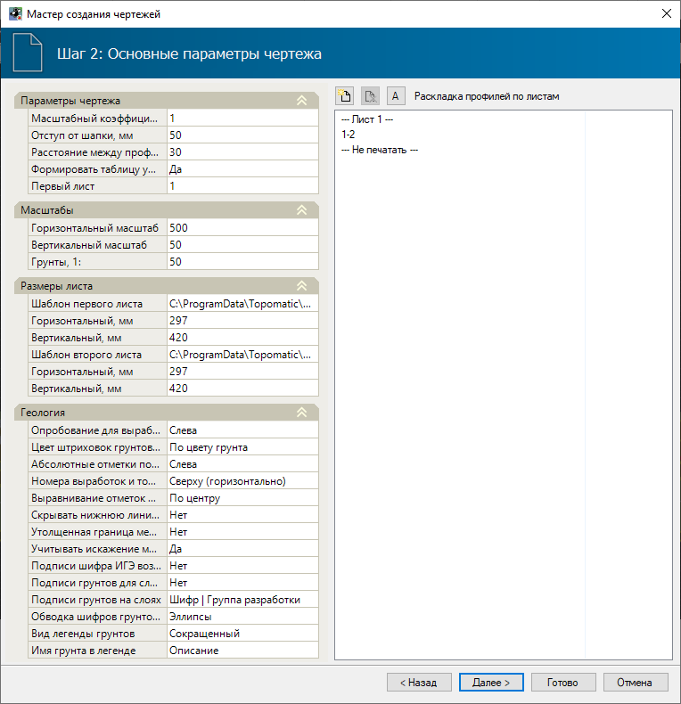

В левой части окна задаются настройки отображения чертежа. В группе свойств **Параметры чертежа** задаются следующие данные:

* **Масштабный коэффициент текста** - размер шрифта, которым подписываются данные в шапке чертежа, задается непосредственно в шаблоне самого чертежа. С помощью данного масштабного коэффициента можно регулировать высоту текста. Задание масштабного коэффициента менее единицы уменьшает высоту текста чертежа, более единицы - увеличивает;
* **Отступ от шапки** - вертикальный отступ от шапки определяет минимальное расстояние между верхней линией шапки и самой нижней точкой линии профиля;
* **Расстояние между профилями** - в данном поле задаётся расстояние между профилями, когда несколько профилей отображены на одном листе чертежа;
* **Формировать таблицу условных обозначений подписей сегментов** - при выборе пункта **Да** на чертеже будет отображена таблица условных обозначений подписей сегментов;

В группе свойств **Масштабы** задаются значения **Горизонтального**, **Вертикального масштаба** и масштаба **Грунтов**.

В группе свойств **Размеры листа** задаются параметры шаблона основной надписи и размеры листа.

В группе свойств **Геология** задаются различные параметры отрисовки геологических данных на чертеже.

В правой части окна задается раскладка чертежей профилей по листам:

* Чтобы добавить новый лист нажмите пиктограмму .
* Чтобы удалить лист нажмите пиктограмму 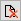.
* Чтобы сортировать участки сети внутри листа по алфавиту нажмите пиктограмму 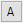.
* Раскладка профилей сетей по листам осуществляется вручную, для этого зажмите левой кнопкой мыши лист или профиль участка сети и переместите. Листы и участки инженерных сетей, которые были помещены под пункт **Не печатать**, не будут выведены на чертеж.

4. На **Шаге 3** необходимо заполнить штамп чертежа:
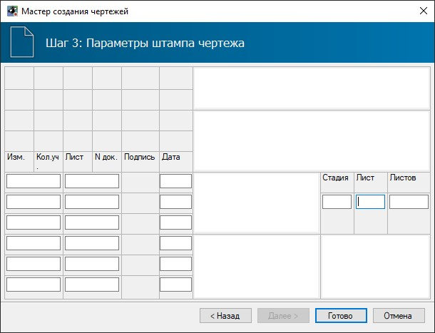

5. Задайте все необходимые настройки формирования чертежа и нажмите кнопку **Готово**.

В результате в структуре проекта появится папка **Ведомости и чертежи**, в которой отобразится созданный чертеж. Этот чертеж автоматически будет открыт для просмотра или дальнейшего редактирования:
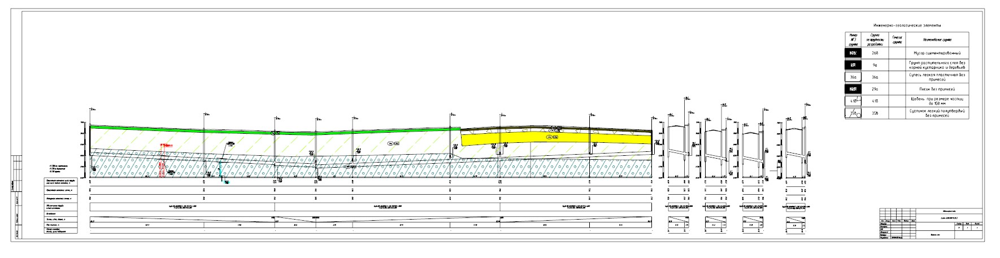





Программа **Топоматик Robur** позволяет сформировать чертежи конструктивных элементов колодцев. Для этого:

1. Выберите элемент меню **Инженерные сети - Чертежи - Создать чертежи колодцев**, откроется окно мастера создания чертежей;
2. Откроется окно мастера формирования чертежа. На **Шаге 1** выберите необходимые настройки и нажмите кнопку **Далее**:
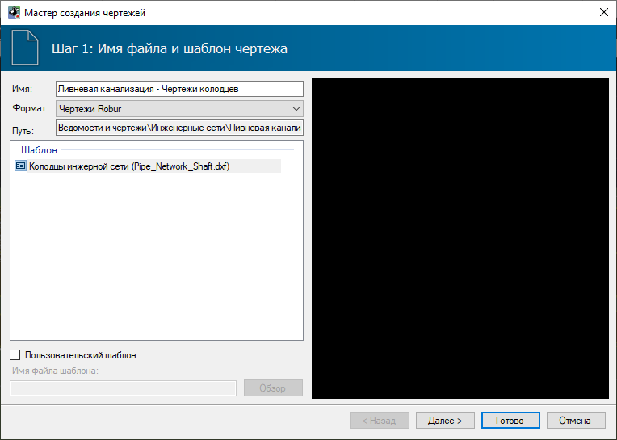

* **Имя** - в данном поле отображается наименование создаваемого файла чертежа. Данное поле редактируемое;
* **Формат** - в данном поле выбирается формат чертежа, в зависимости от редактора, в котором он будет открыт. По умолчанию чертежи представлены в формате **Robur**;
* **Путь** - путь сохранения выгружаемого файла в структуре проекта;
* В поле **Шаблон** представлены стандартные шаблоны чертежей, согласно которым будет формироваться чертеж.



При необходимости использования пользовательского шаблона установите опцию **Пользовательский шаблон** и выберите соответствующий файл с помощью кнопки **Обзор**. Механизмы настройки индивидуальных шаблонов чертежей описаны в [Чертежи и ведомости, Редактирование динамических выходных чертежей](../../doc/edit_dynamic_drawing/general_information.md).



3. На **Шаге 2** необходимо задать основные настройки формирования чертежа, затем нажмите кнопку **Далее**:
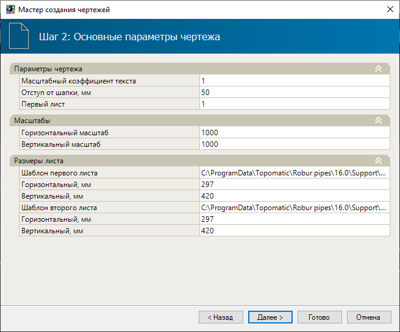

В группе полей **Параметры чертежа** задаются следующие данные:

* **Масштабный коэффициент текста** – размер шрифта, которым подписываются данные в шапке чертежа, задается непосредственно в шаблоне самого чертежа. С помощью данного масштабного коэффициента можно регулировать высоту текста. Задание масштабного коэффициента менее единицы уменьшает высоту текста чертежа, более единицы - увеличивает;
* В группе полей **Масштабы** задаются значения **Горизонтального** и **Вертикального масштаба**;
* В группе полей **Размеры листа** задаются параметры шаблона основной надписи и размеры листа.

4. На **Шаге 3** необходимо заполнить штамп чертежа. Введите в пустые поля необходимые данные:

5. Задайте все необходимые настройки формирования чертежа и нажмите кнопку **Готово**.

В результате в структуре проекта появится папка **Ведомости и чертежи**, в которой отобразится созданный чертеж. Этот чертеж автоматически будет открыт для просмотра или дальнейшего редактирования:
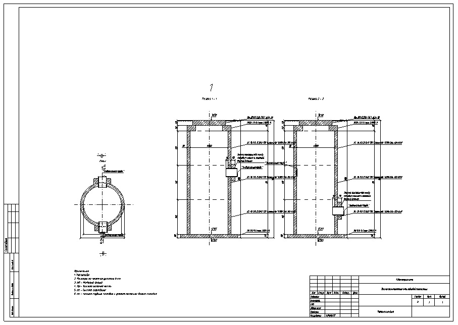





Программа **Топоматик Robur** позволяет сформировать чертеж продольных профилей участков ГНБ. Для этого:

1. Выберите элемент меню **Инженерные сети - Чертежи - Создать чертежи ГНБ**;
2. Откроется окно мастера формирования чертежа. **На Шаге 1** выберите необходимые настройки и нажмите кнопку **Далее**:
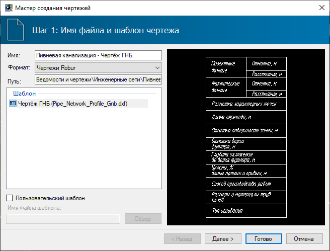

* **Имя** - в данном поле отображается наименование создаваемого файла чертежа. Данное поле редактируемое;
* **Формат** - в данном поле выбирается формат чертежа, в зависимости от редактора, в котором он будет открыт. По умолчанию чертежи представлены в формате **Robur**;
* **Путь** - путь сохранения выгружаемого файла в структуре проекта;
* В поле **Шаблон** представлен стандартный шаблон чертежей, согласно которым будет формироваться чертеж.



При необходимости использования пользовательского шаблона установите опцию **Пользовательский шаблон** и выберите соответствующий файл с помощью кнопки **Обзор**. Механизмы настройки индивидуальных шаблонов чертежей описаны в [Чертежи и ведомости, Редактирование динамических выходных чертежей](../../doc/edit_dynamic_drawing/general_information.md).



3. На **Шаге 2** необходимо задать основные настройки формирования чертежа, затем нажмите кнопку **Далее**:
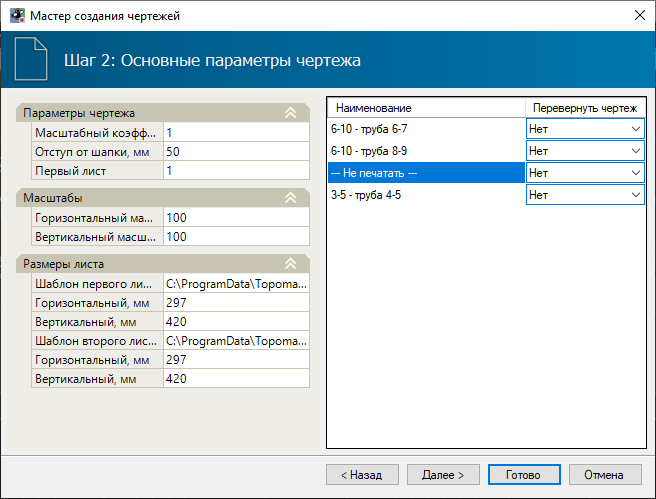

В левой части окна задаются настройки отображения чертежа. В группе свойств **Параметры чертежа** задаются следующие данные:

* **Масштабный коэффициент текста** – размер шрифта, которым подписываются данные в шапке чертежа, задается непосредственно в шаблоне самого чертежа. С помощью данного масштабного коэффициента можно регулировать высоту текста. Задание масштабного коэффициента менее единицы уменьшает высоту текста чертежа, более единицы - увеличивает;
* **Отступ от шапки** - вертикальный отступ от шапки определяет минимальное расстояние между верхней линией шапки и самой нижней точкой линии профиля;
* В группе свойств **Масштабы** задаются значения **Горизонтального** и **Вертикального масштаба**.
* В группе свойств **Размеры листа** задаются параметры шаблона основной надписи и размеры листа.

В правой части окна программа показывает все сегменты участка сети текущей модели, которые имеют изгибы в плане или профиле. Участками ГНБ считаются сегменты с заданным свойством **Способ производства работ - "Закрытый"**:
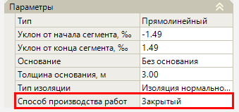

По умолчанию на чертеже участки ГНБ формируются по направлению участка сети. Например, если участок ГНБ устраивался в противоположную сторону от направления участка сети, тогда на чертеже начальный котлован будет справа, а конечный слева. Чтобы чертеж формировался слева - направо в поле **Перевернуть чертеж** необходимо установить значение **Да**.

* Участки инженерных сетей, которые были помещены под пункт **Не печатать**, не будут выведены на чертеж. Для этого зажмите левой кнопкой мыши **Не печатать** или профиль участка сети и переместите.

4. На **Шаге 3** необходимо заполнить штамп чертежа:

5. Задайте все необходимые настройки формирования чертежа и нажмите кнопку **Готово**.

В результате в структуре проекта появится папка **Ведомости и чертежи**, в которой отобразится созданный чертеж. Этот чертеж автоматически будет открыт для просмотра или дальнейшего редактирования:
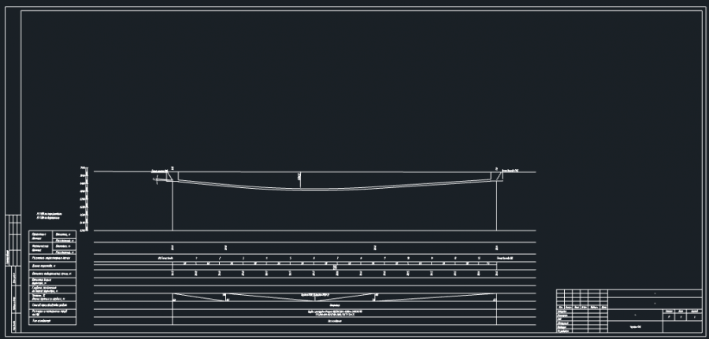





Программа **Топоматик Robur** позволяет создать чертеж пересечений участков сети. Для этого:

1. Выберите элемент меню **Инженерные сети - Чертежи - Создать чертежи пересечений**;
2. Откроется окно мастера формирования чертежа. **На Шаге 1** выберите необходимые настройки и нажмите кнопку **Далее**:
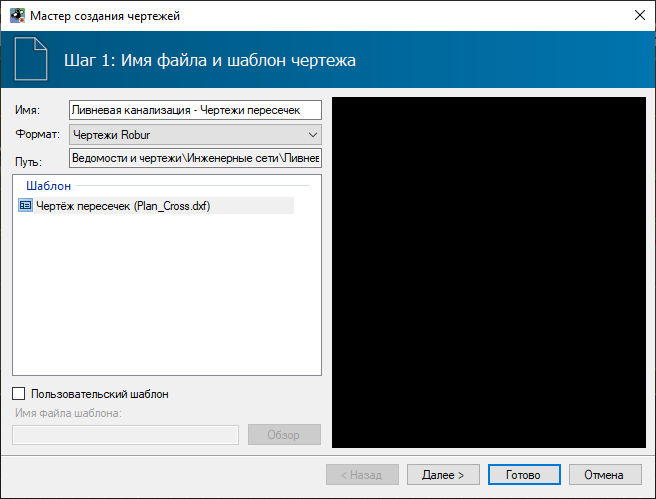

* **Имя** - в данном поле отображается наименование создаваемого файла чертежа. Данное поле редактируемое;
* **Формат** - в данном поле выбирается формат чертежа, в зависимости от редактора, в котором он будет открыт. По умолчанию чертежи представлены в формате **Robur**;
* **Путь** - путь сохранения выгружаемого файла в структуре проекта;
* В поле **Шаблон** представлен стандартный шаблон чертежей, согласно которым будет формироваться чертеж.



При необходимости использования пользовательского шаблона установите опцию **Пользовательский шаблон** и выберите соответствующий файл с помощью кнопки **Обзор**. Механизмы настройки индивидуальных шаблонов чертежей описаны в [Чертежи и ведомости, Редактирование динамических выходных чертежей](../../doc/edit_dynamic_drawing/general_information.md).



3. На **Шаге 2** необходимо задать основные настройки формирования чертежа, затем нажмите кнопку **Далее**:
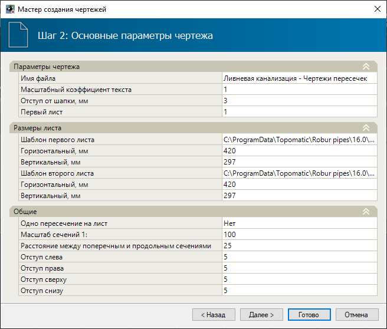

В группе свойств **Параметры чертежа** задаются следующие данные:

* **Имя файла** - в данном поле отображается наименование создаваемого файла чертежа;
* **Масштабный коэффициент текста** - размер шрифта, которым подписываются данные в шапке чертежа, задается непосредственно в шаблоне самого чертежа. С помощью данного масштабного коэффициента можно регулировать высоту текста. Задание масштабного коэффициента менее единицы уменьшает высоту текста чертежа, более единицы - увеличивает;
* **Отступ от шапки** - вертикальный отступ от шапки определяет минимальное расстояние между верхней линией шапки и самой нижней точкой линии профиля;

В группе свойств **Размеры листа** задаются параметры шаблона основной надписи и размеры листа.

В группе свойств **Общие** задаются следующие данные:

* Если необходимо, чтобы на листе отображалась одно пересечение, выберите **Да** в поле **Одно пересечение на лист**;
* **Масштаб сечений** - в данном поле задаётся масштаб сечение на чертеже;
* **Расстояние между поперечными и продольными сечениями** - в данном поле задаётся расстояние между сечениями на чертеже;

4. На **Шаге 3** необходимо заполнить штамп чертежа:
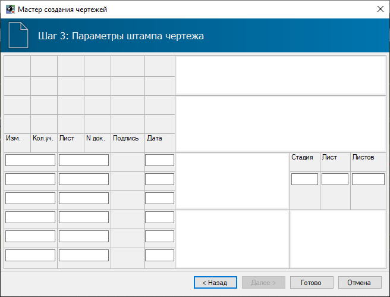

5. Задайте все необходимые настройки формирования чертежа и нажмите кнопку **Готово**.

В результате в структуре проекта появится папка **Ведомости и чертежи**, в которой отобразится созданный чертеж. Этот чертеж автоматически будет открыт для просмотра или дальнейшего редактирования.



Кратко рассмотрим основные способы создания данных чертежей, так как они уже неоднократно были описаны ранее, в разделах, касающихся работы с ЦММ, трассами, автомобильными и железными дорогами.