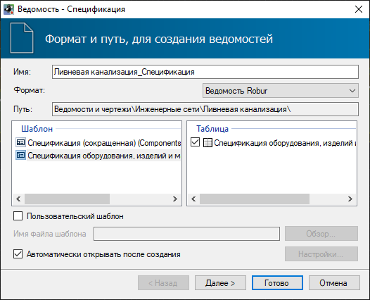
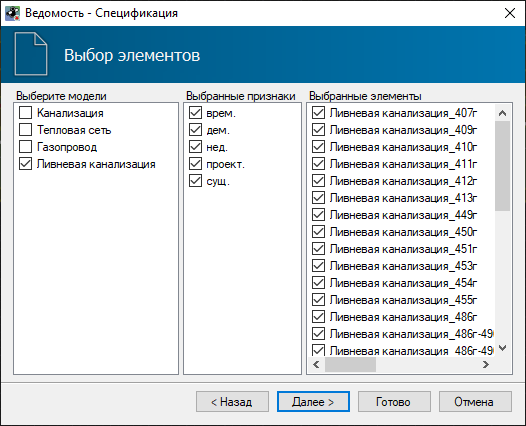
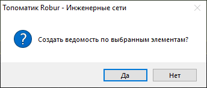
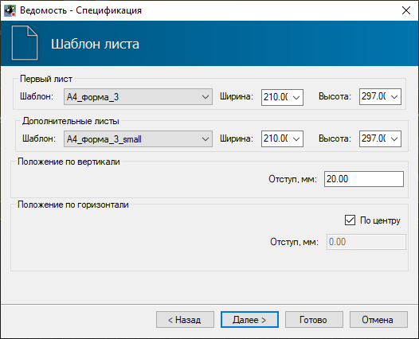
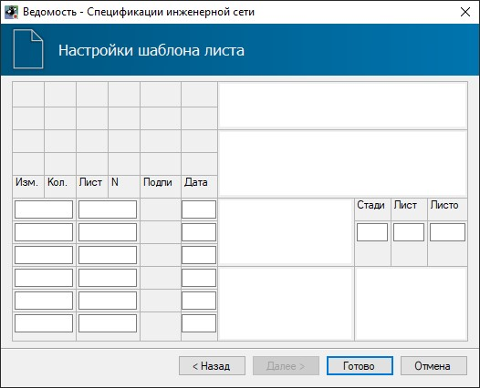

# Создание ведомостей

По данным запроектированной инженерной сети могут быть сформированы следующие основные выходные ведомости:

* **Спецификация**;
* **Ведомость узлов**;
* **Ведомость колодцев**;
* **Ведомость сегментов**;
* **Ведомость глубин заложения сегментов**;
* **Ведомость пересечений**;
* **Ведомость земляных работ**;
* **Ведомость вершин зоны**;
* **Ведомость площадей зоны**.

Для создания ведомости инженерной сети:

1. Выберите меню **Инженерные сети – Ведомости / Зоны отвода – *"Название ведомости"***;



Для создания ведомости зоны отвода необходимо на плане указать требуемые зоны отвода.



2. Откроется окно мастера формирования ведомостей. На вкладке **Формат и путь, для создания ведомостей** выберите необходимые настройки:

* **Имя** - в данном поле отображается наименование создаваемого файла ведомости. Данное поле редактируемое;
* **Формат** - в данном поле выбирается формат ведомости, в зависимости от редактора, в котором она будет открыта. По умолчанию ведомость представлена в формате **Robur**;

* В поле **Шаблон** представлен стандартный шаблон ведомости, согласно которому будет формироваться ведомость;
* В поле **Таблица** указываются формируемые разделы ведомости;
* Опция **Автоматически открывать после создания** позволяет автоматически открыть ведомость после ее создания.



При необходимости использования пользовательского шаблона установите опцию **Пользовательский шаблон** и выберите соответствующий файл с помощью кнопки **Обзор**. Механизмы настройки индивидуальных шаблонов ведомостей описаны в [Чертежи и ведомости. Редактирование динамических выходных ведомостей.](../../doc/dynamic_vedomosti/edit_vedomosti_and_pattern.md)



При выборе формата **Ведомость Robur** нажмите **Далее** для дальнейших настроек (если выбран любой другой формат ведомости, некоторые последующие шаги создания ведомости будут пропущены).

3. На вкладке **Выбор элементов** необходимо последовательно указать модели сетей и признаки элементов сети, по которым следует сформировать выбранную ведомость. В зависимости от настройки данных параметров, в столбце **Выбранные элементы** отобразятся соответствующие элементы.



* У некоторых типов ведомости дается выбор только по требуемым моделям, без указания признаков и конкретных элементов.
* При выборе необходимых элементов на плане выборе типа формируемой ведомости, программа предложит создать ведомость по выбранным элементам и автоматически заполнит параметры на вкладке **Выбор элементов**:



4. На вкладке **Шаблон листа** необходимо задать форматы листов и положение таблицы ведомости относительно границ листа, затем нажмите кнопку **Далее**:



Если шаблон листа выбран **По умолчанию**, программа автоматически подберет формат листа по размеру ведомости.



5. На вкладке **Настройки шаблона листа** необходимо заполнить штамп ведомости:

6. Задайте все необходимые настройки формирования ведомости и нажмите кнопку **Готово**. В результате в структуре проекта отобразится папка **Ведомости и чертежи**, в которой будет сформирована ведомость, и в зависимости от ее формата, автоматически открыта в соответствующем редакторе.

---

## Сводная таблица тэгов ведомостей

| **Спецификация** |  |
| --- | --- |
| *Head (Заголовок)* |  |
| Ведомость компонентов | Caption |
| *Component (Содержание)* |  |
| Номер строки | rowNumber |
| Количество | Count |
| Единица измерения | CountMeasure |
| Позиция | IndexNumber |
| Имя модели | ModelName |
| Примечание | Notes |
| Наименование\* | \_SpFullName\_ |
| Нормативный документ\* | \_SpDocument\_ |
| Код продукции\* | \_SpProductCode\_ |
| Поставщик\* | \_SpProvider\_ |
| Единица измерения\* | \_SpMeasure\_ |
| Масса 1 ед., кг\* | \_SpWeight\_ |
| Примечание\* | \_SpNote\_ |
| \* - данные получены из Библиотеки 3D моделей по пользовательским тэгам. |  |
| **Ведомость узлов** |  |
| *Head (Заголовок)* |  |
| Элементы конструкции | ConstructionElements |
| Подпись | DefaultName |
| *Node (Узлы)* |  |
| Номер строки | rowNumber |
| Позиция | IndexNumber |
| Имя модели | ModelName |
| Все линии сети и пикетаж | NodeAllLines |
| Линия сети | NodeBaseLineName |
| Пикет по линии сети | NodeBaseLineStation |
| Смещение по базису | NodeBasisOffset |
| Габарит, м | NodeBasisOffsetSize |
| Пикет по базису | NodeBasisStation |
| Отметка низа, м | NodeBotElevation |
| Марка альбома | NodeConstructionAlbumMark |
| Признак узла | NodeDeterminationType |
| Вертикальное смещение | NodeElevationFromBasis |
| Наименование | NodePlanNumber |
| Координата X | NodePositionX |
| Координата Y | NodePositionY |
| Отметка верха, м | NodeTopElevation |
| Элементы конструкции\* | ConstructionElements |
| Группа - ...\* (высота) | ConstructionGroup\_... |
| \* - данные получены из назначенной конструкции узла. |  |
| **Ведомость колодцев** |  |
| *Head (Заголовок)* |  |
| Диаметр трубопроводов подключения | InputDiameter |
| Элемент колодца\* | ShaftElement |
| Название ведомости | SheetName |
| Высота элемента\* | ShaftElementHeight |
| *Type (Заголовок типа)* |  |
| Номер строки | rowNumber |
| Тип колодца | ShaftType |
| *Row (Данные)* |  |
| Номер строки | rowNumber |
| Полная глубина | FullDepth |
| Позиция | IndexNumber |
| Имя модели | ModelName |
| Все линии сети и пикетаж | NodeAllLines |
| Линия сети | NodeBaseLineName |
| Пикет по линии сети | NodeBaseLineStation |
| Смещение по базису | NodeBasisOffset |
| Габарит, м | NodeBasisOffsetSize |
| Пикет по базису | NodeBasisStation |
| Отметка низа, м | NodeBotElevation |
| Марка альбома | NodeConstructionAlbumMark |
| Признак узла | NodeDeterminationType |
| Вертикальное смещение | NodeElevationFromBasis |
| Наименование | NodePlanNumber |
| Координата X | NodePositionX |
| Координата Y | NodePositionY |
| Отметка верха, м | NodeTopElevation |
| Диаметр | ShaftDiameter |
| Погрешность раскладки колодцев | ShaftAlignmentError |
| Диаметр трубопроводов подключения | InputDiameter |
| Группа - ...\* (высота) | ConstructionGroup\_... |
| \* - данные получены из назначенной конструкции узла. |  |
| **Ведомость сегментов** |  |
| *ShtPipesHead (Заголовок)* |  |
| Номер строки | rowNumber |
| *ShtPipesPipe (Данные)* |  |
| Номер строки | rowNumber |
| Позиция | IndexNumber |
| Имя модели | ModelName |
| Примечание | Notes |
| Признак сегмента | SegmentDeterminationType |
| Длина 2D, м | SegmentLength |
| Длина 3D, м | SegmentLength3D |
| Наименование и техническая характеристика | SegmentName |
| Длина с учетом запаса, м | SegmentReserveLength |
| Признак футляра | ShellDeterminationType |
| **Ведомость глубин заложения сегментов** |  |
| *PipeSingleHead (Заголовок)* |  |
| Номер строки | rowNumber |
| *PipeSingleData (Данные)* |  |
| Номер строки | rowNumber |
| Способ производства работ | EarthWorkType |
| Конец сегмента | EndNodeName |
| Линия сети | LineName |
| Имя модели | ModelName |
| Позиция | Number |
| Глубина заложения низа сегмента от черной земли средняя | PipeBotEgDepthAverage |
| Глубина заложения низа сегмента от черной земли в конце сегмента | PipeBotEgDepthEnd |
| Глубина заложения низа сегмента от черной земли в начале сегмента | PipeBotEgDepthStart |
| Глубина заложения низа сегмента от проектной земли средняя | PipeBotPgDepthAverage |
| Глубина заложения низа сегмента от проектной земли в конце сегмента | PipeBotPgDepthEnd |
| Глубина заложения низа сегмента от проектной земли в начале сегмента | PipeBotPgDepthStart |
| Глубина заложения характерной точки сечения сегмента от черной земли средняя | PipeCharacterEgDepthAverage |
| Глубина заложения характерной точки сечения сегмента от черной земли в конце сегмента | PipeCharacterEgDepthEnd |
| Глубина заложения характерной точки сечения сегмента от черной земли в начале сегмента | PipeCharacterEgDepthStart |
| Глубина заложения характерной точки сечения сегмента от проектной земли средняя | PipeCharacterPgDepthAverage |
| Глубина заложения характерной точки сечения сегмента от проектной земли в конце сегмента | PipeCharacterPgDepthEnd |
| Глубина заложения характерной точки сечения сегмента от проектной земли в начале сегмента | PipeCharacterPgDepthStart |
| Характерная точка сечения сегмента | PipeCharacterPoint |
| Наименование сегмента | PipeName |
| Характерная точка сегмента | SegmentCharacterPoint |
| Лоток сегмента в конце | SegmentEndCharacterPointBotlnnerElevation |
| Низ сегмента в конце | SegmentEndCharacterPointBotOuterElevation |
| Отметка характерной точки конца сегмента | SegmentEndCharacterPointElevation |
| Ось сегмента в конце | SegmentEndCharacterPointMiddleElevation |
| Шелыга сегмента в конце | SegmentEndCharacterPointToplnnerElevation |
| Верх сегмента в конце | SegmentEndCharacterPointTopOuterElevation |
| Отметка черной земли в конце | SegmentEndEgElevation |
| Уклон от конца сегмента | SegmentEndGrade |
| Отметка проектной земли в конце | SegmentEndPgElevation |
| Длина с учетом запаса, м | SegmentReserveLength |
| Лоток сегмента в начале | SegmentStartCharacterPointBotlnnerElevation |
| Низ сегмента в начале | SegmentStartCharacterPointBotOuterElevation |
| Отметка характерной точки начала сегмента | SegmentStartCharacterPointElevation |
| Ось сегмента в начале | SegmentStartCharacterPointMiddleElevation |
| Шелыга сегмента в начале | SegmentStartCharacterPointToplnnerElevation |
| Верх сегмента в начале | SegmentStartCharacterPointTopOuterElevation |
| Отметка черной земли в начале | SegmentStartEgElevation |
| Уклон от начала сегмента | SegmentStartGrade |
| Отметка проектной земли в начале | SegmentStartPgElevation |
| Начало сегмента | StartNodeName |
| Суммарная длина 2D, м | Length2D |
| Суммарная длина 3D, м | Length3D |
| **Ведомость пересечений** |  |
| *Head (Заголовок)* |  |
| Название по умолчанию | DefaultName |
| *Cross (Пересечения)* |  |
| Номер строки | rowNumber |
| Угол пересечения | CrossAngle |
| Отметка участка пересекаемой сети в точке пересечения | CrossElevation |
| Описание пересекаемой сети | CrossNetworkDescription |
| Название модели пересекаемой сети | CrossNetworkName |
| Тип пересекаемой сети | CrossNetworkType |
| Обозначение типа пересекаемой сети | CrossNetworkTypeDesignation |
| Характеристика участка пересекаемой сети в точке пересечения | CrossPipeCharacter |
| Статус участка пересекаемой сети | CrossStatus |
| Расстояние меду сетями по вертикали в свету | DistlnLightPipe |
| Расстояние между сетями по вертикали в свету, с учетом защитных мероприятий | DistlnLightShell |
| Расстояние между сетями по вертикали нормативное | DistStandard |
| Расстояние от узла сети до пересечения | DistToShaft |
| Участок сети | LineName |
| Имя модели | ModelName |
| Пикетаж пересечения | Piket |
| Характеристика участка сети в точке пересечения | PipeCharacter |
| Отметка сети в точке пересечения | PipeElevation |
| Номер на плане | PlanNumber |
| Координата X | PosX |
| Координата Y | PosY |
| Ссылка на нормативный документ | StandardLink |
| **Ведомость земляных работ** |  |
| *Head (Заголовок)* |  |
| Подпись шапки | Name |
| *Row (Данная)* |  |
| Номер строки | rowNumber |
| Выемка | Cut |
| Слой 1 | Layer1 |
| Слой 2 | Layer2 |
| Слой 3 | Layer3 |
| Слой 4 | Layer4 |
| Слой 5 | Layer5 |
| Имя первого слоя | LayerName\_1 |
| Имя второго слоя | LayerName\_2 |
| Имя третьего слоя | LayerName\_3 |
| Имя четвертого слоя | LayerName\_4 |
| Имя пятого слоя | LayerName\_5 |
| Заложение слева | LeftSlope |
| Имя модели | ModelName |
| Наименование | Name |
| Длина в плане, м | PlanLength |
| Заложение справа | RightSlope |
| Глубина заложения, м | VerticalOffset |
| Ширина по дну, м | Width |
| *Note (Примечание)* |  |
| Номер строки | rowNumber |
| Сообщение | Message |
| **Ведомость вершин зоны** |  |
| *Head (Заголовок)* |  |
| Имя | ZoneName |
| *ContourData (Список вершин)* |  |
| Номер строки | rowNumber |
| Вершины контура | ContourVertexes |
| Имя | Note |
| *VertexData (Данные вершины)* |  |
| Номер строки | rowNumber |
| Индекс | Number |
| Координата X вершины | PositionX |
| Координата Y вершины | PositionY |
| **Ведомость площадей зоны** |  |
| *Data (Данные)* |  |
| Номер строки | rowNumber |
| Площадь, м2 | Area |
| Имя | Name |
| Примечание | Note |
| Индекс | Number |

