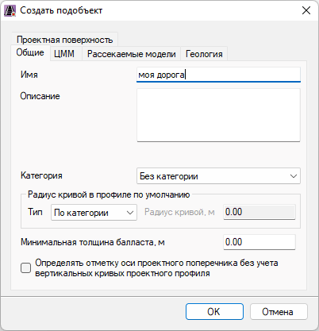

# Создание модели Железная дорога

Проект может содержать неограниченное число моделей типа **Железная дорога**. Редактирование возможно только текущей модели. Процедура выбора текущей модели была описана в разделе [Работа с моделями](../../install_startup/startup/structure_project/work_with_models.md).

По умолчанию каждый создаваемый проект уже содержит одну модель типа **Железная дорога** без данных с наименованием **Ось**.

Если необходимо создать новую модель данного типа:

1. В окне **Структура проекта** щелкните **ПКМ** по любой из папок и выберите из появившегося контекстного меню **Добавить** - **Железная дорога**:

   

2. В открывшемся диалоговом окне задайте в поле **Имя** наименование создаваемого подобъекта и нажмите **ОК**:

   

   

   На вкладках данного окна расположены основные настройки создаваемой модели, которые будут описаны [далее](setting_subobject.md) в соответствующем разделе.

   

В результате, будет создана новая модель типа **Железная дорога** и по умолчанию она будет текущей.