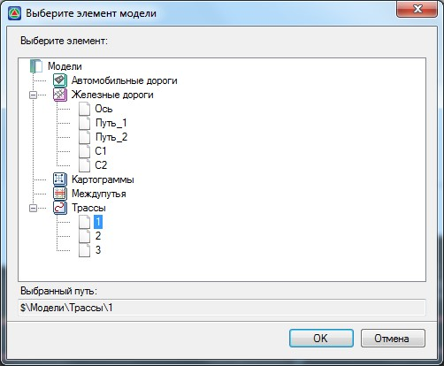

# Создание подобъекта Железная дорога на основе изыскательской трассы

Проект созданный в программе **Топоматик Robur – Изыскания** может иметь набор трасс, содержащих такие данные как: черные профили и поперечники с нанесенными геологическими разрезами, инженерными коммуникациями и т.п. Для того чтобы использовать изыскательскую трассу для решения дальнейших задач проектирования (к примеру: проектирование продольного профиля железнодорожной линии, проектирование земляного полотна и т.п.), необходимо на основе нее создать подобъект **Железная дорога**.

Для этого:

1. Сделайте подобъект **Железной дороги** текущим, либо создайте новый (создание нового подобъекта см. выше).
2. Выберите меню **Проект - Импортировать - Из другого подобъекта**, откроется диалоговое окно выбора модели **Трассы**:

   

3. Выберите необходимую модель **Трассы** и нажмите **ОК**. Программа подгрузит все данные выбранной **Трассы** в текущую модель **Железной дороги**.