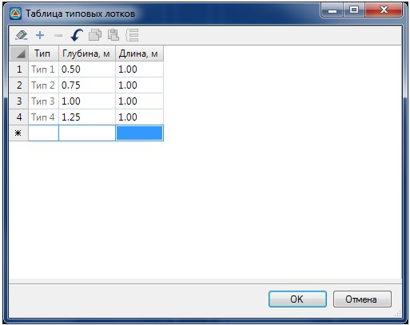
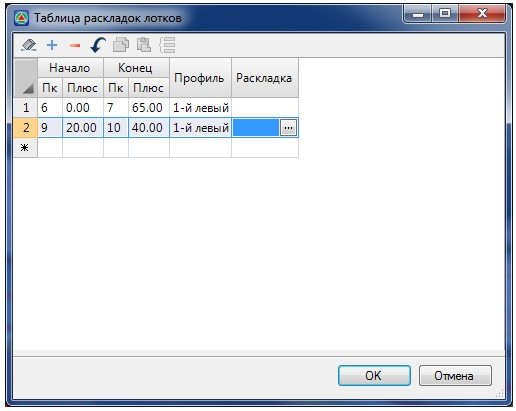
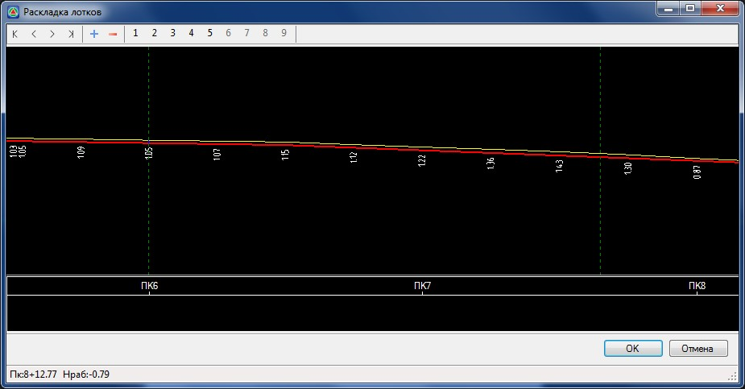
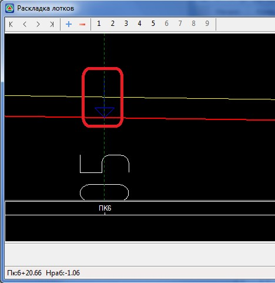
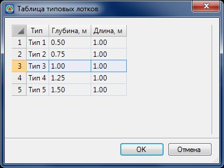
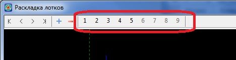
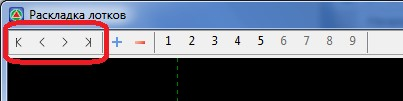
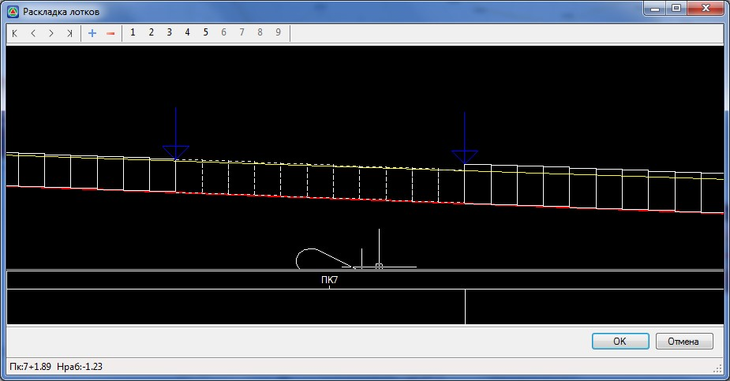
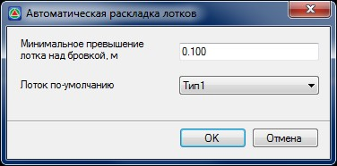
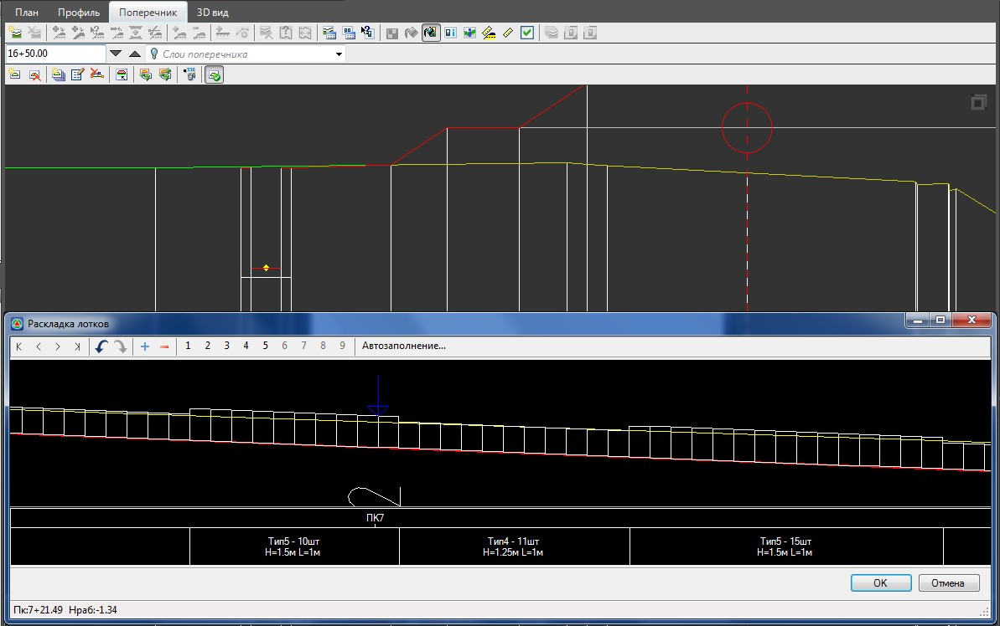

# Раскладка лотков

Данный модуль позволяет наглядно выполнять раскладку лотков определенных марок, на заданных водоотводных участках. Лотки в соответствии со своим типом и размерами отображаются на поперечных профилях. Формируется ведомость раскладки.

Для того что бы в текущем проекте задать типы лотков используемые при раскладке выберите элемент меню **Задачи – Водоотводы - Раскладка лотков – Таблица типовых лотков**:

Номер типа программа присваивает автоматически, пользователь может задать высоту и длину лотка для каждого типа.

Для раскладки лотков на заданном участке выберите элемент меню **Задачи – Раскладка лотков – Таблица раскладок лотков**. Откроется следующее окно:

В таблице задается список участков, на которых будут раскладываться лотки. Участок определяется пикетажными границами, а водоотвод, на котором будут устраиваться лотки, должен быть привязан к соответствующему продольному профилю.



Последовательность действий по созданию и редактированию профилей водоотводных участков была описана ранее ([Железные дороги, Проектирование поперечных профилей, раздел Водоотводы](drains.md)).



Для раскладки лотков на заданном участке нажмите кнопку  в столбце **Раскладка**. Откроется следующее окно:

Раскладка лотков выполняется в отдельном окне. Расстояние в этом окне соответствуют реальной длине водоотводного участка. Это необходимо для более точной раскладки лотков и подсчета их количества. Красная линия в данном окне это проектный профиль по дну лотка, желтая – профиль по линии привязки лотка (по точке привязки лотка).

Раскладка лотков начинается с начала участка. Место вставки следующего лотка показывается синей стрелкой:

Добавлять лотки можно с помощью кнопок на панели инструментов окна **Раскладка лотков** или с клавиатуры.

Лотки добавляются с помощью кнопки  . Программа предложит выбрать лоток в окне **Таблица типовых лотков**:

Добавить лоток также можно курсором, выбрав номер типа на панели инструментов (первые девять типов отображаются на панели инструментов окна Раскладка лотков) или введя номер типа с клавиатуры:

Для перемещения по участку с разложенными лотками можно использовать кнопки на панели инструментов, клавиши на клавиатуре или указывая курсором на экране нужное место:

Так же есть возможность выделить несколько разложенных лотков. Это нужно для того что бы назначить другой тип для выбранных лотков или удалить выбранные лотки. Выделить несколько лотков можно листая их с нажатой клавишей **Shift**, либо выделив их курсором с зажатой левой клавишей мыши. Выделенные лотки отображаются пунктиром:

Например, для того что бы заменить тип у выбранных лотков необходимо нажать номер типа на клавиатуре, либо указать новый номер типа курсором на панели инструментов.

**Удалить** лоток или группу лотков можно с помощью кнопки  на панели инструментов, либо с помощью клавиш **Del** и Backspace на клавиатуре.

Раскладка лотков на заданном участке может осуществляться автоматически в зависимости от их требуемой высоты, определяемой по разности отметок проектного профиля дна и профиля по линии привязки лотка. Для автоматической раскладки нажмите кнопку **Автозаполнение**, рассположенную на панели инструментов. Откроется следующие диалоговое окно:

В поле **Минимальное превышение лотка** над бровкой при необходимости может быть задана величина необходимого возвышения верха лотка относительно линии его привязки.

**Лоток по умолчанию** - Если не один лоток из имеющейся базы не подходит для раскладки, то на этом участке будет применен тип лотка, установленный в данном поле.

Для применения **Автоматической раскладки** нажмите **ОК**.

В результате программа выполнит раскладку, подобрав оптимальные размеры лотков на заданном участке. При необходимости данное решение может быть отредактировано с помощью функционала, который был описан выше.

Для выхода из данного окна с применением результатов раскладки нажмите **ОК**.

Если продольный профиль по водоотводу изменился и в раскладку лотков необходимо внести изменения, это всегда можно сделать, открыв снова соответствующий участок в **Таблице раскладки лотков**.

Если на поперечном профиле в качестве элемента конструкции лотка был выбран **Лоток с привязкой к профилю**, то его параметры (высота), будут назначаться автоматически, в зависимости от того, какой тип лотка находится на данном поперечнике.

По данным раскладки лотков может быть создана соответствующая ведомость, в которой указаны данные по всем типам лотков их количеству.

Для этого:

1. Выберите меню **Задачи - Водоотводы - Раскладка лотков - Создать ведомость**, откроется окно мастера формирования ведомостей.
2. Следуя инструкциям мастера задайте необходимые параметры и нажмите **Готово**. В результате будет сформирована ведомость лотков.
